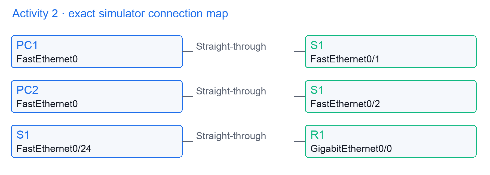
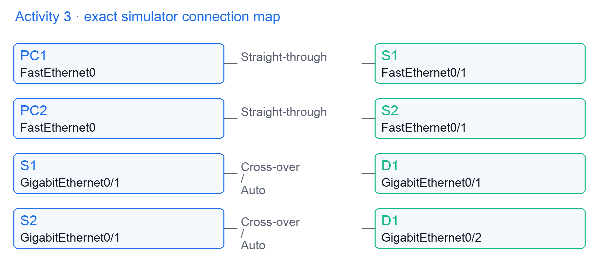
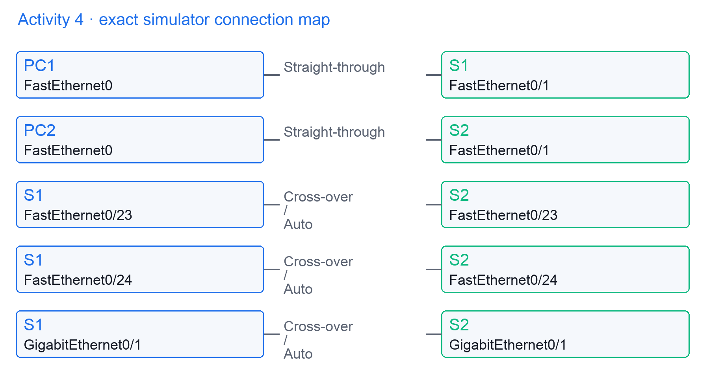
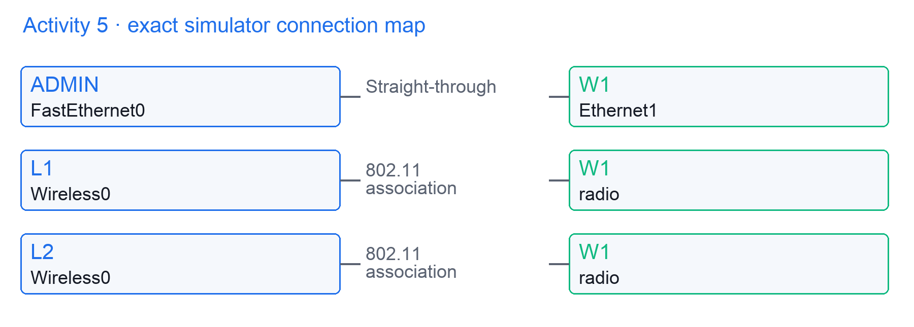
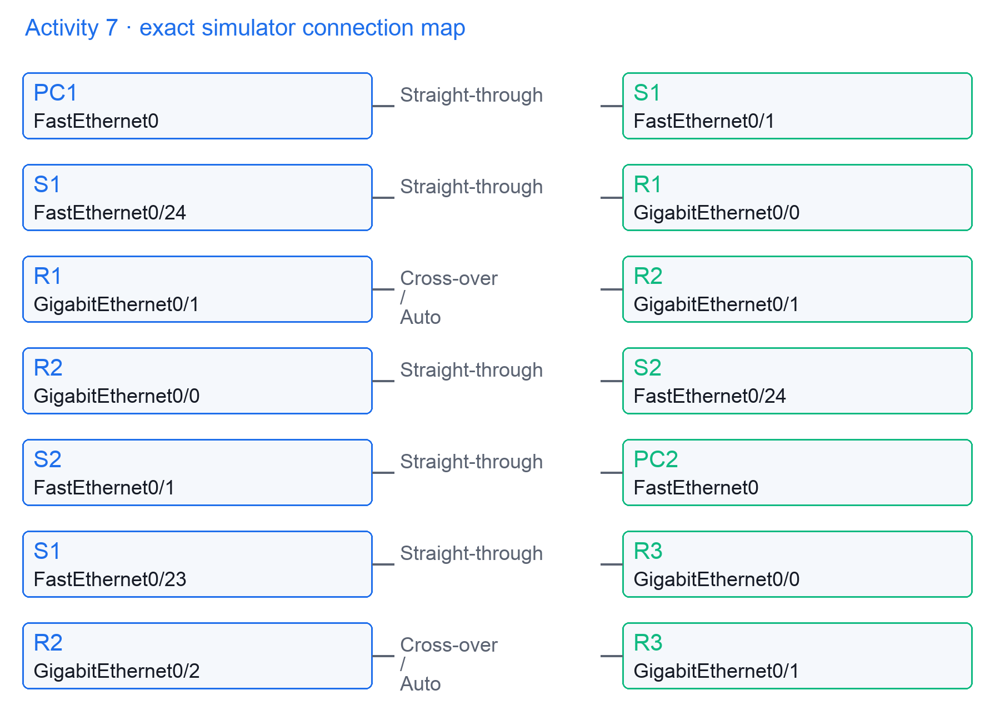
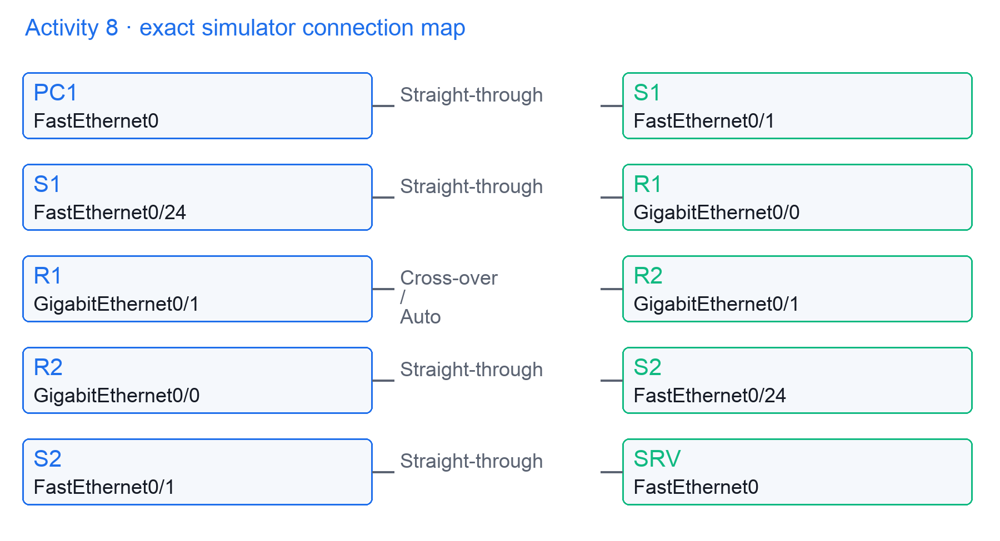
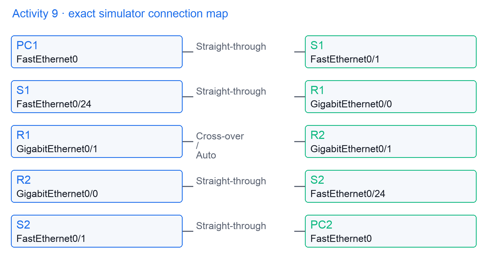
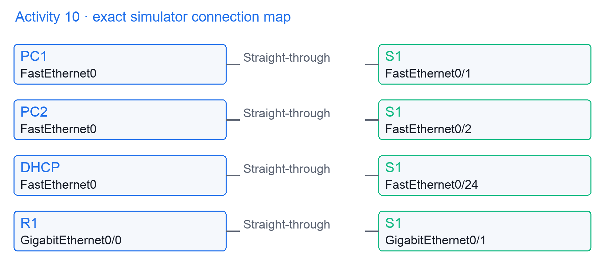
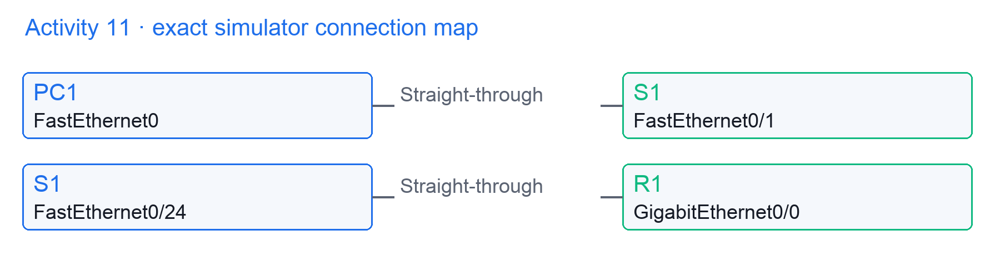
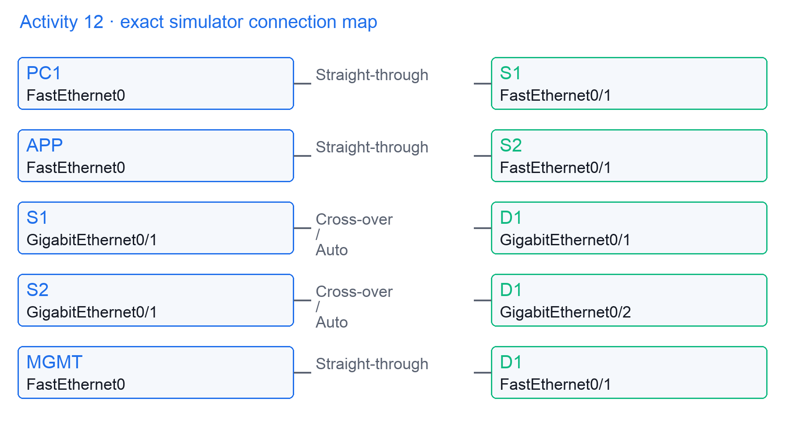

Tertiary Infotech Academy Pte Ltd

UEN: 201200696W

LEARNER GUIDE

For

Cisco Certified Network Associate (CCNA)

TGS Ref No: TGS-2023037854

Conducted by

Tertiary Infotech Academy Pte Ltd

UEN: 201200696W

Version v7.0

DOCUMENT VERSION CONTROL RECORD

| Version Number | Effective Date of Release | Summary of Included Changes | Author |
| --- | --- | --- | --- |
| 6.0 | Legacy reference version | Original CCNA course material retained privately for coverage comparison. | Tertiary Infotech Academy |
| 7.0 | 13 September 2026 | Rebuilt for current CCNA v1.1,announced v2.0 transition,aligned activities and verified evidence. | Tertiary Infotech Academy |

TABLE OF CONTENTS

How to Use This Guide	4

Learning Outcomes and TSC Alignment	4

1. Network Fundamentals ·current v1.1 20%	4

2. Network Access ·current v1.1 20%	13

3. IP Connectivity ·current v1.1 25%	21

4. IP Services ·current v1.1 10%	28

5. Security Fundamentals ·current v1.1 15%	33

6. Automation and Programmability ·current v1.1 10%	38

Announced CCNA v2.0 Transition ·effective 3 February 2027	42

Detailed Activities ·19 practical hours	46

Quick Command Reference	115

Practice Exam and Revision	116

Assessment Flow and Support	116

Sources and Version Notes	116

# How to Use This Guide

This 5-day programme comprises 38 training hours (19 lecture and 19 practical) and 2 assessment hours. The current 200-301 CCNA exam is v1.1; announced v2.0 becomes effective 3 February 2027. Current-domain topics come first; newly announced operational objectives are explicitly labelled. All addresses, tokens and logs in activities are synthetic. Offline checker success proves fixture analysis only; device implementation must be demonstrated separately in an isolated simulator or supported hardware.

Prerequisites: basic computer use, Python 3.10+ for stdlib fixture checks, and a trainer-provided Packet Tracer installation or isolated Cisco device environment for configuration practice. Confirm simulator command support: some IOS XE, IPv6 security, AAA, OSPFv3 and transfer features require supported hardware or evidence interpretation. Do not claim mock records are live device output.

# Learning Outcomes and TSC Alignment

| TSC | Knowledge/ability evidence |
| --- | --- |
| K1 / A1-A2 | Functions and dependencies;requirements and component selection using topology/capacity/addressing evidence. |
| K2-K4 / A3 | Implementation techniques, management tools and device/server configuration with verified state. |
| K5 / A4 | Access management, ACL, AAA, SSH and WLAN security controls. |
| K6 / A5-A6 | Tracking, assessment, tool selection and stability reporting from reproducible operational evidence. |

# 1. Network Fundamentals ·current v1.1 20%

## 1.1 Frame and packet boundaries

Deck slides 17-21 · Activity 1: addressing / Activity 2: physical and VLAN evidence

Architecture: Host NIC -> Access switch -> Default gateway. Runtime: Application bytes enter TCP; IP selects destination; Ethernet selects next-hop MAC; Router rewrites L2 at each hop.

```text
Ethernet dst 00:11:22:33:44:55
IPv4 src 192.0.2.10 dst 198.51.100.20
TCP src 49152 dst 443
```

Failure/control: A remote IP never becomes a local destination MAC. Validate ARP for the gateway, not the remote server.

Verification: Capture both sides of R1: IP endpoints persist without NAT; source and destination MAC change. TTL decreases by one.

## 1.2 Router and switch forwarding

Deck slides 22-26 · Activity 1: addressing / Activity 2: physical and VLAN evidence

Architecture: CAM table -> Routing table -> ARP table. Runtime: Switch learns source MAC; Lookup uses destination MAC; Router performs longest prefix match; ARP resolves egress next hop.

```text
MAC VLAN 10 0011.2233.4455 Gi1/0/1
Route 198.51.100.0/24 via 192.0.2.1
ARP 192.0.2.1 00aa.bbcc.ddee
```

Failure/control: Unknown unicast floods only within its VLAN. A missing route is not solved by adding a MAC entry.

Verification: show mac address-table; show ip route; show ip arp. Separate L2 learning from L3 path selection.

## 1.3 Firewall and IPS control points

Deck slides 27-31 · Activity 1: addressing / Activity 2: physical and VLAN evidence

Architecture: Inside segment -> Policy firewall -> Inline IPS. Runtime: Session initiates outbound; State table records tuple; Return tuple matches state; IPS inspects permitted payload.

```text
Session TCP 192.0.2.10:49152 -> 203.0.113.5:443
State ESTABLISHED
IPS verdict: alert / block
```

Failure/control: Stateful permit does not imply payload is safe. Asymmetric routing can prevent return traffic matching the expected state.

Verification: Compare policy hit counters, session entries and IPS event timestamps. A permitted session can still be blocked by inspection.

## 1.4 Wireless controller boundaries

Deck slides 32-36 · Activity 1: addressing / Activity 2: physical and VLAN evidence

Architecture: Wireless client -> Access point -> WLC. Runtime: Client associates to AP; CAPWAP carries AP control; WLC applies WLAN policy; Data uses central or local switching.

```text
CAPWAP control UDP 5246
CAPWAP data UDP 5247
SSID Staff -> VLAN 20
```

Failure/control: Do not infer data path from control connectivity. FlexConnect local switching may keep client traffic at the site.

Verification: Identify AP mode, WLAN-to-VLAN mapping and client IP. Control tunnel reachability and client gateway reachability are different tests.

## 1.5 Endpoint and server dependencies

Deck slides 37-41 · Activity 1: addressing / Activity 2: physical and VLAN evidence

Architecture: Client -> DNS service -> Application server. Runtime: Name resolves to address; Client opens transport session; Server authorizes request; Response returns on routed path.

```text
DNS A app.example.test 192.0.2.50
TCP SYN dst 443
HTTP status 200 after TLS
```

Failure/control: A successful ping proves neither DNS nor application authorization. Diagnose each dependency using its own evidence.

Verification: Compare DNS result, TCP connection and HTTP response. Record addresses and time so the test is reproducible.

## 1.6 PoE power budgets

Deck slides 42-46 · Activity 1: addressing / Activity 2: physical and VLAN evidence

Architecture: PoE switch -> Powered AP -> Power supply. Runtime: Device signature detected; Power class negotiated; Budget reserves watts; Link and radio initialize.

```text
8 APs x 15.4 W = 123.2 W
Switch available budget = 120 W
Deficit = 3.2 W
```

Failure/control: A port can have a working data link while power is denied or constrained. Budget and per-port limits both matter.

Verification: show power inline. Sum allocated power, examine denied ports and compare hardware PoE class support.

## 1.7 Two-tier and three-tier paths

Deck slides 47-51 · Activity 1: addressing / Activity 2: physical and VLAN evidence

Architecture: Access layer -> Distribution pair -> Core layer. Runtime: Endpoint traffic enters access; Distribution applies gateway/policy; Core transports aggregated routes; Return path follows destination lookup.

```text
Access VLAN 10 -> Distribution SVI
Distribution routed uplink -> Core
Core has no user access ports
```

Failure/control: L2 stretched across distribution increases failure scope. Core design prioritizes fast routed transport over edge policy complexity.

Verification: Mark default gateway ownership and L2/L3 boundaries on the topology. Verify independent uplinks and equal-cost routes.

## 1.8 Spine-leaf forwarding

Deck slides 52-56 · Activity 1: addressing / Activity 2: physical and VLAN evidence

Architecture: Leaf A -> Spine pair -> Leaf B. Runtime: Host enters local leaf; Leaf selects a spine; Spine forwards to destination leaf; Leaf delivers locally.

```text
Leaf A -> Spine 1 -> Leaf B
Alternative Leaf A -> Spine 2 -> Leaf B
Inter-leaf routed path: two fabric links
```

Failure/control: Leaf-to-leaf links are not required in a standard spine-leaf fabric. Oversubscription still depends on link capacities.

Verification: Count equal-cost paths and hop symmetry. Compare downlink aggregate bandwidth with uplink bandwidth.

## 1.9 WAN and SOHO boundaries

Deck slides 57-61 · Activity 1: addressing / Activity 2: physical and VLAN evidence

Architecture: LAN router -> Provider WAN -> Remote service. Runtime: LAN packet reaches CPE; CPE routes or translates; Provider transports traffic; Remote gateway delivers.

```text
LAN 192.168.10.0/24
CPE WAN 203.0.113.2/30
Default via 203.0.113.1
```

Failure/control: Private addressing cannot traverse the public Internet without a suitable translation or tunnel path. WAN failure can leave LAN healthy.

Verification: Test LAN gateway, provider next hop and a remote address separately; record where loss begins.

## 1.10 Cloud and on-premises ownership

Deck slides 62-66 · Activity 1: addressing / Activity 2: physical and VLAN evidence

Architecture: Local LAN -> Cloud VPC/VNet -> Provider edge. Runtime: Traffic exits enterprise edge; Encrypted connection crosses WAN; Cloud route selects subnet; Security policy filters destination.

```text
Local 10.10.0.0/16
Cloud 10.20.0.0/16
Tunnel routes must avoid overlap
```

Failure/control: Overlapping RFC 1918 ranges make routing ambiguous. Provider responsibility does not cover a customer's route or security-rule error.

Verification: Check both route tables, tunnel state and cloud security rules. State who owns each control before changing it.

## 1.11 Copper and optical link contracts

Deck slides 67-71 · Activity 1: addressing / Activity 2: physical and VLAN evidence

Architecture: Transceiver -> Physical medium -> Peer interface. Runtime: PHY negotiates capabilities; Signal crosses matched medium; Receiver recovers symbols; MAC reports link state.

```text
1000BASE-T: copper twisted pair
1000BASE-SX: multimode optical
1000BASE-LX: longer-wave optical
```

Failure/control: Connector fit alone does not prove compatibility. Match wavelength, fiber type, supported optic and distance rating.

Verification: Read both interface/transceiver specifications; inspect optical receive power and interface errors.

## 1.12 Duplex and interface errors

Deck slides 72-76 · Activity 1: addressing / Activity 2: physical and VLAN evidence

Architecture: Local interface -> Physical cable -> Peer interface. Runtime: Frames transmit; Collision/error counters increment; Protocol retransmits lost data; Throughput falls despite link-up.

```text
show interfaces Gi1/0/1
CRC: 240; late collisions: 12
Speed 100 Mb/s; duplex half
```

Failure/control: Late collisions suggest duplex or distance issues on half-duplex Ethernet; CRCs also arise from cable/optical faults.

Verification: Compare speed/duplex on both ends and monitor counter deltas after remediation rather than relying on old totals.

## 1.13 TCP session state

Deck slides 77-81 · Activity 1: addressing / Activity 2: physical and VLAN evidence

Architecture: Client socket -> Network path -> Server socket. Runtime: SYN proposes sequence; SYN-ACK acknowledges client; ACK establishes session; FIN or RST terminates.

```text
Client SYN seq=1000
Server SYN-ACK seq=7000 ack=1001
Client ACK seq=1001 ack=7001
```

Failure/control: A SYN retransmission can indicate filtering or an absent listener. A RST indicates a different failure from silence.

Verification: Read flags and sequence/ack fields in a capture. Confirm whether the handshake completed before testing application data.

## 1.14 UDP delivery and application recovery

Deck slides 82-86 · Activity 1: addressing / Activity 2: physical and VLAN evidence

Architecture: Sender process -> UDP/IP path -> Receiver process. Runtime: Application creates datagram; UDP supplies ports/checksum; IP attempts delivery; Application handles loss or retry.

```text
UDP src 53000 dst 53
DNS query ID 0x1234
Response must match transaction ID
```

Failure/control: UDP does not establish a transport session or guarantee order. A protocol can implement retries above UDP.

Verification: Correlate request and response using application identifiers, endpoints and timestamps; inspect loss separately from latency.

## 1.15 IPv4 subnet boundaries

Deck slides 87-91 · Activity 1: addressing / Activity 2: physical and VLAN evidence

Architecture: Network bits -> Host bits -> Broadcast boundary. Runtime: Prefix fixes network portion; Host bits vary; All-zero host identifies network; All-one host identifies broadcast.

```text
192.0.2.65/26
Mask 255.255.255.192
Network .64; usable .65-.126; broadcast .127
```

Failure/control: Do not include network or broadcast in a traditional subnet's host allocation. /31 point-to-point links are a special case.

Verification: 2^(32-26)-2 = 62 usable addresses. Check that each assigned address remains within .64-.127.

## 1.16 VLSM address allocation

Deck slides 92-96 · Activity 1: addressing / Activity 2: physical and VLAN evidence

Architecture: Address pool -> Largest subnet -> Smaller subnets. Runtime: Sort host demands descending; Choose prefix for each need; Allocate aligned blocks; Reserve remaining address space.

```text
10.10.0.0/24
60 hosts -> .0/26
28 hosts -> .64/27
12 hosts -> .96/28
```

Failure/control: Choosing an unaligned starting boundary causes overlap. VLSM addresses capacity; routes must also be advertised correctly.

Verification: Prove allocated ranges do not intersect; compare usable host counts 62, 30, 14 with requirements 60, 28, 12.

## 1.17 Private and public addressing

Deck slides 97-101 · Activity 1: addressing / Activity 2: physical and VLAN evidence

Architecture: RFC 1918 space -> Enterprise edge -> Public service. Runtime: Private address is assigned internally; Edge selects Internet route; NAT may change source; Public server returns translated tuple.

```text
Private: 10/8, 172.16/12, 192.168/16
Documentation: 192.0.2/24, 198.51.100/24, 203.0.113/24
```

Failure/control: Documentation ranges are for examples, not production Internet addressing. 172.15.0.0/16 is outside RFC 1918.

Verification: Classify each candidate prefix; preserve original and translated addresses in the incident report.

## 1.18 IPv6 address types

Deck slides 102-106 · Activity 1: addressing / Activity 2: physical and VLAN evidence

Architecture: Global interface -> Link-local interface -> Multicast group. Runtime: Interface gains FE80::/10 link-local; Global prefix identifies routed scope; Multicast reaches selected members; No broadcast exists.

```text
Global 2001:db8:10::10/64
Link-local fe80::10
All nodes ff02::1; all routers ff02::2
```

Failure/control: A link-local next hop needs an outgoing interface scope. 2001:db8::/32 is documentation space.

Verification: Classify global unicast, unique-local FC00::/7, link-local and multicast. Inspect interface and route scopes.

## 1.19 IPv6 neighbor and SLAAC state

Deck slides 107-111 · Activity 1: addressing / Activity 2: physical and VLAN evidence

Architecture: Host -> IPv6 router -> Neighbor cache. Runtime: RS solicits routers; RA advertises prefix/default router; Host performs DAD; NS/NA resolves neighbor MAC.

```text
RA: prefix 2001:db8:10::/64 A=1
Default router fe80::1
NS target 2001:db8:10::20
```

Failure/control: Blocking necessary ICMPv 6 breaks neighbor discovery and path operation. SLAAC does not derive a default gateway from DHCPv 6.

Verification: Verify RA prefix, tentative-to-preferred DAD state and neighbor cache entry. Confirm a usable default route separately.

## 1.20 Wireless channel and virtual boundaries

Deck slides 112-116 · Activity 1: addressing / Activity 2: physical and VLAN evidence

Architecture: Radio channel -> SSID/VLAN mapping -> Virtual switch. Runtime: Radio shares airtime; SSID assigns policy domain; Virtual switch connects VM NIC; L3 gateway routes between subnets.

```text
2.4 GHz nonoverlap example: 1, 6, 11
Staff SSID -> VLAN 20
VM vNIC -> port group VLAN 20
```

Failure/control: Overlapping channels increase contention. A VM port-group VLAN mismatch looks like a physical network failure.

Verification: Compare channel utilization, SSID security, VM VLAN tag and host IP/gateway; separate RF evidence from virtual-switch evidence.

## 1.21 IPv6 interface and anycast contracts

Deck slides 117-121 · Activity 1: addressing / Activity 2: physical and VLAN evidence

Architecture: Router interface -> Unicast host -> Anycast service. Runtime: Interface receives global/link-local addresses; Unicast identifies one interface; Anycast address exists on multiple nodes; Routing delivers to topologically nearest member.

```text
interface Gi0/1
 ipv6 address 2001:db8:10::1/64
 ipv6 address fe80::1 link-local
 ipv6 enable
```

Failure/control: Anycast uses unicast address format; it is not multicast fan-out. Nearest means routing metric, not geographic distance.

Verification: show ipv 6 interface brief; compare configured /64 and address scope. Anycast response comes from one reachable service member.

## 1.22 VRF routing isolation

Deck slides 122-126 · Activity 1: addressing / Activity 2: physical and VLAN evidence

Architecture: VRF BLUE -> VRF GREEN -> Shared physical router. Runtime: Interface binds to VRF; Each VRF owns separate RIB/FIB; Overlapping prefixes remain isolated; Leak occurs only with explicit policy.

```text
BLUE route 10.10.0.0/16 via 10.0.0.2
GREEN route 10.10.0.0/16 via 10.0.0.6
show ip route vrf BLUE
```

Failure/control: Do not inspect the global route table and assume a VRF-bound interface has the same paths. Isolation is separate from encryption.

Verification: Verify interface VRF assignment and VRF-specific route/ARP evidence; same prefix can validly use different next hops.

## 1.23 MAC aging and unknown-unicast scope

Deck slides 127-131 · Activity 1: addressing / Activity 2: physical and VLAN evidence

Architecture: Source MAC learner -> CAM aging timer -> VLAN flood domain. Runtime: Incoming source refreshes entry; Idle entry reaches aging threshold; Entry is removed; Unknown destination floods eligible same-VLAN ports.

```text
VLAN 10 MAC0011.2233.4455 portGi 1/0/1
Dynamic aging timer 300 s example
Unknown unicast floods VLAN 10 only
```

Failure/control: Aging time varies by platform/configuration; a removed entry does not remove the host's IP. Flooding cannot cross VLAN boundary without L3 processing.

Verification: show mac address-table aging-time; compare entry before/after inactivity and source relearning; distinguish CAM aging from ARP aging.

## 1.24 Modified EUI-64 address construction

Deck slides 132-136 · Activity 1: addressing / Activity 2: physical and VLAN evidence

Architecture: 48-bit NIC MAC -> Inserted FFFE -> 64-bit interface ID. Runtime: Split MAC into 24-bit halves; Insert hexadecimal FFFE; Invert universal/local bit; Join 64-bit ID to /64 prefix.

```text
MAC00:11:22:33:44:55
ID0211:22ff:fe33:4455
2001:db8:10:0:211:22ff:fe33:4455
```

Failure/control: Modern clients often use privacy/stable interface IDs instead. EUI-64 calculation is a specified method, not a claim every host uses it.

Verification: Prove 00 xor 02 =02 and exact inserted FFFE placement; compare prefix plus 64-bit interface identifier.

## 1.25 Hypervisor VM and container isolation

Deck slides 137-141 · Activity 1: addressing / Activity 2: physical and VLAN evidence

Architecture: Hypervisor -> Guest VM OS -> Container host kernel. Runtime: Hypervisor virtualizes hardware; VM owns guest kernel; Container shares host kernel; vNIC/veth attaches virtual network.

```text
VM: app->guest kernel->vNIC->vSwitch
Container: app->shared kernel->veth/bridge
VLAN policy belongs to attachment
```

Failure/control: A container is not a separate guest kernel. Network namespaces and virtual attachment policies still require isolation controls.

Verification: Trace address, virtual NIC/bridge, VLAN and gateway; compare host versus guest responsibilities during a connectivity incident.

## 1.26 RF link-budget and interference evidence

Deck slides 142-146 · Activity 1: addressing / Activity 2: physical and VLAN evidence

Architecture: AP transmitter -> RF path -> Client receiver. Runtime: Transmit power enters antenna; Path loss reduces received signal; Noise determines signal margin; Rate adaptation responds to channel conditions.

```text
RSSI-62 dBm; noise-92 dBm
SNR=30 dB
Channel utilization 75%
RSSI alone does not establish usable throughput
```

Failure/control: Good signal can coexist with interference/high contention. Wider channels increase capacity potential but consume spectrum and affect reuse.

Verification: Compare SNR, utilization, retry rate and client throughput; identify whether issue is signal strength, noise or airtime contention.

## 1.27 Cross-platform client diagnostics

Deck slides 147-151 · Activity 1: addressing / Activity 2: physical and VLAN evidence

Architecture: Windows host -> macOS host -> Linux host. Runtime: Read address/mask; Read default route; Resolve intended name; Test path and service.

```text
Windows: ipconfig /all; route print
macOS: ifconfig; netstat -rn
Linux: ip addr; ip route
All: ping + name/service test
```

Failure/control: Different commands expose equivalent layers. A disconnected wireless association is separate from a correct but unusable IP configuration.

Verification: Build evidence table for address, prefix, gateway, DNS, association/security and first failing path control.

## 1.28 Five equal subnets from a /24

Deck slides 152-156 · Activity 1: addressing / Activity 2: physical and VLAN evidence

Architecture: 192.168.1.0/24 pool -> Three borrowed bits -> Five allocated /27 VLANs. Runtime: Need at least five subnets; Borrow three bits since 2^3=8; Use /27 blocks of 32 addresses; Assign last usable gateway in each block.

```text
Five VLANs from 192.168.1.0/24
/26 gives4subnets: insufficient
/27 gives8subnets: enough
VLAN 1 .0/27 gateway.30; VLAN 2 .32/27 gateway.62
VLAN 3 .64/27 gateway.94; VLAN 4 .96/27 gateway.126
VLAN 5 .128/27 gateway.158
```

Failure/control: Do not choose /26 for five equal subnets: only four blocks fit in a /24. A Layer 2 switch management address belongs on an SVI, not an ordinary switched physical port.

Verification: Each /27 has 30 usable addresses. Gateways .30, .62, .94, .126, .158 are the last usable addresses; broadcast addresses .31, .63, .95, .127, .159 are not host assignments.

## 1.29 Single-mode versus multimode optical paths

Deck slides 157-161 · Activity 1: addressing / Activity 2: physical and VLAN evidence

Architecture: Single-mode fibre -> Multimode fibre -> Matched optic pair. Runtime: Emitter selects wavelength; Core/mode characteristics govern propagation; Attenuation/dispersion limit reach; Receiver power must stay in supported range.

```text
Single-mode: small core, one propagation mode
Multimode: larger core, multiple modes
1000BASE-SX: short-wave multimode example
1000BASE-LX:1310nm class; verify exact reach/media
```

Failure/control: Fibre jacket colour does not prove specification. LX may have documented multimode support conditions; always check exact transceiver and cable requirements.

Verification: Compare both-end wavelength, fibre type, supported distance and receive power; a fitted connector is insufficient evidence.

# 2. Network Access ·current v1.1 20%

## 2.1 Access VLAN membership

Deck slides 164-168 · Activities 3-5: VLAN paths, STP resilience and wireless policy

Architecture: Client port -> VLAN database -> SVI gateway. Runtime: Untagged frame enters access port; Port assigns VLAN 10; Switch learns source in VLAN 10; SVI routes off subnet.

```text
vlan 10
 name USERS
interface Gi1/0/1
 switchport mode access
 switchport access vlan 10
```

Failure/control: A VLAN must exist and be permitted on the path. Access VLAN configuration alone does not create a routed gateway.

Verification: show vlan brief; show interfaces switchport. Check both operational mode and assigned access VLAN.

## 2.2 Voice and data separation

Deck slides 169-173 · Activities 3-5: VLAN paths, STP resilience and wireless policy

Architecture: IP phone -> Attached workstation -> Access switch. Runtime: Phone tags voice frames; PC sends untagged data; Port maps voice VLAN 20; Port maps data VLAN 10.

```text
interface Gi1/0/2
 switchport mode access
 switchport access vlan 10
 switchport voice vlan 20
```

Failure/control: Trusting arbitrary endpoint QoS markings can admit inflated priority. Voice VLAN does not authenticate the endpoint.

Verification: Inspect voice VLAN, LLDP/CDP phone advertisement and the separate DHCP/IP ranges for phone and workstation.

## 2.3 802.1Q trunk tagging

Deck slides 174-178 · Activities 3-5: VLAN paths, STP resilience and wireless policy

Architecture: Switch A trunk -> Tag header -> Switch B trunk. Runtime: Access frame gains VLAN tag; Trunk carries multiplexed VLANs; Peer parses VID; Egress access port removes tag.

```text
802.1Q: TPID 0x8100
PCP 3 bits; DEI 1 bit; VID 12 bits
VLAN 10 tag differs from VLAN 20
```

Failure/control: A trunk can be up while required VLANs are pruned or missing. Tagging is a L2 multiplexing mechanism.

Verification: show interfaces trunk. Compare allowed, active and forwarding VLAN lists on both ends.

## 2.4 Native VLAN consistency

Deck slides 179-183 · Activities 3-5: VLAN paths, STP resilience and wireless policy

Architecture: Trunk A -> Untagged frame -> Trunk B. Runtime: Sender transmits native traffic untagged; Receiver assigns local native VLAN; Mismatch changes VLAN interpretation; Control traffic reports mismatch.

```text
interface Gi1/0/24
 switchport mode trunk
 switchport trunk native vlan 999
 switchport trunk allowed vlan 10,20,999
```

Failure/control: Native VLAN mismatches can join unintended broadcast domains. Use a consistent unused native VLAN and verify policies.

Verification: show interfaces trunk and CDP native-VLAN warning. Both ends must report native VLAN 999.

## 2.5 Trunk negotiation boundaries

Deck slides 184-188 · Activities 3-5: VLAN paths, STP resilience and wireless policy

Architecture: DTP-capable port -> Peer port -> Operational trunk. Runtime: Administrative mode sets negotiation; DTP messages advertise mode; Compatible modes form trunk; Nonnegotiating trunk is explicitly fixed.

```text
interface Gi1/0/24
 switchport mode trunk
 switchport nonegotiate
```

Failure/control: Do not leave user-facing ports dynamically negotiable. nonegotiate disables DTP sending, not 802.1Q tagging.

Verification: Compare administrative/operational modes and DTP status. An explicitly configured trunk must still have a compatible peer.

## 2.6 Router-on-a-stick paths

Deck slides 189-193 · Activities 3-5: VLAN paths, STP resilience and wireless policy

Architecture: VLAN 10 client -> Router subinterface -> VLAN 20 client. Runtime: Tagged frame reaches router; Subinterface matches VLAN ID; Router selects destination subnet; Frame exits with destination VLAN tag.

```text
interface Gi0/0.10
 encapsulation dot1Q 10
 ip address 10.10.10.1 255.255.255.0
```

Failure/control: Parent interface must be active and switch trunk must allow VLAN 10. Incorrect encapsulation binds gateway to the wrong VLAN.

Verification: show ip interface brief; ping each subinterface gateway; verify tags and route entries.

## 2.7 Multilayer SVI routing

Deck slides 194-198 · Activities 3-5: VLAN paths, STP resilience and wireless policy

Architecture: Access VLAN -> SVI interface -> Routed uplink. Runtime: VLAN exists; Active member supports SVI state; SVI receives gateway traffic; ip routing enables inter-VLAN forwarding.

```text
ip routing
interface Vlan 10
 ip address 10.10.10.1 255.255.255.0
 no shutdown
```

Failure/control: SVI operational state depends on VLAN and active forwarding members. A configured address is insufficient.

Verification: show interfaces vlan 10; show ip route connected. Confirm SVI up/up and routes for both VLANs.

## 2.8 CDP neighbor evidence

Deck slides 199-203 · Activities 3-5: VLAN paths, STP resilience and wireless policy

Architecture: Local Cisco device -> CDP multicast -> Cisco neighbor. Runtime: Device advertises identity; Neighbor caches port/platform; Entry ages without refresh; Operator maps physical link.

```text
show cdp neighbors detail
Device ID: SW2
Interface: Gi1/0/24
Port ID: Gi1/0/23
```

Failure/control: CDP reveals topology and should be constrained on untrusted ports. Management address can differ from data-path address.

Verification: Cross-check local port, peer port and actual cabling. Neighbor discovery does not prove routed application reachability.

## 2.9 LLDP interoperable discovery

Deck slides 204-208 · Activities 3-5: VLAN paths, STP resilience and wireless policy

Architecture: Local switch -> LLDP TLVs -> Non-Cisco peer. Runtime: Chassis and port TLVs identify peer; TTL controls cache lifetime; Optional TLVs describe capabilities; Receiver builds neighbor view.

```text
lldp run
show lldp neighbors detail
Chassis ID; Port ID; TTL; System Name
```

Failure/control: Absence may mean LLDP is disabled rather than cable failure. LLDP uses link-local Ethernet scope.

Verification: Compare advertised capabilities and local/remote port IDs; use interface state as independent evidence.

## 2.10 LACP channel negotiation

Deck slides 209-213 · Activities 3-5: VLAN paths, STP resilience and wireless policy

Architecture: Member interfaces -> LACP actor/partner -> Port-channel. Runtime: Active side sends LACPDU; Partner agrees system/key; Compatible links bundle; Hash places flows on members.

```text
interface range Gi1/0/1 - 2
 channel-group 1 mode active
interface Port-channel1
 switchport mode trunk
```

Failure/control: Passive/passive does not initiate a LACP channel. Member speed, duplex and trunk parameters must be compatible.

Verification: show etherchannel summary. Expect Po 1(SU) and bundled members marked P; investigate I or suspended members.

## 2.11 EtherChannel load distribution

Deck slides 214-218 · Activities 3-5: VLAN paths, STP resilience and wireless policy

Architecture: Flow tuple -> Hash function -> Member link. Runtime: Switch extracts configured fields; Hash maps flow to member; Packets in flow stay ordered; Multiple flows can use different members.

```text
port-channel load-balance src-dst-ip
Flow A -> member 1
Flow B -> member 2
```

Failure/control: Two 1-Gb/s members do not make one TCP flow 2 Gb/s. Hash collisions can skew utilization.

Verification: Compare per-member counters across multiple source/destination pairs and interpret aggregate capacity separately.

## 2.12 STP root bridge election

Deck slides 219-223 · Activities 3-5: VLAN paths, STP resilience and wireless policy

Architecture: Bridge priority -> System ID extension -> Bridge MAC. Runtime: Lowest bridge ID wins; Priority compares first; VLAN extension contributes ID; Lowest MAC breaks equal-priority tie.

```text
VLAN10: SW1 priority 24576
SW2 priority 32768
SW1 becomes root with lower bridge ID
```

Failure/control: Unplanned root location can produce poor paths. Changing priority influences topology and can trigger reconvergence.

Verification: show spanning-tree vlan 10. Root ID equals Bridge ID on root; compare priority plus VLAN system-ID extension.

## 2.13 STP root and designated ports

Deck slides 224-228 · Activities 3-5: VLAN paths, STP resilience and wireless policy

Architecture: Root bridge -> Non-root switch -> Shared segment. Runtime: Choose lowest root-path cost; Tie compares sender bridge ID; Next tie compares sender port ID; Best transmitter becomes designated.

```text
SW2 root cost via Gi1/0/1 = 4
via Gi1/0/2 = 8
Gi1/0/1 -> root port
```

Failure/control: Root port selection uses accumulated path cost, not merely local port number. Alternate ports block loops.

Verification: Annotate each link cost; show spanning-tree reveals root/designated/alternate roles and forwarding state.

## 2.14 Rapid PVST convergence

Deck slides 229-233 · Activities 3-5: VLAN paths, STP resilience and wireless policy

Architecture: Root port -> Alternate port -> Point-to-point link. Runtime: Proposal advertises superior tree; Peer synchronizes other ports; Agreement permits rapid forwarding; Alternate replaces failed root path.

```text
RSTP roles: root, designated, alternate
States: discarding, learning, forwarding
Per-VLAN tree: Rapid PVST+
```

Failure/control: Shared links and legacy STP neighbors can limit rapid convergence. Edge designation must be used only for endpoint-facing ports.

Verification: show spanning-tree summary and vlan detail; trace role changes after a controlled uplink interruption.

## 2.15 PortFast and BPDU guard

Deck slides 234-238 · Activities 3-5: VLAN paths, STP resilience and wireless policy

Architecture: Endpoint port -> Edge forwarding state -> BPDU detector. Runtime: Edge port forwards immediately; BPDU arrives unexpectedly; Guard err-disables port; Recovery follows corrected attachment.

```text
interface Gi1/0/10
 spanning-tree portfast
 spanning-tree bpduguard enable
```

Failure/control: PortFast does not disable STP. BPDU guard protects intended edge ports; switch attachment must be corrected before recovery.

Verification: show interfaces status err-disabled; show logging. Identify bpduguard cause and restore only after removing the unintended bridge.

## 2.16 Root guard boundary

Deck slides 239-243 · Activities 3-5: VLAN paths, STP resilience and wireless policy

Architecture: Designated access link -> Superior BPDU -> Root-inconsistent state. Runtime: Downstream BPDU claims better root; Root guard rejects takeover; Port becomes root-inconsistent; Port recovers after superior BPDUs cease.

```text
interface Gi1/0/20
 spanning-tree guard root
show spanning-tree inconsistentports
```

Failure/control: Do not place root guard where the root port is legitimately expected. It preserves root ownership, not every kind of loop.

Verification: Verify root-inconsistent reason and root bridge remains authorized. Recovery is automatic after superior BPDUs stop.

## 2.17 Loop guard and BPDU filter

Deck slides 244-248 · Activities 3-5: VLAN paths, STP resilience and wireless policy

Architecture: Non-designated port -> BPDU continuity -> Loop-inconsistent state. Runtime: Expected BPDUs disappear; Loop guard prevents unsafe forwarding; Port enters loop-inconsistent; BPDU reception permits recovery.

```text
interface Gi1/0/24
 spanning-tree guard loop
BPDU filter suppresses BPDUs: use cautiously
```

Failure/control: Interface-level BPDU filtering can effectively remove STP protection and cause loops. Loop guard addresses missing BPDUs, not rogue superior roots.

Verification: show spanning-tree inconsistentports. Distinguish loop-inconsistent from root-inconsistent and bpduguard err-disable.

## 2.18 AP modes and WLAN transport

Deck slides 249-253 · Activities 3-5: VLAN paths, STP resilience and wireless policy

Architecture: Local-mode AP -> FlexConnect AP -> WLC policy. Runtime: Local AP tunnels central data; FlexConnect can switch locally; WLC manages WLAN policy; Monitor-mode AP inspects RF.

```text
Local mode: client data -> WLC
FlexConnect local: client data -> local VLAN
Monitor mode: no client-serving WLAN
```

Failure/control: AP mode affects data path and operation during WAN loss. A control connection does not guarantee correct client VLAN.

Verification: Identify AP mode and switching policy; compare client gateway location with observed packet path.

## 2.19 WLAN GUI policy evidence

Deck slides 254-258 · Activities 3-5: VLAN paths, STP resilience and wireless policy

Architecture: SSID object -> Policy profile -> VLAN/security mapping. Runtime: WLAN defines SSID/security; Policy profile defines network policy; Policy tag associates WLAN and profile; AP applies assigned tag.

```text
Catalyst 9800 objects:
WLAN ID + SSID
Policy Profile VLAN 20
Policy Tag WLAN->Profile
```

Failure/control: A visually correct SSID can map to a wrong policy/VLAN. Treat this as an object relationship, not a sequence of GUI clicks.

Verification: Read WLAN, policy profile and AP tag together. Client should receive VLAN 20 addressing and expected authorization.

## 2.20 Wireless management reachability

Deck slides 259-263 · Activities 3-5: VLAN paths, STP resilience and wireless policy

Architecture: Administrator -> AP/WLC management -> Cloud dashboard. Runtime: Admin uses HTTPS/SSH; Device verifies credential; Management changes persistent policy; Audit records actor and change.

```text
HTTPS TCP 443; SSH TCP 22
Console: local out-of-band
Cloud: outbound secure management connection
```

Failure/control: Cloud visibility depends on Internet and management connectivity. Telnet/HTTP expose management traffic; use authenticated encrypted methods.

Verification: Identify management transport, role permission and audit evidence. Read back the intended WLAN policy after a change.

## 2.21 Layer3 LACP port-channel

Deck slides 264-268 · Activities 3-5: VLAN paths, STP resilience and wireless policy

Architecture: Routed switch interfaces -> LACP bundle -> Peer router. Runtime: Physical members enter routed mode; LACP negotiates bundle; Port-channel owns L3 address; Routing sees one logical link.

```text
interface range Gi1/0/1 - 2
 no switchport
 channel-group 1 mode active
interface Port-channel1
 no switchport
 ip address 10.0.0.1 255.255.255.252
```

Failure/control: Do not mix L2 and L3 member configuration. Address the logical port-channel, not each bundled member independently.

Verification: show etherchannel summary expects routed R flag and bundled P members; connected subnet attaches to Port-channel 1.

## 2.22 Default and normal-range VLAN contracts

Deck slides 269-273 · Activities 3-5: VLAN paths, STP resilience and wireless policy

Architecture: Default VLAN 1 -> Normal VLAN database -> Access-port membership. Runtime: Default access membership starts in VLAN 1; Normal-range VLAN IDs are allocated; Port binds selected VLAN; Trunk forwards only allowed active VLANs.

```text
Normal range VLAN 1-1005
VLAN 1002-1005 reserved legacy default VLANs
User example VLAN 10
show vlan brief
```

Failure/control: Do not confuse default VLAN 1 with an arbitrary native VLAN on a trunk. Reserved legacy VLANs are not ordinary user allocations.

Verification: Read VLAN existence, access membership and operational trunk lists; explicitly distinguish default, access, native and management VLAN roles.

## 2.23 AP and WLC physical attachments

Deck slides 274-278 · Activities 3-5: VLAN paths, STP resilience and wireless policy

Architecture: Local-mode AP switchport -> FlexConnect AP switchport -> WLC switch attachment. Runtime: AP management establishes IP reachability; Local-mode client data uses tunnel; Local switching emits VLAN-tagged client data; WLC uplinks carry mapped client/management networks.

```text
Local-mode AP: commonly access management VLAN
FlexConnect local-switch AP: trunk for client VLANs
WLC: configured trunk/LAG attachment per platform
Controller VLAN mapping must match network
```

Failure/control: Do not apply one universal access/trunk rule to every AP mode. WLC aggregation and AP tag behavior depend on platform and switching design.

Verification: Compare AP mode, management addressing, trunk allowed/native VLANs, WLC attachment and client gateway location.

## 2.24 WLAN QoS and advanced-policy evidence

Deck slides 279-283 · Activities 3-5: VLAN paths, STP resilience and wireless policy

Architecture: WLAN security profile -> Policy QoS attributes -> Advanced client behavior. Runtime: WLAN selects authentication; Policy maps VLAN and QoS; Advanced settings influence client session/roaming; Observed client status verifies applied policy.

```text
Inspect actual WLC fields:
WLAN ID/SSID + WPA2PSK/AES
Policy VLAN + QoS profile
Advanced/session/roaming controls depend on release
```

Failure/control: GUI labels and feature availability vary across WLC versions. A policy saved in one profile must be associated with the AP/WLAN before affecting clients.

Verification: Read current controller GUI object relationships, security, QoS and advanced settings; corroborate client VLAN/authentication and relevant policy state.

# 3. IP Connectivity ·current v1.1 25%

## 3.1 Route-table field interpretation

Deck slides 285-289 · Activity 6: static/IPv6 routes or Activity 7: OSPF/gateway failover

Architecture: Destination prefix -> Next hop -> Outgoing interface. Runtime: Routing source proposes prefix; Preference selects installed route; FIB stores forwarding result; Packet uses installed longest match.

```text
O 10.20.0.0/24 [110/20] via 10.0.0.2
110=administrative distance
20=OSPF metric
```

Failure/control: Distance compares sources for the same prefix; it does not override longest prefix match for a packet.

Verification: show ip route. Decode code, prefix, distance, metric, next hop and interface without conflating their roles.

## 3.2 Longest-prefix matching

Deck slides 290-294 · Activity 6: static/IPv6 routes or Activity 7: OSPF/gateway failover

Architecture: Destination IP -> Candidate prefixes -> FIB lookup. Runtime: Compare matching prefixes; Select highest prefix length; Resolve next hop/interface; Forward packet or drop.

```text
10.20.0.0/16 via R2
10.20.1.0/24 via R3
Destination 10.20.1.50 -> R3
```

Failure/control: A less specific route with lower distance loses to an installed more specific match. Do not sort routes by metric alone.

Verification: List every matching prefix and choose /24 over /16 and /0; verify using destination-specific route lookup.

## 3.3 Administrative distance selection

Deck slides 295-299 · Activity 6: static/IPv6 routes or Activity 7: OSPF/gateway failover

Architecture: Static source -> OSPF source -> RIB selector. Runtime: Sources propose same prefix; Lowest distance wins; Selected source enters RIB; Backup source remains candidate.

```text
Same prefix 10.20.0.0/24
Static AD 1 vs OSPF AD 110
Static installs if valid
```

Failure/control: Distance is locally significant and not a bandwidth or hop-count metric. A static route can suppress a dynamic route.

Verification: show ip route 10.20.0.0. Change no forwarding policy until next-hop validity and exact-prefix equality are established.

## 3.4 Metric comparison boundaries

Deck slides 300-304 · Activity 6: static/IPv6 routes or Activity 7: OSPF/gateway failover

Architecture: Protocol candidates -> Metric formula -> Selected path. Runtime: Same protocol evaluates candidates; Metric ranks eligible paths; Lowest metric installs; Equal metrics may permit ECMP.

```text
OSPF cost 20 vs cost 30 ->20
RIP hop 2 vs hop 3 ->2
Metrics across protocols are not directly comparable
```

Failure/control: OSPF cost and RIP hops measure different things. Administrative distance selects source before protocol-specific metrics decide paths.

Verification: Explain why metric 20 from OSPF cannot be compared numerically with RIP metric 2 to select a route.

## 3.5 Connected and local routes

Deck slides 305-309 · Activity 6: static/IPv6 routes or Activity 7: OSPF/gateway failover

Architecture: Interface prefix -> Connected route -> Local host route. Runtime: Interface becomes up/up; Connected subnet enters RIB; Own address enters local host route; Router can forward or terminate traffic.

```text
C 10.10.10.0/24 is directly connected
L 10.10.10.1/32 is directly connected
Outgoing interface Vlan 10
```

Failure/control: A shutdown interface removes connected route eligibility. The local /32 identifies the router's own address, not all hosts.

Verification: show ip interface brief; show ip route connected. Relate interface state to C and L entries.

## 3.6 Static next-hop recursion

Deck slides 310-314 · Activity 6: static/IPv6 routes or Activity 7: OSPF/gateway failover

Architecture: Static prefix -> Next-hop address -> Connected adjacency. Runtime: RIB receives static route; Resolve next hop through another route; Find outgoing interface; ARP resolves on-link gateway.

```text
ip route 10.20.0.0 255.255.255.0 10.0.0.2
10.0.0.0/30 connected Gi0/0
Next hop resolves Gi0/0
```

Failure/control: Recursive resolution must terminate in a usable adjacency. A next hop that is itself unreachable invalidates forwarding.

Verification: show ip route 10.0.0.2; show ip arp. Verify the static destination and the recursive next-hop route independently.

## 3.7 Fully specified static routes

Deck slides 315-319 · Activity 6: static/IPv6 routes or Activity 7: OSPF/gateway failover

Architecture: Destination prefix -> Next hop -> Exit interface. Runtime: Route identifies interface and gateway; ARP targets gateway; Ethernet frame reaches neighbor; Neighbor routes onward.

```text
ip route 10.20.0.0 255.255.255.0 Gi0/0 10.0.0.2
```

Failure/control: Interface-only static routes on Ethernet can cause ARP for many destinations. Fully specified routes avoid ambiguous neighbor resolution.

Verification: Confirm next-hop adjacency and interface state; compare ARP entries before and after fully specified configuration.

## 3.8 Default IPv4 routing

Deck slides 320-324 · Activity 6: static/IPv6 routes or Activity 7: OSPF/gateway failover

Architecture: Unmatched destination -> Default prefix -> Upstream router. Runtime: No more-specific prefix matches; 0.0.0.0/0 matches every IPv4; Resolve upstream next hop; Send toward provider.

```text
ip route 0.0.0.0 0.0.0.0 203.0.113.1
Gateway of last resort 203.0.113.1
```

Failure/control: A default route is not proof the upstream can reach the destination. Avoid loops where two routers point defaults at one another.

Verification: show ip route 0.0.0.0; traceroute target. Identify next-hop loop or upstream policy separately.

## 3.9 Host-specific static routes

Deck slides 325-329 · Activity 6: static/IPv6 routes or Activity 7: OSPF/gateway failover

Architecture: Single target IP -> Host route -> Preferred gateway. Runtime: Destination matches /32; More-specific route overrides aggregate; Gateway resolves; Only target follows special path.

```text
ip route 192.0.2.50 255.255.255.255 10.0.0.6
Other 192.0.2.x uses /24 route
```

Failure/control: A host route can be used for precise control but accumulates maintenance complexity. It can conceal a bad aggregate path.

Verification: Compare destination .50 with .51. Only .50 should use the /32 next hop.

## 3.10 Floating static backup

Deck slides 330-334 · Activity 6: static/IPv6 routes or Activity 7: OSPF/gateway failover

Architecture: Primary route -> Higher-distance static -> Failover path. Runtime: Primary source installs; Floating static remains absent; Primary disappears; Backup static becomes best valid route.

```text
ip route 10.20.0.0 255.255.255.0 10.0.0.6 200
OSPF primary AD 110
Backup AD 200
```

Failure/control: Floating distance must exceed primary source distance. Route withdrawal, not an application outage alone, triggers this basic backup.

Verification: show ip route before/after a controlled primary-link failure. Record route source, next hop and recovery timing.

## 3.11 IPv6 static-route scope

Deck slides 335-339 · Activity 6: static/IPv6 routes or Activity 7: OSPF/gateway failover

Architecture: IPv6 prefix -> Link-local next hop -> Outgoing interface. Runtime: Destination matches IPv6 prefix; Link-local gateway is interface-scoped; Neighbor discovery resolves MAC; Packet forwards on selected link.

```text
ipv6 unicast-routing
ipv6 route 2001:db8:20::/64 Gi0/0 fe80::2
```

Failure/control: Link-local addresses can repeat on different links. The route must specify the interface for a link-local next hop.

Verification: show ipv 6 route; show ipv 6 neighbors. Prove gateway fe80::2 is reachable on the intended Gi0/0.

## 3.12 IPv6 default and host routes

Deck slides 340-344 · Activity 6: static/IPv6 routes or Activity 7: OSPF/gateway failover

Architecture: Default ::/0 -> Host /128 -> Global next hop. Runtime: IPv6 destination lookup runs; Most specific installed prefix wins; Default catches unmatched traffic; ND resolves next hop.

```text
ipv6 route ::/0 2001:db8:0::2
ipv6 route 2001:db8:20::50/128 2001:db8:0::6
```

Failure/control: Do not apply IPv4 broadcast assumptions to IPv6. /128 host routes can override a routed /64 subnet.

Verification: show ipv 6 route target. Compare /128, /64 and /0 matching behavior.

## 3.13 OSPF process and area boundaries

Deck slides 345-349 · Activity 6: static/IPv6 routes or Activity 7: OSPF/gateway failover

Architecture: Local OSPF process -> Area 0 interfaces -> Neighbor router. Runtime: Process selects interfaces; Interfaces send Hellos; Same-area neighbors form adjacency; LSDB supports shortest-path calculation.

```text
router ospf 1
 network 10.0.0.0 0.0.0.3 area 0
 network 10.10.10.0 0.0.0.255 area 0
```

Failure/control: Process ID is locally significant; area ID must match on the link. Wildcard errors can select unintended interfaces.

Verification: show ip ospf interface brief. Confirm only intended interfaces and area 0 membership.

## 3.14 OSPF interface activation

Deck slides 350-354 · Activity 6: static/IPv6 routes or Activity 7: OSPF/gateway failover

Architecture: Interface address -> OSPF area assignment -> Passive setting. Runtime: Interface-level area activates OSPF; Hello is sent if not passive; Neighbor exchanges state; Connected prefix is advertised.

```text
interface Gi0/0
 ip ospf 1 area 0
router ospf 1
 passive-interface Gi0/1
```

Failure/control: A passive interface advertises its subnet but does not form neighbors there. Use passive access segments to reduce unwanted adjacencies.

Verification: show ip protocols; show ip ospf interface. Distinguish advertising a subnet from sending Hello packets.

## 3.15 OSPF router ID selection

Deck slides 355-359 · Activity 6: static/IPv6 routes or Activity 7: OSPF/gateway failover

Architecture: Configured router ID -> Loopback address -> Physical address. Runtime: Explicit router ID has precedence; Otherwise select highest loopback IPv4; Otherwise highest active physical IPv4; Process retains selected ID.

```text
router ospf 1
 router-id 1.1.1.1
show ip ospf: Routing Process ID1.1.1.1
```

Failure/control: Duplicate router IDs disrupt LSDB/neighbor operation. A change may require process restart under a maintenance plan.

Verification: Compare show ip ospf on all routers. Router ID need not be a reachable data-path address.

## 3.16 OSPF Hello compatibility

Deck slides 360-364 · Activity 6: static/IPv6 routes or Activity 7: OSPF/gateway failover

Architecture: Hello packet -> Area/timers -> Neighbor receiver. Runtime: Hello lists router ID; Receiver checks link parameters; Two-way confirms mutual discovery; Adjacency progresses if eligible.

```text
Hello 10 s; Dead 40 s (broadcast default)
Area 0; subnet/mask compatible
Authentication and area options compatible
```

Failure/control: Timer/area/authentication mismatches prevent adjacency. MTU mismatch commonly stalls ExStart/Exchange after initial discovery.

Verification: show ip ospf neighbor; inspect interface timers and MTU on both sides. Diagnose stage rather than guessing.

## 3.17 OSPF neighbor state exchange

Deck slides 365-369 · Activity 6: static/IPv6 routes or Activity 7: OSPF/gateway failover

Architecture: Neighbor state -> Database description -> LSA exchange. Runtime: Down->Init sees peer; 2-Way confirms self listed; ExStart/Exchange negotiate database; Loading->Full synchronizes LSDB.

```text
Down -> Init -> 2-Way
ExStart -> Exchange -> Loading -> Full
Broadcast DROTHER pairs may remain 2-Way
```

Failure/control: 2-Way is not always a failure on broadcast networks. Full is expected to DR/BDR and on point-to-point peers.

Verification: Correlate neighbor role with state. A stuck ExStart differs from legitimate DROTHER 2-Way.

## 3.18 OSPF point-to-point operation

Deck slides 370-374 · Activity 6: static/IPv6 routes or Activity 7: OSPF/gateway failover

Architecture: Router A -> Single peer -> Router B. Runtime: Point-to-point Hellos discover peer; No DR/BDR election occurs; Peers synchronize LSDB; Both reach Full adjacency.

```text
interface Gi0/0
 ip ospf network point-to-point
show ip ospf neighbor: FULL/-
```

Failure/control: Network type must be compatible with topology and peer settings. Do not expect DR/BDR roles on point-to-point links.

Verification: show ip ospf interface verifies POINT_TO_POINT; neighbor should show FULL/- rather than FULL/DR.

## 3.19 OSPF DR and BDR election

Deck slides 375-379 · Activity 6: static/IPv6 routes or Activity 7: OSPF/gateway failover

Architecture: Broadcast segment -> Eligible routers -> DR/BDR. Runtime: Highest interface priority wins DR; Router ID breaks tie; BDR backs up DR; Existing elected DR is nonpreemptive.

```text
R1 priority 100 RID 1.1.1.1
R2 priority 50 RID 2.2.2.2
Priority0: ineligible for DR/BDR
```

Failure/control: A later higher-priority router does not automatically replace an established DR. Election timing affects observed results.

Verification: show ip ospf interface and neighbor. Record priorities and election history before claiming the highest RID must be current DR.

## 3.20 OSPF cost calculation

Deck slides 380-384 · Activity 6: static/IPv6 routes or Activity 7: OSPF/gateway failover

Architecture: Reference bandwidth -> Interface bandwidth -> Path sum. Runtime: Reference bandwidth divides by link bandwidth; Interface cost has minimum 1; Costs sum across path; Lowest total wins.

```text
Reference 100 Mb/s
100 Mb/s link cost 1
10 Mb/s link cost 10
1 Gb/s link also cost 1 at default
```

Failure/control: Default reference does not distinguish fast links well. Apply a consistent reference-bandwidth policy across routers.

Verification: show ip ospf interface. Compare stated bandwidth and configured cost with the installed route metric.

## 3.21 OSPF LSA and SPF boundaries

Deck slides 385-389 · Activity 6: static/IPv6 routes or Activity 7: OSPF/gateway failover

Architecture: Link-state advertisement -> Area LSDB -> SPF tree. Runtime: Router describes topology in LSAs; Neighbors flood changes; Area databases synchronize; Each router computes its own shortest tree.

```text
LSDB: router ID + links + costs
SPF root: local router ID
Result: next hop for each prefix
```

Failure/control: Same LSDB does not mean identical next hops because each router roots SPF at itself. Link-state is not distance-vector rumor.

Verification: show ip ospf database and show ip route ospf. Connect LSDB topology to local forwarding result.

## 3.22 OSPF failure diagnosis

Deck slides 390-394 · Activity 6: static/IPv6 routes or Activity 7: OSPF/gateway failover

Architecture: Physical adjacency -> OSPF neighbor -> Destination prefix. Runtime: Link state checked first; Hello/adjacency state checked next; LSDB checked for prefix; RIB verifies selected route.

```text
Interface up/up
Neighbor FULL
Prefix absent from LSDB
Likely interface not selected into OSPF, interface down, or wrong area
```

Failure/control: A Full neighbor alone does not prove every needed subnet is advertised. Diagnose missing route separately from neighbor state.

Verification: Use show ip ospf neighbor, database and route. Record one observation per layer and test the specific hypothesis.

## 3.23 Equal-cost multipath forwarding

Deck slides 395-399 · Activity 6: static/IPv6 routes or Activity 7: OSPF/gateway failover

Architecture: Equal OSPF routes -> FIB hash -> Outgoing links. Runtime: Same-prefix equal metrics qualify; RIB installs multiple next hops; FIB distributes eligible flows; Each flow follows hash decision.

```text
O 10.20.0.0/24 [110/20] via 10.0.0.2
                    via 10.0.0.6
Two equal next hops
```

Failure/control: Packet or flow distribution depends on platform forwarding mode. Equal cost does not guarantee equal measured utilization.

Verification: Read installed next-hop count and interface counter deltas across several flows; do not infer per-flow doubling.

## 3.24 FHRP virtual-gateway ownership

Deck slides 400-404 · Activity 6: static/IPv6 routes or Activity 7: OSPF/gateway failover

Architecture: Two gateway routers -> Virtual IP/MAC -> LAN hosts. Runtime: Active router owns virtual gateway; Standby monitors control messages; Active failure transfers ownership; Hosts keep same default gateway.

```text
HSRP virtual IP 10.10.10.1
R1 physical .2; R2 physical .3
Group 10 virtual MAC0000.0c07.ac0a
```

Failure/control: FHRP provides gateway redundancy, not end-to-end path guarantees. Tracking and preemption policy affect ownership recovery.

Verification: show standby brief. Confirm one active owner, one standby and host ARP resolves virtual rather than physical gateway MAC.

## 3.25 End-to-end routed fault isolation

Deck slides 405-409 · Activity 6: static/IPv6 routes or Activity 7: OSPF/gateway failover

Architecture: Source host -> Transit routers -> Destination host. Runtime: Host chooses local/remote; Gateway forwards by longest match; Each hop resolves adjacency; Return route carries response.

```text
Source 10.10.10.10/24 gw 10.10.10.1
Target 10.20.20.20/24 gw 10.20.20.1
Both directions need routes
```

Failure/control: One-way routes can produce request arrival with no response. ACL and NAT may alter observed reachability independently.

Verification: Collect source settings, forward route, return route and filtering evidence; isolate first failing control point.

## 3.26 IPv6 floating static failover

Deck slides 410-414 · Activity 6: static/IPv6 routes or Activity 7: OSPF/gateway failover

Architecture: Primary IPv6 route -> Backup next hop -> Administrative distance. Runtime: Primary source installs prefix; Higher-distance static stays candidate; Primary route withdraws; Backup resolves and installs.

```text
ipv6 route 2001:db8:20::/64 Gi0/0 fe80::2 200
Primary OSPFv3 AD 110
Backup AD 200
show ipv6 route
```

Failure/control: If primary route remains installed despite remote failure, an untracked floating route may not activate. Link-local next hop requires interface scope.

Verification: Compare /64 route source and next hop before/after controlled primary withdrawal; show ipv 6 neighbors confirms backup adjacency.

# 4. IP Services ·current v1.1 10%

## 4.1 Static NAT mapping

Deck slides 416-420 · Activity 8: NAT, DHCP, DNS and time

Architecture: Inside local host -> Inside global address -> NAT router. Runtime: Inside packet matches mapping; Source changes to global; Outside reply matches reverse mapping; Destination returns to local.

```text
ip nat inside source static 10.10.10.10 203.0.113.10
Inside local 10.10.10.10
Inside global 203.0.113.10
```

Failure/control: NAT requires inside/outside interface roles and routing. A mapping is not an inbound security policy.

Verification: show ip nat translations; inspect original/translated endpoints and both route directions.

## 4.2 Dynamic NAT pool allocation

Deck slides 421-425 · Activity 8: NAT, DHCP, DNS and time

Architecture: Inside address ACL -> Global pool -> Translation table. Runtime: Permitted inside source starts traffic; Free global address assigned; Entry persists while active; Pool exhaustion rejects new mapping.

```text
ip nat pool PUBLIC 203.0.113.10 203.0.113.20 netmask 255.255.255.0
ip nat inside source list 1 pool PUBLIC
```

Failure/control: Pool has 11 addresses; more simultaneous unique inside mappings can exhaust it. ACL selects translation candidates, not interface filtering.

Verification: show ip nat statistics and translations. Compare allocated addresses with pool capacity and identify unmatched ACL sources.

## 4.3 PAT port disambiguation

Deck slides 426-430 · Activity 8: NAT, DHCP, DNS and time

Architecture: Inside clients -> Shared public IP -> Port mapping table. Runtime: Client sends unique source tuple; NAT selects translated source port; Reply matches global tuple; Original tuple is restored.

```text
10.10.10.10:49152 ->203.0.113.2:30001
10.10.10.11:49152 ->203.0.113.2:30002
ip nat inside source list 1 interface Gi0/0 overload
```

Failure/control: PAT depends on tuple state and protocol behavior. An address-only inspection cannot distinguish concurrent sessions.

Verification: show ip nat translations. Compare inside local/global address and port; correlate remote endpoint and protocol.

## 4.4 NTP synchronization hierarchy

Deck slides 431-435 · Activity 8: NAT, DHCP, DNS and time

Architecture: Time source -> Router client -> Device logs. Runtime: Client polls NTP server; Round-trip estimates offset; Eligible source selected; Clock supports correlated logs.

```text
ntp server 192.0.2.123
Stratum 0 reference clock
Stratum 1 directly synchronized server
Stratum 2 downstream client
show ntp associations
```

Failure/control: A configured server can be unreachable or unsynchronized. Wrong time undermines incident correlation and certificates.

Verification: show ntp status and associations. Identify selected peer and synchronized state; compare clock with trusted reference.

## 4.5 DHCP DORA allocation

Deck slides 436-440 · Activity 8: NAT, DHCP, DNS and time

Architecture: DHCP client -> Relay/router -> DHCP server. Runtime: Discover broadcasts need; Offer proposes lease; Request selects offer; ACK confirms options and lifetime.

```text
UDP client 68 -> server 67
Options: mask, router, DNS, lease
DORA: Discover Offer Request ACK
```

Failure/control: A lease without correct router/DNS options yields partial connectivity. Exhausted pool and blocked relay are distinct faults.

Verification: Capture DORA and inspect ipconfig/ip address evidence. Confirm assigned subnet, gateway, DNS and lease scope.

## 4.6 DHCP relay and client roles

Deck slides 441-445 · Activity 8: NAT, DHCP, DNS and time

Architecture: Client VLAN -> Relay SVI -> Remote DHCP server. Runtime: Broadcast reaches relay; Relay sets giaddr; Server chooses corresponding scope; Reply returns through relay.

```text
interface Vlan 10
 ip helper-address 10.20.0.50
Relay giaddr 10.10.10.1
```

Failure/control: Remote server needs a scope for the relay subnet and return routing. Helper configuration does not fix wrong pool options.

Verification: Check giaddr, scope selection and server response; compare client address with VLAN 10 prefix.

## 4.7 DNS record and cache evidence

Deck slides 446-450 · Activity 8: NAT, DHCP, DNS and time

Architecture: Stub resolver -> Recursive DNS -> Authoritative zone. Runtime: Client queries resolver; Resolver checks cache; Authoritative data answers miss; TTL limits cache lifetime.

```text
A app.example.test 192.0.2.50 TTL 300
AAAA app.example.test2001:db8::50
CNAME portal -> app
```

Failure/control: NXDOMAIN differs from timeout and wrong answer. Ping by IP can succeed while name resolution fails.

Verification: nslookup/dig result: server, status, answer and TTL. Test intended A/AAAA record and resolver reachability separately.

## 4.8 SNMP manager and agent state

Deck slides 451-455 · Activity 8: NAT, DHCP, DNS and time

Architecture: NMS manager -> Device agent -> MIB/OID. Runtime: Manager polls object; Agent returns value; Trap/inform reports event; NMS correlates state over time.

```text
SNMP queries UDP 161
Notifications UDP 162
ifOperStatus: up(1), down(2)
SNMPv 3 authPriv protects messages
```

Failure/control: SNMPv 1/v 2 c community strings do not provide modern encryption. A stale polling value is not the same as live interface status.

Verification: Correlate OID value, timestamp, agent reachability and local show output. Restrict management source and use SNMPv 3.

## 4.9 Syslog severity and facility

Deck slides 456-460 · Activity 8: NAT, DHCP, DNS and time

Architecture: Device event -> Syslog message -> Collector. Runtime: Event selects facility/severity; Message receives timestamp; Transport sends collector record; Collector filters by configured threshold.

```text
%LINK-3-UPDOWN
Severity 0 emergencies ->7 debugging
logging host 192.0.2.60
logging trap warnings
```

Failure/control: Threshold 4 includes 0-4, not 5-7. UDP syslog can lose messages; correlated timestamps require reliable time.

Verification: Identify facility, severity and mnemonic. Compare configured threshold with the missing event level.

## 4.10 QoS classification and management transfer

Deck slides 461-465 · Activity 8: NAT, DHCP, DNS and time

Architecture: Class map -> Queue/scheduler -> Management channel. Runtime: Classification identifies traffic; Marking assigns DSCP; Congestion invokes queue/drop policy; Secure management transfers configuration.

```text
EF DSCP 46; AF 41 DSCP 34
Policing can drop/remark excess
Shaping buffers/delays excess
SSH 22; TFTP 69; FTP 21 control
```

Failure/control: QoS does not create bandwidth. Strict priority needs limits; TFTP lacks authentication; FTP data channels differ from control.

Verification: Compare offered rate with policy counters, queue drops and latency. Use SSH-based management and verify transferred file integrity.

## 4.11 NTP server and client association

Deck slides 466-470 · Activity 8: NAT, DHCP, DNS and time

Architecture: Trusted upstream -> IOS time service -> Downstream client. Runtime: IOS synchronizes to upstream; Downstream queries IOS server; Stratum increases per synchronization level; Offset/status determines usable time.

```text
ntp server 192.0.2.123
show ntp status
Downstream ntp server 10.10.10.1
Unsynchronized stratum 16 is unusable
```

Failure/control: A server's configured source may be unreachable; serving an unsynchronized clock is not evidence of trusted time. Do not use arbitrary ntp master to hide upstream failure.

Verification: Read selected peer, synchronization state, stratum and clock on both server/client; compare log timestamps with trusted reference.

## 4.12 IOS DHCP client interface state

Deck slides 471-475 · Activity 8: NAT, DHCP, DNS and time

Architecture: WAN interface -> Provider DHCP service -> Installed default/options. Runtime: Client interface requests lease; Server supplies address/mask/options; IOS installs leased address; Lease renews before expiry.

```text
interface Gi0/0
 ip address dhcp
 no shutdown
show dhcp lease
show ip interface brief
```

Failure/control: DHCP client role differs from server pool and relay. Lease acceptance does not prove DNS/default route/options are intended.

Verification: Record interface leased address, lease lifetime and received options; inspect route table and provider next-hop reachability.

## 4.13 QoS congestion decisions

Deck slides 476-480 · Activity 8: NAT, DHCP, DNS and time

Architecture: Classifier/marker -> Egress queues -> Congestion-avoidance policy. Runtime: Packet matches class; DSCP marks per-hop behavior; Queue schedules during congestion; Avoidance drops selected packets before hard queue exhaustion.

```text
Classification -> marking -> queuing
Tail drop: queue full
WRED: probabilistic early discard
Policing drop/remark; shaping delay
```

Failure/control: A queue scheduler and congestion-avoidance algorithm serve different roles. Marked priority has no effect unless downstream policy recognizes it.

Verification: Inspect class matches, offered/dropped rates, queue depth and latency; compare baseline with congested test rather than asserting QoS creates bandwidth.

# 5. Security Fundamentals ·current v1.1 15%

## 5.1 Threat-vulnerability-exploit chain

Deck slides 482-486 · Activity 9: ACL/management or Activity 10: L2/wireless security

Architecture: Asset -> Weak control -> Adversary action. Runtime: Exposure identifies reachable asset; Vulnerability enables technique; Exploit triggers unauthorized action; Control reduces likelihood or impact.

```text
Asset: VTY management
Weakness: Telnet + weak password
Exploit: credential interception
Control: SSH + ACL + AAA
```

Failure/control: Threat is an actor/event, vulnerability is a weakness, exploit is a method. Avoid treating labels as proof of compromise.

Verification: Show observed connection, account/audit event and relevant control; distinguish risk hypothesis from confirmed evidence.

## 5.2 Security program evidence

Deck slides 487-491 · Activity 9: ACL/management or Activity 10: L2/wireless security

Architecture: Policy owner -> User behavior -> Technical control. Runtime: Policy defines requirement; Awareness communicates expectation; Training rehearses action; Audit tests whether controls operate.

```text
Policy: MFA required for admins
Training: phishing report procedure
Evidence: MFA enforcement + report record
```

Failure/control: A written policy is not evidence that enforcement works. User awareness complements but does not replace technical control.

Verification: Collect policy, control setting, exercise output and remediation owner; track exceptions explicitly.

## 5.3 Local user and enable secrets

Deck slides 492-496 · Activity 9: ACL/management or Activity 10: L2/wireless security

Architecture: Local user DB -> Privilege level -> CLI session. Runtime: User authenticates; Privilege level authorizes commands; Enable secret controls escalation; Config stores protected secret representation.

```text
username learner privilege 1 secret <unique-training-secret>
enable secret <unique-training-secret>
service password-encryption
```

Failure/control: service password-encryption obfuscates some passwords and is not strong cryptographic protection. Never embed live credentials in course files.

Verification: show running-config filtered for user/enable settings; test allowed commands without publishing secret values.

## 5.4 SSH management prerequisites

Deck slides 497-501 · Activity 9: ACL/management or Activity 10: L2/wireless security

Architecture: Hostname/domain -> RSA key -> VTY access. Runtime: Device key supports SSH server; Local or AAA authenticates user; VTY permits SSH transport; ACL restricts source.

```text
hostname R1
ip domain-name training.example
crypto key generate rsa modulus 2048
line vty 0 4
 login local
 transport input ssh
```

Failure/control: Avoid enabling Telnet as a fallback. Keys, SSH version, user method and VTY lines must align.

Verification: show ip ssh; test authenticated SSH from permitted source and rejected access from an unauthorized source.

## 5.5 Password and MFA policy

Deck slides 502-506 · Activity 9: ACL/management or Activity 10: L2/wireless security

Architecture: Knowledge factor -> Possession factor -> Identity verifier. Runtime: User presents credential; Verifier checks password; Second independent factor validates possession; Session receives authorized role.

```text
Password + hardware/security-key factor
Two passwords are one factor type
MFA protects management identity
```

Failure/control: MFA is not implemented by merely configuring two local passwords. Recovery and fallback methods must preserve the intended assurance.

Verification: Inspect identity policy, enrollment and successful/failed audit records; identify bypass paths and role scope.

## 5.6 AAA responsibility split

Deck slides 507-511 · Activity 9: ACL/management or Activity 10: L2/wireless security

Architecture: Authentication service -> Authorization policy -> Accounting log. Runtime: Authentication proves identity; Authorization limits action; Accounting records action; Audit links account/time/command.

```text
Authentication: who are you?
Authorization: may you configure VLAN?
Accounting: who changed VLAN 20 at14:02?
```

Failure/control: Successful login does not grant every action. Accounting records support diagnosis but do not enforce authorization by themselves.

Verification: Use separate evidence for accepted identity, command permission and logged action; compare role to required task.

## 5.7 RADIUS and TACACS+ boundaries

Deck slides 512-516 · Activity 9: ACL/management or Activity 10: L2/wireless security

Architecture: Network device -> AAA server -> Admin or supplicant. Runtime: Device sends AAA request; Server checks identity/policy; Decision returns to device; Device enforces access/command role.

```text
RADIUS UDP 1812 auth, 1813 accounting
TACACS+ TCP 49
RADIUS common for network access AAA
```

Failure/control: Protocol roles and encryption scope differ. Network access and device administration are distinct authorization problems.

Verification: Confirm AAA server reachability and reject behavior; document local fallback without turning failures into unrestricted access.

## 5.8 Site-to-site IPsec trust

Deck slides 517-521 · Activity 9: ACL/management or Activity 10: L2/wireless security

Architecture: Site A gateway -> Encrypted tunnel -> Site B gateway. Runtime: Interesting traffic matches policy; Peers authenticate and negotiate; IPsec protects transit payload; Remote gateway decrypts and routes.

```text
Local 10.10.0.0/16
Remote 10.20.0.0/16
ESP IP protocol 50
IKE UDP 500; NAT-T UDP 4500
```

Failure/control: Tunnel-up is not proof both subnet routes and policies work. Encryption protects transit, not compromised endpoints.

Verification: Correlate protected-subnet selectors, security associations, packet counters and remote application reachability.

## 5.9 Remote-access VPN roles

Deck slides 522-526 · Activity 9: ACL/management or Activity 10: L2/wireless security

Architecture: Remote user -> VPN headend -> Internal service. Runtime: User authenticates to headend; VPN policy assigns tunnel/access; Traffic follows full/split route policy; Internal service applies own authorization.

```text
Remote client -> TLS/IPsec VPN
Assigned client pool 10.30.0.0/24
Allowed service10.20.0.50:443
```

Failure/control: VPN authentication does not authorize every internal service. Split tunneling changes which traffic crosses enterprise controls.

Verification: Verify client routes, assigned address, headend policy and service access; record identity and tunnel evidence separately.

## 5.10 Standard ACL source matching

Deck slides 527-531 · Activity 9: ACL/management or Activity 10: L2/wireless security

Architecture: Source address -> Wildcard mask -> Ordered rules. Runtime: Packet reaches ACL binding; Rules evaluate top-down; First match permits/denies; Implicit deny handles no match.

```text
access-list 10 permit 10.10.10.0 0.0.0.255
interface Gi0/1
 ip access-group 10 out
```

Failure/control: Standard ACL matches source only. Placement near destination avoids unnecessarily blocking that source from unrelated destinations.

Verification: show access-lists; verify hit counters and direction. Explain which flows share source and would be affected.

## 5.11 Extended ACL tuple control

Deck slides 532-536 · Activity 9: ACL/management or Activity 10: L2/wireless security

Architecture: IP/protocol tuple -> Destination port -> Ordered ACEs. Runtime: Packet tuple evaluated; Protocol/address/port all match; First matching ACE decides; Unmatched traffic meets implicit deny.

```text
ip access-list extended WEB_ONLY
 permit tcp 10.10.10.0 0.0.0.255 host 10.20.20.50 eq 443
 deny ip any any log
```

Failure/control: The source port is usually ephemeral; HTTPS destination port 443 identifies service. Rule order changes behavior.

Verification: Test allowed 443 and denied 22 with same source/destination; compare ACE counters and intended interface direction.

## 5.12 ACL wildcard mathematics

Deck slides 537-541 · Activity 9: ACL/management or Activity 10: L2/wireless security

Architecture: Address bits -> Wildcard bits -> Match predicate. Runtime: Wildcard 0 means compare bit; Wildcard 1 means ignore bit; Address undergoes mask comparison; Matching tuple advances to ACE action.

```text
10.10.10.0 wildcard 0.0.0.255
Matches 10.10.10.0-255
host 10.10.10.5 = wildcard 0.0.0.0
```

Failure/control: Wildcard is not always a subnet mask and need not be contiguous. Inverting a mask is valid for subnet-based matching.

Verification: For /27 mask 255.255.255.224, wildcard 0.0.0.31. Check boundary .32-.63 before applying.

## 5.13 Port-security admission and violations

Deck slides 542-546 · Activity 9: ACL/management or Activity 10: L2/wireless security

Architecture: Access port -> Secure MAC list -> Violation policy. Runtime: MAC source is learned or fixed; Maximum count limits devices; Violation action applies; Counter/log records event.

```text
interface Gi1/0/10
 switchport port-security
 switchport port-security maximum 1
 switchport port-security mac-address sticky
 switchport port-security violation restrict
```

Failure/control: Protect drops silently; restrict drops and records; shutdown err-disables. Sticky entries learned in running config need save to persist.

Verification: show port-security interface. Compare secure count, violation mode/counter and port state after an extra source MAC.

## 5.14 DHCP snooping and ARP inspection

Deck slides 547-551 · Activity 9: ACL/management or Activity 10: L2/wireless security

Architecture: Trusted DHCP uplink -> Binding table -> DAI access port. Runtime: Snooping rejects untrusted server replies; Lease creates IP/MAC/VLAN/port binding; DAI checks ARP claim; Invalid claim is dropped.

```text
ip dhcp snooping
ip dhcp snooping vlan 10
ip arp inspection vlan 10
Trusted uplink: DHCP server direction
```

Failure/control: Trust only the proper uplink; DAI depends on binding knowledge or explicit ARP ACL for static hosts. Trusting all ports defeats protection.

Verification: show ip dhcp snooping binding; show ip arp inspection statistics. Map claimed IP/MAC to lease binding and ingress port.

## 5.15 Wireless WPA and authentication

Deck slides 552-556 · Activity 9: ACL/management or Activity 10: L2/wireless security

Architecture: Supplicant -> AP/WLC -> PSK or AAA backend. Runtime: Client selects WLAN; Authentication proves credential; Key exchange derives session protection; Encrypted data follows authorized VLAN.

```text
WPA2-Personal: shared PSK
WPA2-Enterprise: 802.1 X/EAP + AAA
WPA3-Personal: SAE
WPA2 AES/CCMP
```

Failure/control: A hidden SSID is not an authentication control. Shared PSKs reduce identity attribution; choose WLAN method consistent with users/devices.

Verification: Inspect SSID security settings and client authentication status; verify intended VLAN and authorized connectivity after association.

## 5.16 Physical access and identity controls

Deck slides 557-561 · Activity 9: ACL/management or Activity 10: L2/wireless security

Architecture: Secure equipment room -> Console interface -> Administrator identity. Runtime: Physical control restricts device access; Identity verifier checks factor; Authorization scopes configuration; Audit correlates entry and change.

```text
Controls: locked rack + visitor log
Identity: password, certificate, biometric
Certificate: issuer/subject/validity
Biometric: inherence factor
```

Failure/control: Physical possession can bypass network-layer assumptions; certificates require trust/validity/revocation checks. A biometric plus password uses different factors.

Verification: Compare access record, identity verification and command audit; verify least privilege and documented recovery path.

## 5.17 WPA lineage and WPA2 PSK WLAN evidence

Deck slides 562-566 · Activity 9: ACL/management or Activity 10: L2/wireless security

Architecture: WLAN security object -> Shared PSK -> Client key exchange. Runtime: Legacy WPA used TKIP transition security; WPA2 selects AES/CCMP; PSK authenticates shared-secret possession; Handshake derives session keys.

```text
SSID TRAINING
Security WPA2-Personal / AES-CCMP
PSK <synthetic-training-only>
Policy Profile VLAN 20
```

Failure/control: Legacy WPA/TKIP is obsolete protection. A WPA2PSK GUI task requires verifying security mode, cipher and policy VLAN, not only SSID visibility.

Verification: Read actual WLAN security state and connected-client authentication; validate correct PSK acceptance and incorrect PSK rejection in isolated simulator.

## 5.18 IPsec tunnel and transport boundaries

Deck slides 567-571 · Activity 9: ACL/management or Activity 10: L2/wireless security

Architecture: Original IP packet -> IPsec security association -> Outer routed packet. Runtime: Peers authenticate and negotiate SA; ESP protects selected payload; Tunnel encapsulates original IP packet; Transport retains original outer IP header.

```text
ESP IP protocol50: confidentiality/integrity policy
AH IP protocol51: authentication/integrity, no encryption
Tunnel: new outer IP + protected original packet
Transport: original IP + protected upper-layer data
```

Failure/control: AH does not provide confidentiality and is problematic across address-changing NAT. IPsec protection depends on negotiated algorithms and policy, not protocol name alone.

Verification: Identify mode, selectors, peer endpoints, ESP/AH choice and counters; verify remote-access/site-to-site routing plus traffic protection evidence.

# 6. Automation and Programmability ·current v1.1 10%

## 6.1 Traditional and controller operation

Deck slides 573-577 · Activity 11: REST/JSON/automation or Activity 12: integrated verification

Architecture: Device CLI -> Controller API -> Southbound channel. Runtime: Traditional change targets each device; Controller accepts intent; Southbound programs device state; Telemetry returns observed operation.

```text
Northbound: application->controller API
Southbound: controller->device
Desired state != observed state
```

Failure/control: Centralization reduces coordination work but creates control-system dependencies. A controller acknowledgement does not prove device convergence.

Verification: Read device state after controller operation; compare target inventory, requested policy and observed forwarding.

## 6.2 Control and data plane separation

Deck slides 578-582 · Activity 11: REST/JSON/automation or Activity 12: integrated verification

Architecture: Control process -> Forwarding table -> Packet ASIC. Runtime: Control plane computes route/policy; Programs FIB/adjacency; Data plane forwards packets; Exceptions may punt to CPU.

```text
RIB -> FIB
ARP/ND -> adjacency
Packet lookup: destination prefix + next-hop rewrite
```

Failure/control: High control-plane CPU and data-plane congestion have different causes. Separation can be logical within the same device.

Verification: Compare route computation, installed FIB and interface forwarding counters; identify whether failure is computation or packet execution.

## 6.3 Overlay underlay and fabric roles

Deck slides 583-587 · Activity 11: REST/JSON/automation or Activity 12: integrated verification

Architecture: Underlay routed links -> Overlay virtual network -> Fabric edge/control. Runtime: Underlay reaches tunnel endpoints; Overlay encapsulates tenant packet; Fabric policy maps identity/segment; Remote edge decapsulates.

```text
Inner tenant packet
Outer underlay IP + tunnel header
Cisco DNA/SD-Access roles: edge, border, control plane
```

Failure/control: Underlay reachability alone does not prove overlay policy or endpoint resolution. MTU must accommodate encapsulation overhead.

Verification: Check endpoint reachability, fabric role and policy mapping; inspect inner/outer address distinction in a sourced architecture exhibit.

## 6.4 REST resource and HTTP verbs

Deck slides 588-592 · Activity 11: REST/JSON/automation or Activity 12: integrated verification

Architecture: API client -> Resource endpoint -> Controller state. Runtime: Client identifies URI; Method requests resource operation; Server authorizes/evaluates; Status and representation describe result.

```text
GET read; POST create/action
PUT replace target representation
PATCH partial update; DELETE remove
200 OK;201 Created;401 unauthenticated
```

Failure/control: Do not blindly repeat non-idempotent POST on timeout. Preserve existing fields when endpoint semantics require complete replacement.

Verification: Read back resource after mutation. Distinguish 200 response from semantic correctness and 401 from 403 authorization failure.

## 6.5 REST authentication and HTTPS

Deck slides 593-597 · Activity 11: REST/JSON/automation or Activity 12: integrated verification

Architecture: API identity -> TLS connection -> Authorization policy. Runtime: TLS authenticates server/protects transit; Credential identifies client; Policy checks operation scope; Audit records action/result.

```text
Authorization: Bearer <training-token>
Basic credential only over TLS
Token scope + expiry
HTTPS certificate validation enabled
```

Failure/control: Never put live API keys into activity data or public repos. Authentication token possession does not imply unlimited authorization.

Verification: Use local mock tokens; verify 401 for missing token, 403 for insufficient role and allowed scoped GET with correct identity.

## 6.6 JSON typed data contracts

Deck slides 598-602 · Activity 11: REST/JSON/automation or Activity 12: integrated verification

Architecture: JSON object -> Array of interfaces -> Parser. Runtime: Parser reads valid syntax; Object maps string keys; Array preserves sequence; Type controls consumer behavior.

```text
{"hostname":"R1","interfaces":[{"name":"Gi0/0","enabled":true,"mtu":1500}],"note":null}
```

Failure/control: JSON booleans are lowercase true/false; trailing commas/comments are invalid. Numeric strings differ from numbers.

Verification: Parse with python json.loads; check enabled is boolean and mtu integer; validate required interface keys before acting.

## 6.7 Ansible desired configuration

Deck slides 603-607 · Activity 11: REST/JSON/automation or Activity 12: integrated verification

Architecture: Inventory -> Idempotent task -> Device connection. Runtime: Inventory groups targets; Module gathers or configures state; Task evaluates desired lines; Result reports changed/failed.

```text
hosts: routers
connection: ansible.netcommon.network_cli
tasks:
 - cisco.ios.ios_config:
     lines: [hostname R1]
```

Failure/control: Idempotence depends on module and task behavior; arbitrary shell tasks are not automatically idempotent. Inventory secrets stay outside public files.

Verification: Validate inventory and inspect before/after configs; second identical run should report no change for an idempotent task.

## 6.8 Terraform plan and state

Deck slides 608-612 · Activity 11: REST/JSON/automation or Activity 12: integrated verification

Architecture: HCL desired resources -> Provider API -> State file. Runtime: Configuration defines desired objects; Provider reads current state; Plan displays difference; Apply persists resulting state.

```text
terraform init
terraform plan
terraform apply
State maps resource address to provider identity
```

Failure/control: State can hold sensitive values; never publish state or credentials. A plan is reviewable evidence, not proof an apply converged.

Verification: Review create/update/destroy actions, apply result and provider readback; protect state and record resource identity.

## 6.9 Generative and predictive AI evidence

Deck slides 613-617 · Activity 11: REST/JSON/automation or Activity 12: integrated verification

Architecture: Operational telemetry -> AI model -> Human decision. Runtime: Predictive model estimates event/risk; Generative model drafts explanation/config; Human checks evidence and syntax; Controlled test validates outcome.

```text
Predictive: anomaly probability 0.92
Generative: suggested ACL/change
Required evidence: counters + topology + official syntax
```

Failure/control: Generated config can hallucinate commands or weaken controls. Correlation and model score do not establish incident cause.

Verification: Require source trace, simulator test, rollback and reviewer approval before live change; compare prediction with actual observed event.

## 6.10 Automation change verification

Deck slides 618-622 · Activity 11: REST/JSON/automation or Activity 12: integrated verification

Architecture: Baseline snapshot -> Proposed diff -> Observed readback. Runtime: Capture baseline and identity; Review intended delta; Execute scoped change; Read back and compare semantic fields.

```text
Baseline VLANs 10, 20
Proposed addVLAN 30
Expected unchanged: VLAN 10/20, uplink, AAA
Evidence: post-state + tests
```

Failure/control: A successful API response or tool exit is insufficient. Partial updates can erase fields if endpoint expects replacement.

Verification: Validate target identity, preserved fields, intended change and end-to-end checks; retain rollback artifact without secrets.

# Announced CCNA v2.0 Transition ·effective 3 February 2027

The announced blueprint uses five domains: Network Infrastructure/Connectivity 25%, Switching/Access 25%, IP Routing 20%, Services/Security 20%, AI/Operations 10%. EUI-64, virtualized endpoints and routed LACP already appear in current v1.1 and are therefore taught as current topics. The supplement below adds operational depth and newly specified objectives. Verify exact IOS XE release before applying examples; legacy IPv6 OSPF CLI and newer OSPFv3 address-family CLI differ.

## DHCPv4 IOS server fault isolation

IOS DHCP pool -> Excluded addresses -> Client VLAN. Pool selects subnet; Excluded range prevents collision; Lease allocates free address; Options guide client connectivity.

```text
ip dhcp excluded-address 10.10.10.1 10.10.10.20
ip dhcp pool USERS
 network 10.10.10.0 255.255.255.0
 default-router 10.10.10.1
 dns-server 10.20.0.53
```

Pool subnet must match client/relay scope. Excluding all usable addresses produces exhaustion without any physical-link failure.

show ip dhcp pool; show ip dhcp binding; show ip dhcp conflict. Compare free count and option correctness.

## OSPFv3 IPv6 interface activation

IPv6 interface -> OSPFv3 process -> Area 0 neighbor. IPv6 unicast routing enabled; Process has 32-bit router ID; Interface joins IPv6 OSPF area; Neighbor synchronizes IPv6 routes.

```text
ipv6 unicast-routing
ipv6 router ospf 10
 router-id 1.1.1.1
interface Gi0/0
 ipv6 ospf 10 area 0
```

Legacy ipv 6 ospf syntax varies by IOS XE release; newer deployments may use ospfv 3 process/address-family. Verify platform syntax before execution.

show ipv 6 ospf neighbor; show ipv 6 route ospf. Expected adjacency is Full and remote2001:db8:20::/64 is installed.

## OSPFv3 neighbor transport

Link-local source -> OSPFv3 multicast -> IPv6 LSDB. Hello leaves link-local address; FF02::5 reaches OSPF routers; DR/BDR uses FF02::6; IPv6 prefixes are carried in LSAs.

```text
IPv6 next hop fe80::2 Gi0/0
OSPF IP protocol 89
Router ID stays 32-bit dotted decimal
Neighbor uses link-local reachability
```

A dotted-decimal router ID is an identifier, not IPv4 transport. ICMPv 6/ND and IPv6 link state must work.

Check link-local neighbor entry, area/timers/network type and Full state; separate transport failure from missing IPv6 advertisement.

## HSRP operational status diagnosis

Active router -> Standby router -> Tracked uplink. Priority selects preferred active; Hello monitors peer; Tracking can reduce priority; Preempt policy controls takeover.

```text
show standby brief
Grp 10 Pri 110 State Active Active local
Standby 10.10.10.3 VIP 10.10.10.1
Tracked decrement 20 -> priority 90
```

Higher configured priority alone does not guarantee current ownership without preemption/election context. A failed upstream link can leave LAN interface alive.

Read group, virtual IP, active/standby identities and effective priority before testing tracked uplink failure.

## VRRP master and backup evidence

VRRP master -> Backup router -> Virtual gateway. Master advertises ownership; Backup tracks advertisement; Master failure promotes backup; Clients keep virtual IP.

```text
show vrrp brief
Group 10 Virtual IP 10.10.10.1
R1 priority 110 MASTER
VRRPv 2 multicast 224.0.0.18 protocol 112
```

VRRP terminology is master/backup, unlike HSRP active/standby. Owner/preemption behavior can affect which router currently forwards.

Confirm same group/VIP on peers and one master; compare virtual MAC0000.5e00.010a for group 10 in VRRPv 2.

## TACACS+ IOS AAA client

VTY SSH client -> IOS AAA method list -> TACACS+ server. VTY selects method list; Device contacts server; Server authenticates identity; Authorization/accounting policies apply separately.

```text
aaa new-model
tacacs server TRAINING
 address ipv4 192.0.2.70
 key <training-only-secret>
aaa authentication login default group tacacs+ local
```

Syntax and authorization requirements vary by software. Local fallback usually applies when server errors/unreachable, not merely when credentials are rejected.

Verify server TCP 49 reachability, accepted identity and tested fallback under authorized maintenance; preserve console access.

## RADIUS IOS management client

IOS device -> RADIUS server -> Local fallback DB. Device sends access request; Server returns accept/reject; Device enforces login decision; Accounting can record session.

```text
radius server TRAINING
 address ipv4 192.0.2.71 auth-port 1812 acct-port 1813
 key <training-only-secret>
aaa authentication login default group radius local
```

Do not confuse management AAA client configuration with a WLAN supplicant. Shared secret is sensitive and must stay out of public course files.

Read method-list binding and RADIUS server statistics; test acceptance, rejection and unreachable-server behavior separately.

## SCP and SFTP secure file evidence

Device file system -> SSH transport -> Transfer server. SSH verifies/authenticates peer; SCP/SFTP moves bytes; Destination stores file; Integrity/readback validates artifact.

```text
SCP over SSH TCP 22
SFTP uses SSH file-transfer subsystem
copy running-config scp:
sha 256 source == sha 256 destination
```

SCP and SFTP are distinct protocols even though both use SSH. Server/subsystem support varies; filename transfer success does not prove correct content.

Compare source/destination filename, size, hash and device image compatibility; restrict privileges and protect configs containing secrets.

## DNS mail and authority diagnosis

MX record -> NS authority -> PTR reverse zone. MX points mail domain to host; A/AAAA resolves mail host; NS points zone to authority; PTR maps reverse address to name.

```text
example.test MX 10 mail.example.test
mail.example.test A192.0.2.25
example.test NSns 1.example.test
25.2.0.192.in-addr.arpa PTRmail.example.test
```

An MX target must resolve appropriately; reverse DNS lives in a distinct zone. CNAME aliases, forward and reverse answers are separate evidence.

Query MX, target A/AAAA, NS and PTR; distinguish NXDOMAIN, SERVFAIL, timeout and a valid but unintended answer.

## Broadcast storm-control thresholds

Ingress access port -> Broadcast traffic meter -> Drop policy. Meter measures broadcast utilization; Traffic exceeds rising threshold; Excess broadcast is suppressed; Falling threshold permits recovery.

```text
interface Gi1/0/10
 storm-control broadcast level 5.00 3.00
Rising 5%; falling 3%
Measurement specifics platform-dependent
```

Do not set a threshold without baseline traffic. Legitimate ARP/DHCP can be disrupted; multicast/unicast controls are distinct categories.

show storm-control; compare counter deltas and legitimate protocol success before/after a controlled traffic spike.

## IPv6 RA guard trust boundary

Endpoint port -> Router advertisement -> Authorized router uplink. Host expects RA from router; Endpoint sends rogue RA; RA guard policy blocks unauthorized advertisement; Trusted router remains allowed.

```text
ipv6 nd raguard policy HOST_POLICY
 device-role host
interface Gi1/0/10
 ipv6 nd raguard attach-policy HOST_POLICY
```

Platform support and policy syntax vary. RA guard must not block authorized router-facing advertisements or break legitimate IPv6 access.

Compare received RA source, policy binding and IPv6 default router; verify authorized RA accepted and endpoint-originated RA rejected.

## Extended ping and packet-capture inference

Selected source address -> ICMP path -> Reply route. Operator chooses source/interface; Echo traverses routed path; Target selects return route; Reply result tests both directions.

```text
Extended ping source 10.10.10.1
Target 10.20.20.20
Capture request arrives; no reply seen
Potential return route/policy fault
```

A router ping from WAN source may pass while LAN-sourced traffic fails. ICMP filtering can make traceroute incomplete despite forwarding.

Compare default-source and explicit-source results; capture at boundaries to locate where request or response disappears.

## Agentic AI operational boundary

Telemetry input -> Planning agent -> Human change gate. Agent collects evidence; Plans candidate diagnosis; Calls scoped read-only tool; Human authorizes verified write plan.

```text
Allowed tools: show_route, show_interface
Forbidden autonomous write: remove_acl
Output: hypothesis, evidence, confidence, next_test
```

An autonomous plan can amplify a mistaken diagnosis. Tool permissions, data classification and write gates must be explicit.

Check tool-call audit, referenced evidence and preserved security policy; reject unsupported recommendation even if fluent/confident.

## Network AI prompt selection

Data classification -> Response schema -> Evidence instruction. Remove secrets/PII; Name troubleshooting role; Provide measured logs/topology; Require bounded structured recommendations.

```text
Role: CCNA troubleshooting reviewer
Data: synthetic/anonymized interface counters
Return JSON {hypothesis, evidence, next_test}
Do not execute changes; cite supplied evidence
```

A broad prompt to fix network with all credentials invites unsafe disclosure and uncontrolled change. Persona does not substitute for evidence.

Select prompt with classification, exact output, read-only constraint and uncertainty rule; compare proposed diagnosis to supplied counters.

## Ansible execute and verify commands

Inventory group -> ios_command module -> Result register. Task connects to approved routers; Read-only show command executes; Registered output stores evidence; Assertion evaluates acceptance.

```text
cisco.ios.ios_command:
 commands: [show ip ospf neighbor]
register: ospf_output
Expected neighbor state: FULL
```

Read-only command execution differs from configuration convergence. Parse output carefully; substring matches alone can accept wrong neighbors.

Validate target router ID, neighbor identity, state and interface. Retain command output/time and avoid embedding inventory secrets.

# Detailed Activities ·19 practical hours

## Activity 1 — Addressing and endpoint paths

Duration: 90 minutes · Folder: activities/activity 01-addressing-endpoint-paths


Exact cabling diagram. Use the following construction table for the complete endpoint and cable contract.

Tertiary Infotech Academy Pte Ltd | TGS-2023037854 | v7.0 | 90 minutes

### Goal

Allocate non-overlapping VLSM subnets and explain remote packet versus next-hop frame addressing.

### Before you start

Cisco Packet Tracer for the compulsory core simulation, Python 3.9+, a text editor and this entire folder. Offline checkers need no pip installation, Internet access or real credentials. Use the exact device models, cabling and baseline configurations below. Separately labelled advanced extensions may require CML/IOS XE or remain evidence-only on unsupported PT models. Keep case.json as your working fixture; faulty.json resets it. reference.json is corrected synthetic evidence for self-study. The simulator uses the stated campus addresses; offline fixtures are independent documentation-address cases and do not connect to the simulator.

### Detailed procedure

### 1. Construct and save the mandatory simulator topology (11 minutes)

Start Cisco Packet Tracer 8.x or a current compatible version. File > New; use the bottom device palette, drag these models into the workspace and rename them via Config > Display Name: 2 x Router 2911 (R1, R2), 2 x Switch 2960 (S1, S2), 2 x PC-PT (PC1, PC2). Choose Connections > Copper Straight-Through for the table unless otherwise stated. Switch-to-switch links use Copper Cross-Over or Automatically Choose Connection Type. Click the first device and select its named interface; click the peer and select its named interface. Wait for links to initialize. Save as activity-start.pkt.

| Device/port A | Device/port B | Cable |
| --- | --- | --- |
| PC1 FastEthernet 0 | S1 FastEthernet 0/1 | Straight-through |
| S1 FastEthernet 0/24 | R1 GigabitEthernet 0/0 | Straight-through |
| R1 GigabitEthernet 0/1 | R2 GigabitEthernet 0/1 | Cross-over/Auto |
| R2 GigabitEthernet 0/0 | S2 FastEthernet 0/24 | Straight-through |
| S2 FastEthernet 0/1 | PC2 FastEthernet 0 | Straight-through |

```text
Save both activity-start.pkt and a working activity-working.pkt; use File > Save As.
```

### 2. Assign endpoint addresses and inspect interface identifiers (9 minutes)

Set Desktop > IP Configuration > Static on each endpoint.

| Endpoint | Address | Mask | Gateway | DNS |
| --- | --- | --- | --- | --- |
| PC1 | 10.10.0.10 | 255.255.255.192 | 10.10.0.1 | none |
| PC2 | 10.10.0.70 | 255.255.255.224 | 10.10.0.65 | none |

For routers/switches open CLI. Answer no to the initial configuration dialog and press Enter. Use the exact interface names below; a 2911 uses GigabitEthernet 0/0 through 0/2, a 2960/3560 uses FastEthernet 0/1 through 0/24 and GigabitEthernet 0/1 through 0/2.

```text
enable
show ip interface brief
```

### 3. Install all peer baseline configurations (27 minutes)

Paste the following device-specific blocks into each named device CLI one device at a time. Wait for the router/switch prompt between blocks. These are complete activity configurations for the stated construction. Do not apply configuration from a different activity. When copy asks for Destination filename, press Enter. Save the Packet Tracer working file after all blocks.

Device S1

```text
enable
configure terminal
hostname S1
no ip domain-lookup
interface range FastEthernet0/1,FastEthernet0/24
 switchport mode access
 no shutdown
exit
end
copy running-config startup-config
```

Device S2

```text
enable
configure terminal
hostname S2
no ip domain-lookup
interface range FastEthernet0/1,FastEthernet0/24
 switchport mode access
 no shutdown
exit
end
copy running-config startup-config
```

Device R1

```text
enable
configure terminal
hostname R1
no ip domain-lookup
interface GigabitEthernet0/0
 ip address 10.10.0.1 255.255.255.192
 no shutdown
exit
interface GigabitEthernet0/1
 ip address 10.0.0.1 255.255.255.252
 no shutdown
exit
ip route 10.10.0.64 255.255.255.224 10.0.0.2
end
copy running-config startup-config
```

Device R2

```text
enable
configure terminal
hostname R2
no ip domain-lookup
interface GigabitEthernet0/0
 ip address 10.10.0.65 255.255.255.224
 no shutdown
exit
interface GigabitEthernet0/1
 ip address 10.0.0.2 255.255.255.252
 no shutdown
exit
ip route 10.10.0.0 255.255.255.192 10.0.0.1
end
copy running-config startup-config
```

```text
show running-config
show ip interface brief
copy running-config startup-config
```

### 4. Prove the healthy baseline with actual packets (11 minutes)

Run every test below before introducing the fault. PC/Desktop > Command Prompt provides ping, ipconfig and arp. Use Simulation mode and Edit Filters to keep ARP, ICMP and the protocol under study; click Add Simple PDU for a ping and Capture/Forward to inspect hops. The first ping may lose one packet during ARP; repeat and record the second result. Do not mark a test passed until observed.

PC1: ping 10.10.0.1 and ping 10.10.0.70; PC2: ping 10.10.0.10. All repeated baseline pings should succeed. R1: show ip route; show ip arp. In Simulation inspect the packet destination 10.10.0.70 and frame destination gateway MAC on the PC1-to-R1 hop; on the transit hop the MAC addresses change.

After all healthy tests pass, File > Save As > activity-start.pkt to preserve the CONFIGURED healthy baseline, then File > Save As > activity-working.pkt before introducing the fault. The initial empty construction is not the rollback baseline.

```text
Save baseline screenshots / CLI text with device names; File > Save.
```

### 5. Introduce and diagnose the controlled fault (11 minutes)

Save the baseline first. Apply only the following fault to the specified device. Repeat the same traffic tests, capture the first failing hop/control and compare show output with the healthy baseline.

PC1 > Desktop > IP Configuration: change Default Gateway to 10.10.0.65. Keep the /26 mask. Local gateway ping may still work, but remote PC2 ping must fail because the selected gateway is outside the local subnet.

```text
Retain activity-start.pkt and baseline running configurations; work in activity-working.pkt.
```

### 6. Apply the narrow repair and re-test the network (11 minutes)

Set PC1 gateway back to 10.10.0.1. Repeat remote ping and inspect PC1 arp -a.

Repeat the baseline test matrix. Check surrounding controls as well as the repaired flow. why PC1 ARPs for 10.10.0.1 when sending to PC2, and how the /26 and /27 boundaries prevent overlap

```text
Save actual show output and allowed/denied traffic results; copy running-config startup-config only after successful verification.
```

### 7. Rollback and rehearse recovery (5 minutes)

Save the repaired file as activity-verified.pkt. To undo the exercise, open the saved healthy baseline activity-start.pkt after you have saved configurations into it at Step 3, or paste the saved pre-fault running configuration into a clean topology. For the specific repair, retain the exact old command/value rather than guessing a trunk list or ACL. Repeat one positive and one relevant negative test after recovery.

```text
File > Save As > activity-verified.pkt; close working topology; reopen saved healthy baseline.
```

### 8. Submit observed evidence and explain the forwarding mechanism (5 minutes)

Submit the verified .pkt file, a cabling/address table, pre-fault and post-repair show outputs, screenshots of traffic tests, diagnosis and rollback notes. Explain why PC1 ARPs for 10.10.0.1 when sending to PC2, and how the /26 and /27 boundaries prevent overlap Keep synthetic checker output separate from real simulator observations.

```text
Record simulator version, device models and tests actually completed.
```

### Untimed appendix: independent fixture analysis

These independent synthetic cases supplement the allocated hands-on time. They do not configure the simulator.

### Appendix 1. Establish the baseline

Open activity 01-addressing-endpoint-paths; inspect topology.md, case.json and observations.csv. Identify the controls for: Allocate non-overlapping VLSM subnets and explain remote packet versus next-hop frame addressing.

```text
python3 --version
```

### Appendix 2. Run the faulty evidence case

Run the checker against case.json; exit status 1 is expected at this stage. Record each FAIL label and the calculated detail.

```text
python3 checker.py case.json
```

### Appendix 3. Propose the repair

Set gateway to 10.10.0.1 and arp_target to 10.10.0.1; retain remote 198.51.100.20 as the packet destination. Calculate each subnet before editing.

```text
Open case.json in a plain text editor; preserve JSON types.
```

### Appendix 4. Validate the corrected case

Save a separate working copy first. Run the checker after each narrow edit until all controls PASS; capture output as evidence. This validates fixtures only.

```text
python3 checker.py case.json > evidence.txt
```

### Appendix 5. Verify checker behavior

Run self-test; it must accept corrected reference evidence and reject the faulty fixture and the independent corrupted-control test.

```text
python3 checker.py --self-test
```

### Expected evidence

Corrected reference: all checks PASS, exit 0; faulty fixture: one or more FAIL, exit 1; self-test: PASS, exit 0. Domain-specific computed fields appear in JSON detail.

Calculated corrected-fixture results:

```text
{
  "usable_hosts": [
    62,
    30,
    14
  ],
  "packet_destination": "198.51.100.20",
  "next_hop": "10.10.0.1"
}
```

Required PASS controls:

- VLSM capacity

- VLSM no overlap

- usable local gateway

- remote destination is routed

- ARP and frame target gateway

The checker calculates domain results instead of relying on a single success label. Inspect each PASS/FAIL control and JSON detail. Save evidence.txt, your corrected case.json, an incident explanation and any genuine sandbox show outputs with device/model/time.

### Troubleshooting

- Exit 1 means a control failed; read the specific label and repair one field at a time.

- Exit 2 means malformed evidence or a missing key; restore faulty.json to case.json and reapply edits with correct JSON types.

- Run from this folder or pass an absolute fixture path. The checker finds its own reference files for self-test.

- A CLI command rejected by a simulator is unsupported on that model; retain the limitation and do not fabricate output.

- A passing fixture with failed real traffic requires fresh device evidence; a JSON edit cannot repair a live network.

### Close and reset

Confirm each acceptance item in checklist.pdf. Restore simulator settings from the saved baseline or apply your reviewed rollback; preserve diagnostic evidence. To reset the offline exercise copy faulty.json over case.json.

### References

Cisco CCNA v1.1 exam topics: https://learningcontent.cisco.com/documents/marketing/exam-topics/200-301-CCNA-v1.1.pdf

Cisco IOS XE configuration guides: https://www.cisco.com/c/en/us/support/ios-nx-os-software/ios-xe/products-installation-and-configuration-guides-list.html

Python ipaddress: https://docs.python.org/3/library/ipaddress.html

## Activity 2 — Physical and VLAN evidence

Duration: 90 minutes · Folder: activities/activity 02-physical-vlan-evidence



Exact cabling diagram. Use the following construction table for the complete endpoint and cable contract.

Tertiary Infotech Academy Pte Ltd | TGS-2023037854 | v7.0 | 90 minutes

### Goal

Use interface counter deltas and endpoint VLAN membership to separate physical faults from segmentation errors.

### Before you start

Cisco Packet Tracer for the compulsory core simulation, Python 3.9+, a text editor and this entire folder. Offline checkers need no pip installation, Internet access or real credentials. Use the exact device models, cabling and baseline configurations below. Separately labelled advanced extensions may require CML/IOS XE or remain evidence-only on unsupported PT models. Keep case.json as your working fixture; faulty.json resets it. reference.json is corrected synthetic evidence for self-study. The simulator uses the stated campus addresses; offline fixtures are independent documentation-address cases and do not connect to the simulator.

### Detailed procedure

### 1. Construct and save the mandatory simulator topology (11 minutes)

Start Cisco Packet Tracer 8.x or a current compatible version. File > New; use the bottom device palette, drag these models into the workspace and rename them via Config > Display Name: 1 x Router 2911 (R1), 1 x Switch 2960 (S1), 2 x PC-PT (PC1, PC2). Choose Connections > Copper Straight-Through for the table unless otherwise stated. Switch-to-switch links use Copper Cross-Over or Automatically Choose Connection Type. Click the first device and select its named interface; click the peer and select its named interface. Wait for links to initialize. Save as activity-start.pkt.

| Device/port A | Device/port B | Cable |
| --- | --- | --- |
| PC1 FastEthernet 0 | S1 FastEthernet 0/1 | Straight-through |
| PC2 FastEthernet 0 | S1 FastEthernet 0/2 | Straight-through |
| S1 FastEthernet 0/24 | R1 GigabitEthernet 0/0 | Straight-through |

```text
Save both activity-start.pkt and a working activity-working.pkt; use File > Save As.
```

### 2. Assign endpoint addresses and inspect interface identifiers (9 minutes)

Set Desktop > IP Configuration > Static on each endpoint.

| Endpoint | Address | Mask | Gateway | DNS |
| --- | --- | --- | --- | --- |
| PC1 | 10.10.10.10 | 255.255.255.0 | 10.10.10.1 | none |
| PC2 | 10.10.10.20 | 255.255.255.0 | 10.10.10.1 | none |

For routers/switches open CLI. Answer no to the initial configuration dialog and press Enter. Use the exact interface names below; a 2911 uses GigabitEthernet 0/0 through 0/2, a 2960/3560 uses FastEthernet 0/1 through 0/24 and GigabitEthernet 0/1 through 0/2.

```text
enable
show ip interface brief
```

### 3. Install all peer baseline configurations (27 minutes)

Paste the following device-specific blocks into each named device CLI one device at a time. Wait for the router/switch prompt between blocks. These are complete activity configurations for the stated construction. Do not apply configuration from a different activity. When copy asks for Destination filename, press Enter. Save the Packet Tracer working file after all blocks.

Device R1

```text
enable
configure terminal
hostname R1
no ip domain-lookup
interface GigabitEthernet0/0
 ip address 10.10.10.1 255.255.255.0
 no shutdown
exit
end
copy running-config startup-config
```

Device S1

```text
enable
configure terminal
hostname S1
no ip domain-lookup
vlan 10
 name USERS
vlan 20
 name WRONG
interface range FastEthernet0/1-2,FastEthernet0/24
 switchport mode access
 switchport access vlan 10
 speed auto
 duplex auto
 no shutdown
exit
end
copy running-config startup-config
```

```text
show running-config
show ip interface brief
copy running-config startup-config
```

### 4. Prove the healthy baseline with actual packets (11 minutes)

Run every test below before introducing the fault. PC/Desktop > Command Prompt provides ping, ipconfig and arp. Use Simulation mode and Edit Filters to keep ARP, ICMP and the protocol under study; click Add Simple PDU for a ping and Capture/Forward to inspect hops. The first ping may lose one packet during ARP; repeat and record the second result. Do not mark a test passed until observed.

PC1 ping 10.10.10.20 and 10.10.10.1 should succeed. S1: show interfaces status; show vlan brief; show interfaces FastEthernet 0/1; show mac address-table. Expect Fa0/1, Fa0/2, Fa0/24 in VLAN 10 and endpoint MACs learned on their actual ports. Packet Tracer does not reproduce all real CRC/PoE counters: use the offline counter/PoE exercise for those observations.

After all healthy tests pass, File > Save As > activity-start.pkt to preserve the CONFIGURED healthy baseline, then File > Save As > activity-working.pkt before introducing the fault. The initial empty construction is not the rollback baseline.

```text
Save baseline screenshots / CLI text with device names; File > Save.
```

### 5. Introduce and diagnose the controlled fault (11 minutes)

Save the baseline first. Apply only the following fault to the specified device. Repeat the same traffic tests, capture the first failing hop/control and compare show output with the healthy baseline.

S1 CLI:

```text
enable
configure terminal
interface FastEthernet0/1
 switchport access vlan 20
end
```

Repeat PC1-to-PC2 ping; it fails despite the physical port being connected. As a separate physical fault, disconnect PC1 cable and observe link down, then reconnect the exact same ports.

```text
Retain activity-start.pkt and baseline running configurations; work in activity-working.pkt.
```

### 6. Apply the narrow repair and re-test the network (11 minutes)

S1 CLI: configure terminal; interface FastEthernet 0/1; switchport access vlan 10; end. Reconnect any deliberately removed cable. Verify both link state and VLAN membership before another ping.

Repeat the baseline test matrix. Check surrounding controls as well as the repaired flow. why an up/up port in the wrong VLAN fails L2 communication and why a zero counter delta differs from a zero historical total

```text
Save actual show output and allowed/denied traffic results; copy running-config startup-config only after successful verification.
```

### 7. Rollback and rehearse recovery (5 minutes)

Save the repaired file as activity-verified.pkt. To undo the exercise, open the saved healthy baseline activity-start.pkt after you have saved configurations into it at Step 3, or paste the saved pre-fault running configuration into a clean topology. For the specific repair, retain the exact old command/value rather than guessing a trunk list or ACL. Repeat one positive and one relevant negative test after recovery.

```text
File > Save As > activity-verified.pkt; close working topology; reopen saved healthy baseline.
```

### 8. Submit observed evidence and explain the forwarding mechanism (5 minutes)

Submit the verified .pkt file, a cabling/address table, pre-fault and post-repair show outputs, screenshots of traffic tests, diagnosis and rollback notes. Explain why an up/up port in the wrong VLAN fails L2 communication and why a zero counter delta differs from a zero historical total Keep synthetic checker output separate from real simulator observations.

```text
Record simulator version, device models and tests actually completed.
```

### Untimed appendix: independent fixture analysis

These independent synthetic cases supplement the allocated hands-on time. They do not configure the simulator.

### Appendix 1. Establish the baseline

Open activity 02-physical-vlan-evidence; inspect topology.md, case.json and observations.csv. Identify the controls for: Use interface counter deltas and endpoint VLAN membership to separate physical faults from segmentation errors.

```text
python3 --version
```

### Appendix 2. Run the faulty evidence case

Run the checker against case.json; exit status 1 is expected at this stage. Record each FAIL label and the calculated detail.

```text
python3 checker.py case.json
```

### Appendix 3. Propose the repair

Restore auto negotiation on both ends and VLAN 10 membership in the specimen. In case.json set speed 1000, duplex full, access_vlan 10 and after counters equal the before sample. Existing totals remain; no counter reset is claimed.

```text
Open case.json in a plain text editor; preserve JSON types.
```

### Appendix 4. Validate the corrected case

Save a separate working copy first. Run the checker after each narrow edit until all controls PASS; capture output as evidence. This validates fixtures only.

```text
python3 checker.py case.json > evidence.txt
```

### Appendix 5. Verify checker behavior

Run self-test; it must accept corrected reference evidence and reject the faulty fixture and the independent corrupted-control test.

```text
python3 checker.py --self-test
```

### Expected evidence

Corrected reference: all checks PASS, exit 0; faulty fixture: one or more FAIL, exit 1; self-test: PASS, exit 0. Domain-specific computed fields appear in JSON detail.

Calculated corrected-fixture results:

```text
{
  "counter_delta": {
    "crc": 0,
    "late_collisions": 0
  },
  "poe_demand_watts": 123.2,
  "poe_margin": 26.8
}
```

Required PASS controls:

- link administrative and operational up

- peer speed duplex agreement

- endpoint VLAN membership

- fresh counters stable

- PoE capacity

The checker calculates domain results instead of relying on a single success label. Inspect each PASS/FAIL control and JSON detail. Save evidence.txt, your corrected case.json, an incident explanation and any genuine sandbox show outputs with device/model/time.

### Troubleshooting

- Exit 1 means a control failed; read the specific label and repair one field at a time.

- Exit 2 means malformed evidence or a missing key; restore faulty.json to case.json and reapply edits with correct JSON types.

- Run from this folder or pass an absolute fixture path. The checker finds its own reference files for self-test.

- A CLI command rejected by a simulator is unsupported on that model; retain the limitation and do not fabricate output.

- A passing fixture with failed real traffic requires fresh device evidence; a JSON edit cannot repair a live network.

### Close and reset

Confirm each acceptance item in checklist.pdf. Restore simulator settings from the saved baseline or apply your reviewed rollback; preserve diagnostic evidence. To reset the offline exercise copy faulty.json over case.json.

### References

Cisco CCNA v1.1 exam topics: https://learningcontent.cisco.com/documents/marketing/exam-topics/200-301-CCNA-v1.1.pdf

Cisco IOS XE configuration guides: https://www.cisco.com/c/en/us/support/ios-nx-os-software/ios-xe/products-installation-and-configuration-guides-list.html

Python ipaddress: https://docs.python.org/3/library/ipaddress.html

## Activity 3 — Trunks and inter-VLAN routing

Duration: 100 minutes · Folder: activities/activity 03-trunks-inter-vlan-routing



Exact cabling diagram. Use the following construction table for the complete endpoint and cable contract.

Tertiary Infotech Academy Pte Ltd | TGS-2023037854 | v7.0 | 100 minutes

### Goal

Diagnose a missing allowed VLAN and native VLAN mismatch, then verify SVI gateway mapping.

### Before you start

Cisco Packet Tracer for the compulsory core simulation, Python 3.9+, a text editor and this entire folder. Offline checkers need no pip installation, Internet access or real credentials. Use the exact device models, cabling and baseline configurations below. Separately labelled advanced extensions may require CML/IOS XE or remain evidence-only on unsupported PT models. Keep case.json as your working fixture; faulty.json resets it. reference.json is corrected synthetic evidence for self-study. The simulator uses the stated campus addresses; offline fixtures are independent documentation-address cases and do not connect to the simulator.

### Detailed procedure

### 1. Construct and save the mandatory simulator topology (13 minutes)

Start Cisco Packet Tracer 8.x or a current compatible version. File > New; use the bottom device palette, drag these models into the workspace and rename them via Config > Display Name: 1 x Multilayer Switch 3560-24 PS (D1), 2 x Switch 2960 (S1, S2), 2 x PC-PT (PC1, PC2). Choose Connections > Copper Straight-Through for the table unless otherwise stated. Switch-to-switch links use Copper Cross-Over or Automatically Choose Connection Type. Click the first device and select its named interface; click the peer and select its named interface. Wait for links to initialize. Save as activity-start.pkt.

| Device/port A | Device/port B | Cable |
| --- | --- | --- |
| PC1 FastEthernet 0 | S1 FastEthernet 0/1 | Straight-through |
| PC2 FastEthernet 0 | S2 FastEthernet 0/1 | Straight-through |
| S1 GigabitEthernet 0/1 | D1 GigabitEthernet 0/1 | Cross-over/Auto |
| S2 GigabitEthernet 0/1 | D1 GigabitEthernet 0/2 | Cross-over/Auto |

```text
Save both activity-start.pkt and a working activity-working.pkt; use File > Save As.
```

### 2. Assign endpoint addresses and inspect interface identifiers (10 minutes)

Set Desktop > IP Configuration > Static on each endpoint.

| Endpoint | Address | Mask | Gateway | DNS |
| --- | --- | --- | --- | --- |
| PC1 | 10.10.10.10 | 255.255.255.0 | 10.10.10.1 | none |
| PC2 | 10.10.20.20 | 255.255.255.0 | 10.10.20.1 | none |

For routers/switches open CLI. Answer no to the initial configuration dialog and press Enter. Use the exact interface names below; a 2911 uses GigabitEthernet 0/0 through 0/2, a 2960/3560 uses FastEthernet 0/1 through 0/24 and GigabitEthernet 0/1 through 0/2.

```text
enable
show ip interface brief
```

### 3. Install all peer baseline configurations (26 minutes)

Paste the following device-specific blocks into each named device CLI one device at a time. Wait for the router/switch prompt between blocks. These are complete activity configurations for the stated construction. Do not apply configuration from a different activity. When copy asks for Destination filename, press Enter. Save the Packet Tracer working file after all blocks.

Device D1

```text
enable
configure terminal
hostname D1
no ip domain-lookup
vlan 10
 name USERS
vlan 20
 name SERVICES
vlan 99
 name NATIVE
interface range GigabitEthernet0/1-2
 switchport trunk encapsulation dot1q
 switchport mode trunk
 switchport trunk native vlan 99
 switchport trunk allowed vlan 10,20,99
 no shutdown
exit
ip routing
interface Vlan10
 ip address 10.10.10.1 255.255.255.0
 no shutdown
exit
interface Vlan20
 ip address 10.10.20.1 255.255.255.0
 no shutdown
exit
end
copy running-config startup-config
```

Device S1

```text
enable
configure terminal
hostname S1
no ip domain-lookup
vlan 10
 name USERS
vlan 20
 name SERVICES
vlan 99
 name NATIVE
interface FastEthernet0/1
 switchport mode access
 switchport access vlan 10
 no shutdown
exit
interface GigabitEthernet0/1
 switchport mode trunk
 switchport trunk native vlan 99
 switchport trunk allowed vlan 10,20,99
 no shutdown
exit
end
copy running-config startup-config
```

Device S2

```text
enable
configure terminal
hostname S2
no ip domain-lookup
vlan 10
 name USERS
vlan 20
 name SERVICES
vlan 99
 name NATIVE
interface FastEthernet0/1
 switchport mode access
 switchport access vlan 20
 no shutdown
exit
interface GigabitEthernet0/1
 switchport mode trunk
 switchport trunk native vlan 99
 switchport trunk allowed vlan 10,20,99
 no shutdown
exit
end
copy running-config startup-config
```

```text
show running-config
show ip interface brief
copy running-config startup-config
```

### 4. Prove the healthy baseline with actual packets (13 minutes)

Run every test below before introducing the fault. PC/Desktop > Command Prompt provides ping, ipconfig and arp. Use Simulation mode and Edit Filters to keep ARP, ICMP and the protocol under study; click Add Simple PDU for a ping and Capture/Forward to inspect hops. The first ping may lose one packet during ARP; repeat and record the second result. Do not mark a test passed until observed.

PC1 ping 10.10.10.1; PC2 ping 10.10.20.1; PC1 ping 10.10.20.20; PC2 ping 10.10.10.10. All succeed before/after repair. D1 show ip route connected displays C 10.10.10.0/24 and C 10.10.20.0/24. show ip interface brief shows Vlan10/Vlan20 up/up. On all switches show interfaces trunk displays native 99 and VLAN 10, 20, 99 allowed.

After all healthy tests pass, File > Save As > activity-start.pkt to preserve the CONFIGURED healthy baseline, then File > Save As > activity-working.pkt before introducing the fault. The initial empty construction is not the rollback baseline.

```text
Save baseline screenshots / CLI text with device names; File > Save.
```

### 5. Introduce and diagnose the controlled fault (13 minutes)

Save the baseline first. Apply only the following fault to the specified device. Repeat the same traffic tests, capture the first failing hop/control and compare show output with the healthy baseline.

On S2 remove VLAN 20 from the uplink:

```text
enable
configure terminal
interface GigabitEthernet0/1
 switchport trunk allowed vlan 10,99
end
```

PC2 ping 10.10.20.1 fails; PC1 ping 10.10.10.1 remains healthy. Capture show interfaces trunk on S2 and D1. As a separate fault set S2 native VLAN 1; inspect the native VLAN mismatch and then restore 99.

```text
Retain activity-start.pkt and baseline running configurations; work in activity-working.pkt.
```

### 6. Apply the narrow repair and re-test the network (13 minutes)

On S2: configure terminal; interface GigabitEthernet 0/1; switchport trunk native vlan 99; switchport trunk allowed vlan 10, 20, 99; end. Inspect both ends, not just D1.

Repeat the baseline test matrix. Check surrounding controls as well as the repaired flow. how the trunk preserves VLAN tags while D1 routes between its SVIs; explain why a VLAN must exist and have an active forwarding port for the SVI to be up

```text
Save actual show output and allowed/denied traffic results; copy running-config startup-config only after successful verification.
```

### 7. Rollback and rehearse recovery (6 minutes)

Save the repaired file as activity-verified.pkt. To undo the exercise, open the saved healthy baseline activity-start.pkt after you have saved configurations into it at Step 3, or paste the saved pre-fault running configuration into a clean topology. For the specific repair, retain the exact old command/value rather than guessing a trunk list or ACL. Repeat one positive and one relevant negative test after recovery.

```text
File > Save As > activity-verified.pkt; close working topology; reopen saved healthy baseline.
```

### 8. Submit observed evidence and explain the forwarding mechanism (6 minutes)

Submit the verified .pkt file, a cabling/address table, pre-fault and post-repair show outputs, screenshots of traffic tests, diagnosis and rollback notes. Explain how the trunk preserves VLAN tags while D1 routes between its SVIs; explain why a VLAN must exist and have an active forwarding port for the SVI to be up Keep synthetic checker output separate from real simulator observations.

```text
Record simulator version, device models and tests actually completed.
```

### Untimed appendix: independent fixture analysis

These independent synthetic cases supplement the allocated hands-on time. They do not configure the simulator.

### Appendix 1. Establish the baseline

Open activity 03-trunks-inter-vlan-routing; inspect topology.md, case.json and observations.csv. Identify the controls for: Diagnose a missing allowed VLAN and native VLAN mismatch, then verify SVI gateway mapping.

```text
python3 --version
```

### Appendix 2. Run the faulty evidence case

Run the checker against case.json; exit status 1 is expected at this stage. Record each FAIL label and the calculated detail.

```text
python3 checker.py case.json
```

### Appendix 3. Propose the repair

Set the right trunk native VLAN to 99 and allowed VLANs to [10, 20, 99]. Keep VLAN 99 distinct from user VLANs. Validate the remote trunk before changing an SVI.

```text
Open case.json in a plain text editor; preserve JSON types.
```

### Appendix 4. Validate the corrected case

Save a separate working copy first. Run the checker after each narrow edit until all controls PASS; capture output as evidence. This validates fixtures only.

```text
python3 checker.py case.json > evidence.txt
```

### Appendix 5. Verify checker behavior

Run self-test; it must accept corrected reference evidence and reject the faulty fixture and the independent corrupted-control test.

```text
python3 checker.py --self-test
```

### Expected evidence

Corrected reference: all checks PASS, exit 0; faulty fixture: one or more FAIL, exit 1; self-test: PASS, exit 0. Domain-specific computed fields appear in JSON detail.

Calculated corrected-fixture results:

```text
{
  "common_allowed_vlans": [
    10,
    20,
    99
  ],
  "gateways": [
    "10.10.10.1/24",
    "10.10.20.1/24"
  ]
}
```

Required PASS controls:

- both interfaces trunks

- native VLAN agreement

- end-to-end VLAN allowance

- layer 3 enabled

- SVI gateways

The checker calculates domain results instead of relying on a single success label. Inspect each PASS/FAIL control and JSON detail. Save evidence.txt, your corrected case.json, an incident explanation and any genuine sandbox show outputs with device/model/time.

### Troubleshooting

- Exit 1 means a control failed; read the specific label and repair one field at a time.

- Exit 2 means malformed evidence or a missing key; restore faulty.json to case.json and reapply edits with correct JSON types.

- Run from this folder or pass an absolute fixture path. The checker finds its own reference files for self-test.

- A CLI command rejected by a simulator is unsupported on that model; retain the limitation and do not fabricate output.

- A passing fixture with failed real traffic requires fresh device evidence; a JSON edit cannot repair a live network.

### Close and reset

Confirm each acceptance item in checklist.pdf. Restore simulator settings from the saved baseline or apply your reviewed rollback; preserve diagnostic evidence. To reset the offline exercise copy faulty.json over case.json.

### References

Cisco CCNA v1.1 exam topics: https://learningcontent.cisco.com/documents/marketing/exam-topics/200-301-CCNA-v1.1.pdf

Cisco IOS XE configuration guides: https://www.cisco.com/c/en/us/support/ios-nx-os-software/ios-xe/products-installation-and-configuration-guides-list.html

Python ipaddress: https://docs.python.org/3/library/ipaddress.html

## Activity 4 — EtherChannel and STP resilience

Duration: 100 minutes · Folder: activities/activity 04-etherchannel-stp-resilience



Exact cabling diagram. Use the following construction table for the complete endpoint and cable contract.

Tertiary Infotech Academy Pte Ltd | TGS-2023037854 | v7.0 | 100 minutes

### Goal

Check LACP negotiation and spanning-tree redundancy without confusing blocked paths with failed links.

### Before you start

Cisco Packet Tracer for the compulsory core simulation, Python 3.9+, a text editor and this entire folder. Offline checkers need no pip installation, Internet access or real credentials. Use the exact device models, cabling and baseline configurations below. Separately labelled advanced extensions may require CML/IOS XE or remain evidence-only on unsupported PT models. Keep case.json as your working fixture; faulty.json resets it. reference.json is corrected synthetic evidence for self-study. The simulator uses the stated campus addresses; offline fixtures are independent documentation-address cases and do not connect to the simulator.

### Detailed procedure

### 1. Construct and save the mandatory simulator topology (13 minutes)

Start Cisco Packet Tracer 8.x or a current compatible version. File > New; use the bottom device palette, drag these models into the workspace and rename them via Config > Display Name: 2 x Switch 2960 (S1, S2), 2 x PC-PT (PC1, PC2). Choose Connections > Copper Straight-Through for the table unless otherwise stated. Switch-to-switch links use Copper Cross-Over or Automatically Choose Connection Type. Click the first device and select its named interface; click the peer and select its named interface. Wait for links to initialize. Save as activity-start.pkt.

| Device/port A | Device/port B | Cable |
| --- | --- | --- |
| PC1 FastEthernet 0 | S1 FastEthernet 0/1 | Straight-through |
| PC2 FastEthernet 0 | S2 FastEthernet 0/1 | Straight-through |
| S1 FastEthernet 0/23 | S2 FastEthernet 0/23 | Cross-over/Auto |
| S1 FastEthernet 0/24 | S2 FastEthernet 0/24 | Cross-over/Auto |
| S1 GigabitEthernet 0/1 | S2 GigabitEthernet 0/1 | Cross-over/Auto |

```text
Save both activity-start.pkt and a working activity-working.pkt; use File > Save As.
```

### 2. Assign endpoint addresses and inspect interface identifiers (10 minutes)

Set Desktop > IP Configuration > Static on each endpoint.

| Endpoint | Address | Mask | Gateway | DNS |
| --- | --- | --- | --- | --- |
| PC1 | 10.10.10.10 | 255.255.255.0 | none | none |
| PC2 | 10.10.10.20 | 255.255.255.0 | none | none |

For routers/switches open CLI. Answer no to the initial configuration dialog and press Enter. Use the exact interface names below; a 2911 uses GigabitEthernet 0/0 through 0/2, a 2960/3560 uses FastEthernet 0/1 through 0/24 and GigabitEthernet 0/1 through 0/2.

```text
enable
show ip interface brief
```

### 3. Install all peer baseline configurations (26 minutes)

Paste the complete corrected per-device blocks below, including the Po 1 STP cost 3 to prefer the channel over Gi0/1.

Device S1

```text
enable
configure terminal
hostname S1
no ip domain-lookup
vlan 10
spanning-tree mode rapid-pvst
spanning-tree vlan 10 priority 4096
interface FastEthernet0/1
 switchport mode access
 switchport access vlan 10
 spanning-tree portfast
 no shutdown
exit
interface range FastEthernet0/23-24
 switchport mode trunk
 switchport trunk allowed vlan 10
 channel-group 1 mode active
 no shutdown
exit
interface Port-channel1
 spanning-tree vlan 10 cost 3
 switchport mode trunk
 switchport trunk allowed vlan 10
exit
interface GigabitEthernet0/1
 switchport mode trunk
 switchport trunk allowed vlan 10
 no shutdown
exit
end
copy running-config startup-config
```

Device S2

```text
enable
configure terminal
hostname S2
no ip domain-lookup
vlan 10
spanning-tree mode rapid-pvst
spanning-tree vlan 10 priority 8192
interface FastEthernet0/1
 switchport mode access
 switchport access vlan 10
 spanning-tree portfast
 no shutdown
exit
interface range FastEthernet0/23-24
 switchport mode trunk
 switchport trunk allowed vlan 10
 channel-group 1 mode passive
 no shutdown
exit
interface Port-channel1
 spanning-tree vlan 10 cost 3
 switchport mode trunk
 switchport trunk allowed vlan 10
exit
interface GigabitEthernet0/1
 switchport mode trunk
 switchport trunk allowed vlan 10
 no shutdown
exit
end
copy running-config startup-config
```

```text
show running-config
show ip interface brief
copy running-config startup-config
```

### 4. Prove the healthy baseline with actual packets (13 minutes)

Run every test below before introducing the fault. PC/Desktop > Command Prompt provides ping, ipconfig and arp. Use Simulation mode and Edit Filters to keep ARP, ICMP and the protocol under study; click Add Simple PDU for a ping and Capture/Forward to inspect hops. The first ping may lose one packet during ARP; repeat and record the second result. Do not mark a test passed until observed.

S1/S2 show etherchannel summary: Po 1(SU), both Fa0/23 and Fa0/24 show (P). show spanning-tree vlan 10: S1 is root. The configured Po 1 STP cost 3 is lower than Gi0/1 cost 4. Therefore S2 Po 1 root forwarding, Gi0/1 alternate. PC1 ping PC2 succeeds. After Po 1 shutdown Gi0/1 becomes forwarding. Measure actual simulated interruption; offline 2.1 s is a synthetic example, not your measured result.

After all healthy tests pass, File > Save As > activity-start.pkt to preserve the CONFIGURED healthy baseline, then File > Save As > activity-working.pkt before introducing the fault. The initial empty construction is not the rollback baseline.

```text
Save baseline screenshots / CLI text with device names; File > Save.
```

### 5. Introduce and diagnose the controlled fault (13 minutes)

Save the baseline first. Apply only the following fault to the specified device. Repeat the same traffic tests, capture the first failing hop/control and compare show output with the healthy baseline.

After capturing baseline, shut S1 Port-channel1:

```text
enable
configure terminal
interface Port-channel1
 shutdown
end
```

Repeat ping while RSTP reconverges; inspect the Gi0/1 alternate becoming forwarding. Restore Port-channel 1 before the next fault. For LACP initiation failure, remove channel-group 1 from S1 Fa0/23-24 and recreate it mode passive; with S2 passive, no bundled LACP channel should form.

```text
Retain activity-start.pkt and baseline running configurations; work in activity-working.pkt.
```

### 6. Apply the narrow repair and re-test the network (13 minutes)

S1: configure terminal; interface Port-channel 1; no shutdown; exit; interface range FastEthernet 0/23-24; no channel-group 1; channel-group 1 mode active; end. If old membership exists remove it before changing mode. Keep S2 passive.

Repeat the baseline test matrix. Check surrounding controls as well as the repaired flow. why LACP needs at least one active peer and STP treats a correctly bundled channel as one logical link

```text
Save actual show output and allowed/denied traffic results; copy running-config startup-config only after successful verification.
```

### 7. Rollback and rehearse recovery (6 minutes)

Save the repaired file as activity-verified.pkt. To undo the exercise, open the saved healthy baseline activity-start.pkt after you have saved configurations into it at Step 3, or paste the saved pre-fault running configuration into a clean topology. For the specific repair, retain the exact old command/value rather than guessing a trunk list or ACL. Repeat one positive and one relevant negative test after recovery.

```text
File > Save As > activity-verified.pkt; close working topology; reopen saved healthy baseline.
```

### 8. Submit observed evidence and explain the forwarding mechanism (6 minutes)

Submit the verified .pkt file, a cabling/address table, pre-fault and post-repair show outputs, screenshots of traffic tests, diagnosis and rollback notes. Explain why LACP needs at least one active peer and STP treats a correctly bundled channel as one logical link Keep synthetic checker output separate from real simulator observations.

```text
Record simulator version, device models and tests actually completed.
```

### Untimed appendix: independent fixture analysis

These independent synthetic cases supplement the allocated hands-on time. They do not configure the simulator.

### Appendix 1. Establish the baseline

Open activity 04-etherchannel-stp-resilience; inspect topology.md, case.json and observations.csv. Identify the controls for: Check LACP negotiation and spanning-tree redundancy without confusing blocked paths with failed links.

```text
python3 --version
```

### Appendix 2. Run the faulty evidence case

Run the checker against case.json; exit status 1 is expected at this stage. Record each FAIL label and the calculated detail.

```text
python3 checker.py case.json
```

### Appendix 3. Propose the repair

Use active/passive or active/active LACP. Set both members to speed 1000 and VLAN signature 10, 20, 99; set bundled true only for the corrected synthetic evidence. Explain why passive/passive never initiates negotiation.

```text
Open case.json in a plain text editor; preserve JSON types.
```

### Appendix 4. Validate the corrected case

Save a separate working copy first. Run the checker after each narrow edit until all controls PASS; capture output as evidence. This validates fixtures only.

```text
python3 checker.py case.json > evidence.txt
```

### Appendix 5. Verify checker behavior

Run self-test; it must accept corrected reference evidence and reject the faulty fixture and the independent corrupted-control test.

```text
python3 checker.py --self-test
```

### Expected evidence

Corrected reference: all checks PASS, exit 0; faulty fixture: one or more FAIL, exit 1; self-test: PASS, exit 0. Domain-specific computed fields appear in JSON detail.

Calculated corrected-fixture results:

```text
{
  "calculated_root": "DIST1",
  "convergence_seconds": 2.1
}
```

Required PASS controls:

- LACP initiation

- channel member consistency

- intended STP root

- one redundant alternate

- alternate takes over within budget

The checker calculates domain results instead of relying on a single success label. Inspect each PASS/FAIL control and JSON detail. Save evidence.txt, your corrected case.json, an incident explanation and any genuine sandbox show outputs with device/model/time.

### Troubleshooting

- Exit 1 means a control failed; read the specific label and repair one field at a time.

- Exit 2 means malformed evidence or a missing key; restore faulty.json to case.json and reapply edits with correct JSON types.

- Run from this folder or pass an absolute fixture path. The checker finds its own reference files for self-test.

- A CLI command rejected by a simulator is unsupported on that model; retain the limitation and do not fabricate output.

- A passing fixture with failed real traffic requires fresh device evidence; a JSON edit cannot repair a live network.

### Close and reset

Confirm each acceptance item in checklist.pdf. Restore simulator settings from the saved baseline or apply your reviewed rollback; preserve diagnostic evidence. To reset the offline exercise copy faulty.json over case.json.

### References

Cisco CCNA v1.1 exam topics: https://learningcontent.cisco.com/documents/marketing/exam-topics/200-301-CCNA-v1.1.pdf

Cisco IOS XE configuration guides: https://www.cisco.com/c/en/us/support/ios-nx-os-software/ios-xe/products-installation-and-configuration-guides-list.html

Python ipaddress: https://docs.python.org/3/library/ipaddress.html

## Activity 5 — Wireless WLAN and policy mapping

Duration: 90 minutes · Folder: activities/activity 05-wireless-wlan-policy-mapping



Exact cabling diagram. Use the following construction table for the complete endpoint and cable contract.

Tertiary Infotech Academy Pte Ltd | TGS-2023037854 | v7.0 | 90 minutes

### Goal

Connect SSID, authentication, VLAN and client addressing while inspecting RF channel and WLC data-path choices.

### Before you start

Cisco Packet Tracer for the compulsory core simulation, Python 3.9+, a text editor and this entire folder. Offline checkers need no pip installation, Internet access or real credentials. Use the exact device models, cabling and baseline configurations below. Separately labelled advanced extensions may require CML/IOS XE or remain evidence-only on unsupported PT models. Keep case.json as your working fixture; faulty.json resets it. reference.json is corrected synthetic evidence for self-study. The simulator uses the stated campus addresses; offline fixtures are independent documentation-address cases and do not connect to the simulator.

### Detailed procedure

### 1. Construct and save the mandatory simulator topology (11 minutes)

Start Cisco Packet Tracer 8.x or a current compatible version. File > New; use the bottom device palette, drag these models into the workspace and rename them via Config > Display Name: 1 x Wireless Router WRT 300 N (W 1), 1 x PC-PT (ADMIN), 2 x Laptop-PT (L 1, L2). Choose Connections > Copper Straight-Through for the table unless otherwise stated. Switch-to-switch links use Copper Cross-Over or Automatically Choose Connection Type. Click the first device and select its named interface; click the peer and select its named interface. Wait for links to initialize. Save as activity-start.pkt.

| Device/port A | Device/port B | Cable |
| --- | --- | --- |
| ADMIN FastEthernet 0 | W 1 Ethernet 1 | Straight-through |
| L 1 Wireless 0 | W 1 radio | 802.11 association |
| L2 Wireless 0 | W 1 radio | 802.11 association |

```text
Save both activity-start.pkt and a working activity-working.pkt; use File > Save As.
```

### 2. Assign endpoint addresses and inspect interface identifiers (9 minutes)

ADMIN Desktop > IP Configuration > Static: 192.168.20.10/24, gateway 192.168.20.1. Configure W 1 first from its Config/GUI tab; the factory default is often 192.168.0.1 so use direct device GUI. W 1 GUI > Setup > Basic Setup: Local IP 192.168.20.1, mask 255.255.255.0, DHCP Enable, start 192.168.20.100, maximum 50. Save Settings. In each laptop Physical tab switch power off, remove wired module if present, insert WPC 300 N wireless module, power on.

For routers/switches open CLI. Answer no to the initial configuration dialog and press Enter. Use the exact interface names below; a 2911 uses GigabitEthernet 0/0 through 0/2, a 2960/3560 uses FastEthernet 0/1 through 0/24 and GigabitEthernet 0/1 through 0/2.

```text
W1 > GUI > Setup / Wireless; laptop > Desktop > PC Wireless / IP Configuration
```

### 3. Install all peer baseline configurations (24 minutes)

Configure W 1 through its GUI using the exact values in the address and traffic-test steps. There is no IOS CLI on WRT 300 N. Set SSID CCNA-Staff/channel 6 and WPA2-Personal/AES before attempting associations; Save Settings after each screen. Complete DHCP leases and healthy pings before saving the baseline .pkt file.

```text
Save Settings on W1; capture laptop association and DHCP results; save configured topology.
```

### 4. Prove the healthy baseline with actual packets (11 minutes)

Run every test below before introducing the fault. PC/Desktop > Command Prompt provides ping, ipconfig and arp. Use Simulation mode and Edit Filters to keep ARP, ICMP and the protocol under study; click Add Simple PDU for a ping and Capture/Forward to inspect hops. The first ping may lose one packet during ARP; repeat and record the second result. Do not mark a test passed until observed.

W 1 GUI > Wireless > Basic Wireless Settings: SSID CCNA-Staff, channel 6; Save Settings. Wireless Security: WPA2 Personal, AES, create a training-only passphrase of at least 12 characters; Save Settings. On each laptop Desktop > PC Wireless > Connect choose CCNA-Staff and enter that phrase; Desktop > IP Configuration > DHCP. Expect 192.168.20.100+ leases with gateway 192.168.20.1. L 1/L2 ping 192.168.20.1 and ADMIN 192.168.20.10 should succeed. Wrong PSK association must fail. Capture SSID/security/channel and DHCP evidence without showing the passphrase.

After all healthy tests pass, File > Save As > activity-start.pkt to preserve the CONFIGURED healthy baseline, then File > Save As > activity-working.pkt before introducing the fault. The initial empty construction is not the rollback baseline.

```text
Save baseline screenshots / CLI text with device names; File > Save.
```

### 5. Introduce and diagnose the controlled fault (11 minutes)

Save the baseline first. Apply only the following fault to the specified device. Repeat the same traffic tests, capture the first failing hop/control and compare show output with the healthy baseline.

W 1 GUI > Wireless > Wireless Security: change the configured WPA2-Personal passphrase to a different training-only value while leaving the old value on L2. Save Settings. L2 loses association/traffic; L 1 must be reconnected with the new phrase to remain healthy. Inspect association before changing IP settings.

```text
Retain activity-start.pkt and baseline running configurations; work in activity-working.pkt.
```

### 6. Apply the narrow repair and re-test the network (11 minutes)

Restore the original exercise passphrase on W 1 and reconnect both laptops. Do not place it in course submissions/screenshots. Keep WPA2/AES enabled; do not repair by disabling authentication.

Repeat the baseline test matrix. Check surrounding controls as well as the repaired flow. the difference between PSK association failure, DHCP failure and a routed policy denial

```text
Save actual show output and allowed/denied traffic results; copy running-config startup-config only after successful verification.
```

### 7. Rollback and rehearse recovery (5 minutes)

Save the repaired file as activity-verified.pkt. To undo the exercise, open the saved healthy baseline activity-start.pkt after you have saved configurations into it at Step 3, or paste the saved pre-fault running configuration into a clean topology. For the specific repair, retain the exact old command/value rather than guessing a trunk list or ACL. Repeat one positive and one relevant negative test after recovery.

```text
File > Save As > activity-verified.pkt; close working topology; reopen saved healthy baseline.
```

### 8. Submit observed evidence and explain the forwarding mechanism (5 minutes)

Submit the verified .pkt file, a cabling/address table, pre-fault and post-repair show outputs, screenshots of traffic tests, diagnosis and rollback notes. Explain the difference between PSK association failure, DHCP failure and a routed policy denial Keep synthetic checker output separate from real simulator observations.

```text
Record simulator version, device models and tests actually completed.
```

### 9. Complete the separately labelled extension (3 minutes)

Mandatory core WPA2-PSK GUI exercise above covers current v1.1 WLAN configuration. Then inspect the supplied Staff WPA2-Enterprise/802.1 X versus Guest PSK fixture. For WLAN-to-VLAN policy use a PT WLC-2504, two lightweight 3702 i APs, 3560 switch and AAA/DHCP Server-PT if supported: keep the WLC/AP/AAA in a management VLAN, create Staff VLAN 20 and Guest VLAN 30 at the switch, map Staff WLAN to VLAN 20 and Guest WLAN to VLAN 30, and point Staff 802.1 X to the AAA server. IOS XE/CML/controller GUI names vary, so this advanced mapping extension requires trainer-provided platform baseline. Export actual policy/client VLAN evidence or mark evidence-only; no enterprise deployment is claimed by the WRT 300 N core exercise.

```text
Record supported platform, output observed or evidence-only limitation.
```

### Untimed appendix: independent fixture analysis

These independent synthetic cases supplement the allocated hands-on time. They do not configure the simulator.

### Appendix 1. Establish the baseline

Open activity 05-wireless-wlan-policy-mapping; inspect topology.md, case.json and observations.csv. Identify the controls for: Connect SSID, authentication, VLAN and client addressing while inspecting RF channel and WLC data-path choices.

```text
python3 --version
```

### Appendix 2. Run the faulty evidence case

Run the checker against case.json; exit status 1 is expected at this stage. Record each FAIL label and the calculated detail.

```text
python3 checker.py case.json
```

### Appendix 3. Propose the repair

Restore Staff VLAN 20 and WPA2-Enterprise; set channels [1, 6, 11] for this 2.4 GHz example, and guest_to_staff_permitted false. An actual RF plan requires a survey and regulatory-domain support.

```text
Open case.json in a plain text editor; preserve JSON types.
```

### Appendix 4. Validate the corrected case

Save a separate working copy first. Run the checker after each narrow edit until all controls PASS; capture output as evidence. This validates fixtures only.

```text
python3 checker.py case.json > evidence.txt
```

### Appendix 5. Verify checker behavior

Run self-test; it must accept corrected reference evidence and reject the faulty fixture and the independent corrupted-control test.

```text
python3 checker.py --self-test
```

### Expected evidence

Corrected reference: all checks PASS, exit 0; faulty fixture: one or more FAIL, exit 1; self-test: PASS, exit 0. Domain-specific computed fields appear in JSON detail.

Calculated corrected-fixture results:

```text
{
  "staff_vlan": 20,
  "radio_channels": [
    1,
    6,
    11
  ],
  "data_path": "local site switching"
}
```

Required PASS controls:

- staff enterprise and VLAN 20

- clients match WLAN subnet

- 2.4 GHz plan 1 6 11

- CAPWAP control and local data

- guest isolation

The checker calculates domain results instead of relying on a single success label. Inspect each PASS/FAIL control and JSON detail. Save evidence.txt, your corrected case.json, an incident explanation and any genuine sandbox show outputs with device/model/time.

### Troubleshooting

- Exit 1 means a control failed; read the specific label and repair one field at a time.

- Exit 2 means malformed evidence or a missing key; restore faulty.json to case.json and reapply edits with correct JSON types.

- Run from this folder or pass an absolute fixture path. The checker finds its own reference files for self-test.

- A CLI command rejected by a simulator is unsupported on that model; retain the limitation and do not fabricate output.

- A passing fixture with failed real traffic requires fresh device evidence; a JSON edit cannot repair a live network.

### Close and reset

Confirm each acceptance item in checklist.pdf. Restore simulator settings from the saved baseline or apply your reviewed rollback; preserve diagnostic evidence. To reset the offline exercise copy faulty.json over case.json.

### References

Cisco CCNA v1.1 exam topics: https://learningcontent.cisco.com/documents/marketing/exam-topics/200-301-CCNA-v1.1.pdf

Cisco IOS XE configuration guides: https://www.cisco.com/c/en/us/support/ios-nx-os-software/ios-xe/products-installation-and-configuration-guides-list.html

Python ipaddress: https://docs.python.org/3/library/ipaddress.html

## Activity 6 — Static routing and IPv6

Duration: 100 minutes · Folder: activities/activity 06-static-routing-ipv 6


Exact cabling diagram. Use the following construction table for the complete endpoint and cable contract.

Tertiary Infotech Academy Pte Ltd | TGS-2023037854 | v7.0 | 100 minutes

### Goal

Apply longest-prefix match, a floating route and interface-scoped IPv6 link-local next hops.

### Before you start

Cisco Packet Tracer for the compulsory core simulation, Python 3.9+, a text editor and this entire folder. Offline checkers need no pip installation, Internet access or real credentials. Use the exact device models, cabling and baseline configurations below. Separately labelled advanced extensions may require CML/IOS XE or remain evidence-only on unsupported PT models. Keep case.json as your working fixture; faulty.json resets it. reference.json is corrected synthetic evidence for self-study. The simulator uses the stated campus addresses; offline fixtures are independent documentation-address cases and do not connect to the simulator.

### Detailed procedure

### 1. Construct and save the mandatory simulator topology (13 minutes)

Start Cisco Packet Tracer 8.x or a current compatible version. File > New; use the bottom device palette, drag these models into the workspace and rename them via Config > Display Name: 2 x Router 2911 (R1, R2), 2 x Switch 2960 (S1, S2), 2 x PC-PT (PC1, PC2). Choose Connections > Copper Straight-Through for the table unless otherwise stated. Switch-to-switch links use Copper Cross-Over or Automatically Choose Connection Type. Click the first device and select its named interface; click the peer and select its named interface. Wait for links to initialize. Save as activity-start.pkt.

| Device/port A | Device/port B | Cable |
| --- | --- | --- |
| PC1 FastEthernet 0 | S1 FastEthernet 0/1 | Straight-through |
| S1 FastEthernet 0/24 | R1 GigabitEthernet 0/0 | Straight-through |
| R1 GigabitEthernet 0/1 | R2 GigabitEthernet 0/1 | Cross-over/Auto |
| R2 GigabitEthernet 0/0 | S2 FastEthernet 0/24 | Straight-through |
| S2 FastEthernet 0/1 | PC2 FastEthernet 0 | Straight-through |

```text
Save both activity-start.pkt and a working activity-working.pkt; use File > Save As.
```

### 2. Assign endpoint addresses and inspect interface identifiers (10 minutes)

Set Desktop > IP Configuration > Static on each endpoint.

| Endpoint | Address | Mask | Gateway | DNS |
| --- | --- | --- | --- | --- |
| PC1 | 10.10.10.10 | 255.255.255.0 | 10.10.10.1 | none |
| PC2 | 10.10.20.20 | 255.255.255.0 | 10.10.20.1 | none |

Also set PC1 IPv6 2001:db8:10::10/64 gateway2001:db8:10::1; PC2 IPv6 2001:db8:20::20/64 gateway2001:db8:20::1.

For routers/switches open CLI. Answer no to the initial configuration dialog and press Enter. Use the exact interface names below; a 2911 uses GigabitEthernet 0/0 through 0/2, a 2960/3560 uses FastEthernet 0/1 through 0/24 and GigabitEthernet 0/1 through 0/2.

```text
enable
show ip interface brief
```

### 3. Install all peer baseline configurations (26 minutes)

Paste the following device-specific blocks into each named device CLI one device at a time. Wait for the router/switch prompt between blocks. These are complete activity configurations for the stated construction. Do not apply configuration from a different activity. When copy asks for Destination filename, press Enter. Save the Packet Tracer working file after all blocks.

Device S1

```text
enable
configure terminal
hostname S1
no ip domain-lookup
interface range FastEthernet0/1,FastEthernet0/24
 switchport mode access
 no shutdown
exit
end
copy running-config startup-config
```

Device S2

```text
enable
configure terminal
hostname S2
no ip domain-lookup
interface range FastEthernet0/1,FastEthernet0/24
 switchport mode access
 no shutdown
exit
end
copy running-config startup-config
```

Device R1

```text
enable
configure terminal
hostname R1
no ip domain-lookup
interface GigabitEthernet0/0
 ip address 10.10.10.1 255.255.255.0
 no shutdown
exit
interface GigabitEthernet0/1
 ip address 10.0.0.1 255.255.255.252
 no shutdown
exit
ip route 10.10.20.0 255.255.255.0 10.0.0.2
ipv6 unicast-routing
interface GigabitEthernet0/0
 ipv6 address 2001:db8:10::1/64
exit
interface GigabitEthernet0/1
 ipv6 address 2001:db8:0::1/64
 ipv6 address fe80::1 link-local
exit
ipv6 route 2001:db8:20::/64 GigabitEthernet0/1 fe80::2
end
copy running-config startup-config
```

Device R2

```text
enable
configure terminal
hostname R2
no ip domain-lookup
interface GigabitEthernet0/0
 ip address 10.10.20.1 255.255.255.0
 no shutdown
exit
interface GigabitEthernet0/1
 ip address 10.0.0.2 255.255.255.252
 no shutdown
exit
ip route 10.10.10.0 255.255.255.0 10.0.0.1
ipv6 unicast-routing
interface GigabitEthernet0/0
 ipv6 address 2001:db8:20::1/64
exit
interface GigabitEthernet0/1
 ipv6 address 2001:db8:0::2/64
 ipv6 address fe80::2 link-local
exit
ipv6 route 2001:db8:10::/64 GigabitEthernet0/1 fe80::1
end
copy running-config startup-config
```

```text
show running-config
show ip interface brief
copy running-config startup-config
```

### 4. Prove the healthy baseline with actual packets (13 minutes)

Run every test below before introducing the fault. PC/Desktop > Command Prompt provides ping, ipconfig and arp. Use Simulation mode and Edit Filters to keep ARP, ICMP and the protocol under study; click Add Simple PDU for a ping and Capture/Forward to inspect hops. The first ping may lose one packet during ARP; repeat and record the second result. Do not mark a test passed until observed.

PC1 ping 10.10.20.20 and ping 2001:db8:20::20; PC2 ping 10.10.10.10 and ping 2001:db8:10::10. All repeated baseline/repair pings succeed. R1/R2 show ip route and show ipv 6 route show S routes; show ipv 6 neighbors shows fe 80 peer on Gi0/1. Add host route on R1: ip route 10.10.20.20 255.255.255.255 10.0.0.2; show ip route 10.10.20.20 chooses /32. Add a floating static with distance 200 to the SAME next hop and inspect that distance 1 wins; it is not a physically diverse backup. Use the independent offline two-next-hop fixture to verify real backup selection under route withdrawal.

After all healthy tests pass, File > Save As > activity-start.pkt to preserve the CONFIGURED healthy baseline, then File > Save As > activity-working.pkt before introducing the fault. The initial empty construction is not the rollback baseline.

```text
Save baseline screenshots / CLI text with device names; File > Save.
```

### 5. Introduce and diagnose the controlled fault (13 minutes)

Save the baseline first. Apply only the following fault to the specified device. Repeat the same traffic tests, capture the first failing hop/control and compare show output with the healthy baseline.

On R2 remove the return route: configure terminal; no ip route 10.10.10.0 255.255.255.0 10.0.0.1; end. PC1 ping PC2 fails; Simulation shows request delivery and failed return. Restore before IPv6 test. Then remove the R1 IPv6 static route using its exact no form.

```text
Retain activity-start.pkt and baseline running configurations; work in activity-working.pkt.
```

### 6. Apply the narrow repair and re-test the network (13 minutes)

Restore R2 ip route 10.10.10.0 255.255.255.0 10.0.0.1. Restore R1 ipv 6 route 2001:db8:20::/64 GigabitEthernet 0/1 fe80::2. Include interface scope for link-local next hop.

Repeat the baseline test matrix. Check surrounding controls as well as the repaired flow. why forward and return routes are both required, and why link-local next hops need an interface

```text
Save actual show output and allowed/denied traffic results; copy running-config startup-config only after successful verification.
```

### 7. Rollback and rehearse recovery (6 minutes)

Save the repaired file as activity-verified.pkt. To undo the exercise, open the saved healthy baseline activity-start.pkt after you have saved configurations into it at Step 3, or paste the saved pre-fault running configuration into a clean topology. For the specific repair, retain the exact old command/value rather than guessing a trunk list or ACL. Repeat one positive and one relevant negative test after recovery.

```text
File > Save As > activity-verified.pkt; close working topology; reopen saved healthy baseline.
```

### 8. Submit observed evidence and explain the forwarding mechanism (6 minutes)

Submit the verified .pkt file, a cabling/address table, pre-fault and post-repair show outputs, screenshots of traffic tests, diagnosis and rollback notes. Explain why forward and return routes are both required, and why link-local next hops need an interface Keep synthetic checker output separate from real simulator observations.

```text
Record simulator version, device models and tests actually completed.
```

### Untimed appendix: independent fixture analysis

These independent synthetic cases supplement the allocated hands-on time. They do not configure the simulator.

### Appendix 1. Establish the baseline

Open activity 06-static-routing-ipv 6; inspect topology.md, case.json and observations.csv. Identify the controls for: Apply longest-prefix match, a floating route and interface-scoped IPv6 link-local next hops.

```text
python3 --version
```

### Appendix 2. Run the faulty evidence case

Run the checker against case.json; exit status 1 is expected at this stage. Record each FAIL label and the calculated detail.

```text
python3 checker.py case.json
```

### Appendix 3. Propose the repair

For the /32 set next 10.0.0.6; for the backup /24 set distance 200; set the IPv6 outgoing interface Gi0/0. Observe that .50 follows a host route while .51 follows the aggregate.

```text
Open case.json in a plain text editor; preserve JSON types.
```

### Appendix 4. Validate the corrected case

Save a separate working copy first. Run the checker after each narrow edit until all controls PASS; capture output as evidence. This validates fixtures only.

```text
python3 checker.py case.json > evidence.txt
```

### Appendix 5. Verify checker behavior

Run self-test; it must accept corrected reference evidence and reject the faulty fixture and the independent corrupted-control test.

```text
python3 checker.py --self-test
```

### Expected evidence

Corrected reference: all checks PASS, exit 0; faulty fixture: one or more FAIL, exit 1; self-test: PASS, exit 0. Domain-specific computed fields appear in JSON detail.

Calculated corrected-fixture results:

```text
{
  "selected": {
    "prefix": "192.0.2.50/32",
    "next": "10.0.0.6",
    "distance": 1,
    "up": true
  },
  "withdrawal_backup": {
    "prefix": "192.0.2.0/24",
    "next": "10.0.0.6",
    "distance": 200,
    "up": true
  }
}
```

Required PASS controls:

- host route longest match

- floating distance greater

- backup selected after withdrawal

- IPv6 link-local scope

The checker calculates domain results instead of relying on a single success label. Inspect each PASS/FAIL control and JSON detail. Save evidence.txt, your corrected case.json, an incident explanation and any genuine sandbox show outputs with device/model/time.

### Troubleshooting

- Exit 1 means a control failed; read the specific label and repair one field at a time.

- Exit 2 means malformed evidence or a missing key; restore faulty.json to case.json and reapply edits with correct JSON types.

- Run from this folder or pass an absolute fixture path. The checker finds its own reference files for self-test.

- A CLI command rejected by a simulator is unsupported on that model; retain the limitation and do not fabricate output.

- A passing fixture with failed real traffic requires fresh device evidence; a JSON edit cannot repair a live network.

### Close and reset

Confirm each acceptance item in checklist.pdf. Restore simulator settings from the saved baseline or apply your reviewed rollback; preserve diagnostic evidence. To reset the offline exercise copy faulty.json over case.json.

### References

Cisco CCNA v1.1 exam topics: https://learningcontent.cisco.com/documents/marketing/exam-topics/200-301-CCNA-v1.1.pdf

Cisco IOS XE configuration guides: https://www.cisco.com/c/en/us/support/ios-nx-os-software/ios-xe/products-installation-and-configuration-guides-list.html

Python ipaddress: https://docs.python.org/3/library/ipaddress.html

## Activity 7 — OSPF and gateway failover

Duration: 120 minutes · Folder: activities/activity 07-ospf-gateway-failover



Exact cabling diagram. Use the following construction table for the complete endpoint and cable contract.

Tertiary Infotech Academy Pte Ltd | TGS-2023037854 | v7.0 | 120 minutes

### Goal

Diagnose OSPF adjacency, path costs and a virtual gateway; distinguish current v1.1 FHRP explanation from refresh practice.

### Before you start

Cisco Packet Tracer for the compulsory core simulation, Python 3.9+, a text editor and this entire folder. Offline checkers need no pip installation, Internet access or real credentials. Use the exact device models, cabling and baseline configurations below. Separately labelled advanced extensions may require CML/IOS XE or remain evidence-only on unsupported PT models. Keep case.json as your working fixture; faulty.json resets it. reference.json is corrected synthetic evidence for self-study. The simulator uses the stated campus addresses; offline fixtures are independent documentation-address cases and do not connect to the simulator.

### Detailed procedure

### 1. Construct and save the mandatory simulator topology (15 minutes)

Start Cisco Packet Tracer 8.x or a current compatible version. File > New; use the bottom device palette, drag these models into the workspace and rename them via Config > Display Name: 3 x Router 2911 (R1, R2, R3), 2 x Switch 2960 (S1, S2), 2 x PC-PT (PC1, PC2). Choose Connections > Copper Straight-Through for the table unless otherwise stated. Switch-to-switch links use Copper Cross-Over or Automatically Choose Connection Type. Click the first device and select its named interface; click the peer and select its named interface. Wait for links to initialize. Save as activity-start.pkt.

| Device/port A | Device/port B | Cable |
| --- | --- | --- |
| PC1 FastEthernet 0 | S1 FastEthernet 0/1 | Straight-through |
| S1 FastEthernet 0/24 | R1 GigabitEthernet 0/0 | Straight-through |
| R1 GigabitEthernet 0/1 | R2 GigabitEthernet 0/1 | Cross-over/Auto |
| R2 GigabitEthernet 0/0 | S2 FastEthernet 0/24 | Straight-through |
| S2 FastEthernet 0/1 | PC2 FastEthernet 0 | Straight-through |
| S1 FastEthernet 0/23 | R3 GigabitEthernet 0/0 | Straight-through |
| R2 GigabitEthernet 0/2 | R3 GigabitEthernet 0/1 | Cross-over/Auto |

```text
Save both activity-start.pkt and a working activity-working.pkt; use File > Save As.
```

### 2. Assign endpoint addresses and inspect interface identifiers (12 minutes)

Set Desktop > IP Configuration > Static on each endpoint.

| Endpoint | Address | Mask | Gateway | DNS |
| --- | --- | --- | --- | --- |
| PC1 | 10.10.10.10 | 255.255.255.0 | 10.10.10.254 | none |
| PC2 | 10.10.20.20 | 255.255.255.0 | 10.10.20.1 | none |

For routers/switches open CLI. Answer no to the initial configuration dialog and press Enter. Use the exact interface names below; a 2911 uses GigabitEthernet 0/0 through 0/2, a 2960/3560 uses FastEthernet 0/1 through 0/24 and GigabitEthernet 0/1 through 0/2.

```text
enable
show ip interface brief
```

### 3. Install all peer baseline configurations (29 minutes)

Paste the following device-specific blocks into each named device CLI one device at a time. Wait for the router/switch prompt between blocks. These are complete activity configurations for the stated construction. Do not apply configuration from a different activity. When copy asks for Destination filename, press Enter. Save the Packet Tracer working file after all blocks.

Device S1

```text
enable
configure terminal
hostname S1
no ip domain-lookup
interface range FastEthernet0/1,FastEthernet0/24
 switchport mode access
 no shutdown
exit
end
copy running-config startup-config
```

Device S2

```text
enable
configure terminal
hostname S2
no ip domain-lookup
interface range FastEthernet0/1,FastEthernet0/24
 switchport mode access
 no shutdown
exit
end
copy running-config startup-config
```

Device R1

```text
enable
configure terminal
hostname R1
no ip domain-lookup
interface GigabitEthernet0/0
 ip address 10.10.10.1 255.255.255.0
 no shutdown
exit
interface GigabitEthernet0/1
 ip address 10.0.0.1 255.255.255.252
 no shutdown
exit
router ospf 1
 router-id 1.1.1.1
 network 10.0.0.0 0.0.0.3 area 0
 network 10.10.10.0 0.0.0.255 area 0
 passive-interface GigabitEthernet0/0
exit
interface GigabitEthernet0/0
 standby 10 ip 10.10.10.254
 standby 10 priority 110
 standby 10 preempt
exit
end
copy running-config startup-config
```

Device R2

```text
enable
configure terminal
hostname R2
no ip domain-lookup
interface GigabitEthernet0/0
 ip address 10.10.20.1 255.255.255.0
 no shutdown
exit
interface GigabitEthernet0/1
 ip address 10.0.0.2 255.255.255.252
 no shutdown
exit
router ospf 1
 router-id 2.2.2.2
 network 10.0.0.0 0.0.0.3 area 0
 network 10.10.20.0 0.0.0.255 area 0
 passive-interface GigabitEthernet0/0
exit
interface GigabitEthernet0/2
 ip address 10.0.0.5 255.255.255.252
 no shutdown
exit
router ospf 1
 network 10.0.0.4 0.0.0.3 area 0
exit
end
copy running-config startup-config
```

Device R3

```text
enable
configure terminal
hostname R3
no ip domain-lookup
interface GigabitEthernet0/0
 ip address 10.10.10.3 255.255.255.0
 standby 10 ip 10.10.10.254
 standby 10 priority 100
 standby 10 preempt
 no shutdown
exit
interface GigabitEthernet0/1
 ip address 10.0.0.6 255.255.255.252
 no shutdown
exit
router ospf 1
 router-id 3.3.3.3
 network 10.10.10.0 0.0.0.255 area 0
 network 10.0.0.4 0.0.0.3 area 0
 passive-interface GigabitEthernet0/0
exit
end
copy running-config startup-config
```

```text
show running-config
show ip interface brief
copy running-config startup-config
```

### 4. Prove the healthy baseline with actual packets (15 minutes)

Run every test below before introducing the fault. PC/Desktop > Command Prompt provides ping, ipconfig and arp. Use Simulation mode and Edit Filters to keep ARP, ICMP and the protocol under study; click Add Simple PDU for a ping and Capture/Forward to inspect hops. The first ping may lose one packet during ARP; repeat and record the second result. Do not mark a test passed until observed.

R1/R2 show ip ospf neighbor: FULL adjacency on Gi0/1; R2/R3 FULL on their transit link. R1 show ip route ospf includes 10.10.20.0/24; R2 learns 10.10.10.0/24 through equal advertised LAN paths according to cost. show standby brief: R1 Active, R3 Standby, VIP 10.10.10.254. PC1 ping 10.10.20.20 succeeds. After R1 isolation R3 Active and PC1 remote ping recovers using unchanged gateway. Capture before/failure/recovery route and HSRP outputs.

After all healthy tests pass, File > Save As > activity-start.pkt to preserve the CONFIGURED healthy baseline, then File > Save As > activity-working.pkt before introducing the fault. The initial empty construction is not the rollback baseline.

```text
Save baseline screenshots / CLI text with device names; File > Save.
```

### 5. Introduce and diagnose the controlled fault (15 minutes)

Save the baseline first. Apply only the following fault to the specified device. Repeat the same traffic tests, capture the first failing hop/control and compare show output with the healthy baseline.

On R2 Gi0/1 set ip ospf hello-interval 5 and ip ospf dead-interval 20. Wait past the old dead timer; R1/R2 adjacency disappears. Restore timers. Next shut BOTH R1 Gi0/0 and Gi0/1 to simulate router isolation; R3 takes virtual gateway ownership and has an independent route through R2.

```text
Retain activity-start.pkt and baseline running configurations; work in activity-working.pkt.
```

### 6. Apply the narrow repair and re-test the network (15 minutes)

Restore R2 Gi0/1: ip ospf hello-interval 10; ip ospf dead-interval 40. Restore both R1 interfaces with no shutdown. Preempt lets R1 retake HSRP ownership after recovery; observe actual timing rather than assuming instant failover.

Repeat the baseline test matrix. Check surrounding controls as well as the repaired flow. how OSPF route convergence and HSRP virtual-gateway transfer are different mechanisms

```text
Save actual show output and allowed/denied traffic results; copy running-config startup-config only after successful verification.
```

### 7. Rollback and rehearse recovery (7 minutes)

Save the repaired file as activity-verified.pkt. To undo the exercise, open the saved healthy baseline activity-start.pkt after you have saved configurations into it at Step 3, or paste the saved pre-fault running configuration into a clean topology. For the specific repair, retain the exact old command/value rather than guessing a trunk list or ACL. Repeat one positive and one relevant negative test after recovery.

```text
File > Save As > activity-verified.pkt; close working topology; reopen saved healthy baseline.
```

### 8. Submit observed evidence and explain the forwarding mechanism (7 minutes)

Submit the verified .pkt file, a cabling/address table, pre-fault and post-repair show outputs, screenshots of traffic tests, diagnosis and rollback notes. Explain how OSPF route convergence and HSRP virtual-gateway transfer are different mechanisms Keep synthetic checker output separate from real simulator observations.

```text
Record simulator version, device models and tests actually completed.
```

### 9. Complete the separately labelled extension (5 minutes)

Current v1.1 core configures OSPFv2 and explains FHRP; the HSRP hands-on deepens that explanation. OSPFv3 and VRRP transition fixtures are evidence-only when PT lacks support. On a supported IOS XE/CML platform create a separate copy, replace OSPFv2 with IPv6 OSPFv3 and replace HSRP with VRRP; do not run both FHRPs on the same VIP. Use specimen.cfg for syntax examples and record the exact supported version.

```text
Record supported platform, output observed or evidence-only limitation.
```

### Untimed appendix: independent fixture analysis

These independent synthetic cases supplement the allocated hands-on time. They do not configure the simulator.

### Appendix 1. Establish the baseline

Open activity 07-ospf-gateway-failover; inspect topology.md, case.json and observations.csv. Identify the controls for: Diagnose OSPF adjacency, path costs and a virtual gateway; distinguish current v1.1 FHRP explanation from refresh practice.

```text
python3 --version
```

### Appendix 2. Run the faulty evidence case

Run the checker against case.json; exit status 1 is expected at this stage. Record each FAIL label and the calculated detail.

```text
python3 checker.py case.json
```

### Appendix 3. Propose the repair

Set peer hello/dead to 10/40 and state FULL in corrected evidence; set installed_next 10.0.0.2 because costs 20 and 30 are unequal. Keep host gateway .1 during ownership transfer.

```text
Open case.json in a plain text editor; preserve JSON types.
```

### Appendix 4. Validate the corrected case

Save a separate working copy first. Run the checker after each narrow edit until all controls PASS; capture output as evidence. This validates fixtures only.

```text
python3 checker.py case.json > evidence.txt
```

### Appendix 5. Verify checker behavior

Run self-test; it must accept corrected reference evidence and reject the faulty fixture and the independent corrupted-control test.

```text
python3 checker.py --self-test
```

### Expected evidence

Corrected reference: all checks PASS, exit 0; faulty fixture: one or more FAIL, exit 1; self-test: PASS, exit 0. Domain-specific computed fields appear in JSON detail.

Calculated corrected-fixture results:

```text
{
  "path_costs": {
    "10.0.0.2": 20,
    "10.0.0.6": 30
  },
  "virtual_gateway": "10.10.10.1"
}
```

Required PASS controls:

- unique router IDs

- compatible adjacency

- lowest OSPF path cost

- single virtual gateway owner

- refresh OSPFv3 IPv6 adjacency

- refresh VRRP unique master

The checker calculates domain results instead of relying on a single success label. Inspect each PASS/FAIL control and JSON detail. Save evidence.txt, your corrected case.json, an incident explanation and any genuine sandbox show outputs with device/model/time.

### Troubleshooting

- Exit 1 means a control failed; read the specific label and repair one field at a time.

- Exit 2 means malformed evidence or a missing key; restore faulty.json to case.json and reapply edits with correct JSON types.

- Run from this folder or pass an absolute fixture path. The checker finds its own reference files for self-test.

- A CLI command rejected by a simulator is unsupported on that model; retain the limitation and do not fabricate output.

- A passing fixture with failed real traffic requires fresh device evidence; a JSON edit cannot repair a live network.

### Close and reset

Confirm each acceptance item in checklist.pdf. Restore simulator settings from the saved baseline or apply your reviewed rollback; preserve diagnostic evidence. To reset the offline exercise copy faulty.json over case.json.

### Transition practice

Refresh extension: OSPFv3 and VRRP are introduced for the announced 3 February 2027 transition. Current CCNA v1.1 requires single-area OSPFv2 configuration and an explanation of FHRP purpose; do not represent the extension as a current v1.1 configuration requirement.

### References

Cisco CCNA v1.1 exam topics: https://learningcontent.cisco.com/documents/marketing/exam-topics/200-301-CCNA-v1.1.pdf

Cisco IOS XE configuration guides: https://www.cisco.com/c/en/us/support/ios-nx-os-software/ios-xe/products-installation-and-configuration-guides-list.html

Python ipaddress: https://docs.python.org/3/library/ipaddress.html

## Activity 8 — NAT DHCP DNS and time

Duration: 100 minutes · Folder: activities/activity 08-nat-dhcp-dns-time



Exact cabling diagram. Use the following construction table for the complete endpoint and cable contract.

Tertiary Infotech Academy Pte Ltd | TGS-2023037854 | v7.0 | 100 minutes

### Goal

Correlate translated transport tuples, DHCP scope options, DNS records and synchronized logging.

### Before you start

Cisco Packet Tracer for the compulsory core simulation, Python 3.9+, a text editor and this entire folder. Offline checkers need no pip installation, Internet access or real credentials. Use the exact device models, cabling and baseline configurations below. Separately labelled advanced extensions may require CML/IOS XE or remain evidence-only on unsupported PT models. Keep case.json as your working fixture; faulty.json resets it. reference.json is corrected synthetic evidence for self-study. The simulator uses the stated campus addresses; offline fixtures are independent documentation-address cases and do not connect to the simulator.

### Detailed procedure

### 1. Construct and save the mandatory simulator topology (12 minutes)

Start Cisco Packet Tracer 8.x or a current compatible version. File > New; use the bottom device palette, drag these models into the workspace and rename them via Config > Display Name: 2 x Router 2911 (R1, R2), 2 x Switch 2960 (S1, S2), 1 x PC-PT (PC1), 1 x Server-PT (SRV). Choose Connections > Copper Straight-Through for the table unless otherwise stated. Switch-to-switch links use Copper Cross-Over or Automatically Choose Connection Type. Click the first device and select its named interface; click the peer and select its named interface. Wait for links to initialize. Save as activity-start.pkt.

| Device/port A | Device/port B | Cable |
| --- | --- | --- |
| PC1 FastEthernet 0 | S1 FastEthernet 0/1 | Straight-through |
| S1 FastEthernet 0/24 | R1 GigabitEthernet 0/0 | Straight-through |
| R1 GigabitEthernet 0/1 | R2 GigabitEthernet 0/1 | Cross-over/Auto |
| R2 GigabitEthernet 0/0 | S2 FastEthernet 0/24 | Straight-through |
| S2 FastEthernet 0/1 | SRV FastEthernet 0 | Straight-through |

```text
Save both activity-start.pkt and a working activity-working.pkt; use File > Save As.
```

### 2. Assign endpoint addresses and inspect interface identifiers (10 minutes)

Set Desktop > IP Configuration > Static on each endpoint.

| Endpoint | Address | Mask | Gateway | DNS |
| --- | --- | --- | --- | --- |
| PC1 | DHCP | DHCP | DHCP option | DHCP option |
| SRV | 192.0.2.50 | 255.255.255.0 | 192.0.2.1 | 192.0.2.50 |

SRV Services > HTTP: HTTP On and HTTPS On if offered. DNS On; add A record app.example.test ->192.0.2.50. NTP On if available (no authentication for this isolated exercise). PC1 gets DHCP from R1; do not enable a competing SRV DHCP scope.

For routers/switches open CLI. Answer no to the initial configuration dialog and press Enter. Use the exact interface names below; a 2911 uses GigabitEthernet 0/0 through 0/2, a 2960/3560 uses FastEthernet 0/1 through 0/24 and GigabitEthernet 0/1 through 0/2.

```text
enable
show ip interface brief
```

### 3. Install all peer baseline configurations (26 minutes)

Paste the following device-specific blocks into each named device CLI one device at a time. Wait for the router/switch prompt between blocks. These are complete activity configurations for the stated construction. Do not apply configuration from a different activity. When copy asks for Destination filename, press Enter. Save the Packet Tracer working file after all blocks.

Device S1

```text
enable
configure terminal
hostname S1
no ip domain-lookup
interface range FastEthernet0/1,FastEthernet0/24
 switchport mode access
 no shutdown
exit
end
copy running-config startup-config
```

Device S2

```text
enable
configure terminal
hostname S2
no ip domain-lookup
interface range FastEthernet0/1,FastEthernet0/24
 switchport mode access
 no shutdown
exit
end
copy running-config startup-config
```

Device R1

```text
enable
configure terminal
hostname R1
no ip domain-lookup
interface GigabitEthernet0/0
 ip address 10.10.10.1 255.255.255.0
 no shutdown
exit
interface GigabitEthernet0/1
 ip address 10.0.0.1 255.255.255.252
 no shutdown
exit
interface GigabitEthernet0/0
 ip nat inside
exit
interface GigabitEthernet0/1
 ip nat outside
exit
ip dhcp excluded-address 10.10.10.1 10.10.10.20
ip dhcp pool USERS
 network 10.10.10.0 255.255.255.0
 default-router 10.10.10.1
 dns-server 192.0.2.50
exit
access-list 1 permit 10.10.10.0 0.0.0.255
ip nat inside source list 1 interface GigabitEthernet0/1 overload
ip route 0.0.0.0 0.0.0.0 10.0.0.2
ntp server 192.0.2.50
end
copy running-config startup-config
```

Device R2

```text
enable
configure terminal
hostname R2
no ip domain-lookup
interface GigabitEthernet0/0
 ip address 192.0.2.1 255.255.255.0
 no shutdown
exit
interface GigabitEthernet0/1
 ip address 10.0.0.2 255.255.255.252
 no shutdown
exit
ip route 10.10.10.0 255.255.255.0 10.0.0.1
end
copy running-config startup-config
```

```text
show running-config
show ip interface brief
copy running-config startup-config
```

### 4. Prove the healthy baseline with actual packets (12 minutes)

Run every test below before introducing the fault. PC/Desktop > Command Prompt provides ping, ipconfig and arp. Use Simulation mode and Edit Filters to keep ARP, ICMP and the protocol under study; click Add Simple PDU for a ping and Capture/Forward to inspect hops. The first ping may lose one packet during ARP; repeat and record the second result. Do not mark a test passed until observed.

PC1 ipconfig shows 10.10.10.21+ /24 gateway 10.10.10.1 DNS 192.0.2.50. PC1 ping 192.0.2.50 succeeds. Browser http://app.example.test returns the PT server page. R1 show ip dhcp binding shows the leased client; show ip nat translations during traffic shows inside local 10.10.10.x mapped to inside global 10.0.0.1; show ntp associations/status should show synchronized peer if the PT NTP model supports it. In Simulation inspect DHCP DORA, DNS question/answer and NAT address rewrite.

After all healthy tests pass, File > Save As > activity-start.pkt to preserve the CONFIGURED healthy baseline, then File > Save As > activity-working.pkt before introducing the fault. The initial empty construction is not the rollback baseline.

```text
Save baseline screenshots / CLI text with device names; File > Save.
```

### 5. Introduce and diagnose the controlled fault (12 minutes)

Save the baseline first. Apply only the following fault to the specified device. Repeat the same traffic tests, capture the first failing hop/control and compare show output with the healthy baseline.

On R1 DHCP pool USERS change dns-server 192.0.2.99. PC1 Desktop > IP Configuration select Static then DHCP to request a new lease. PC1 ping 192.0.2.50 succeeds but Web Browser http://app.example.test fails. Preserve that IP-versus-name difference. Restore DNS then remove R1 ip nat inside from Gi0/0 and inspect missing translations during fresh HTTP sessions; return routing may permit traffic without NAT in this private sandbox, so NAT failure is proven by translation absence, not by assuming ping always fails.

```text
Retain activity-start.pkt and baseline running configurations; work in activity-working.pkt.
```

### 6. Apply the narrow repair and re-test the network (12 minutes)

Restore R1 pool DNS to 192.0.2.50 and renew the lease. Restore ip nat inside on Gi0/0. Create new traffic and inspect the translation tuple rather than relying on old entries.

Repeat the baseline test matrix. Check surrounding controls as well as the repaired flow. why a successful ping by address cannot prove DNS, HTTP, synchronized time or NAT translation

```text
Save actual show output and allowed/denied traffic results; copy running-config startup-config only after successful verification.
```

### 7. Rollback and rehearse recovery (6 minutes)

Save the repaired file as activity-verified.pkt. To undo the exercise, open the saved healthy baseline activity-start.pkt after you have saved configurations into it at Step 3, or paste the saved pre-fault running configuration into a clean topology. For the specific repair, retain the exact old command/value rather than guessing a trunk list or ACL. Repeat one positive and one relevant negative test after recovery.

```text
File > Save As > activity-verified.pkt; close working topology; reopen saved healthy baseline.
```

### 8. Submit observed evidence and explain the forwarding mechanism (6 minutes)

Submit the verified .pkt file, a cabling/address table, pre-fault and post-repair show outputs, screenshots of traffic tests, diagnosis and rollback notes. Explain why a successful ping by address cannot prove DNS, HTTP, synchronized time or NAT translation Keep synthetic checker output separate from real simulator observations.

```text
Record simulator version, device models and tests actually completed.
```

### 9. Complete the separately labelled extension (4 minutes)

DNS MX/NS/PTR and SFTP/SCP are transition extensions: PT DNS often supports only A/CNAME. Use the supplied record fixtures for MX preference and reverse names. checker.py calculates a genuine local SHA-256 of transfer-copy.cfg; alter one character and observe rejection, then restore. A real SCP/SFTP transfer requires SSH-capable IOS XE/CML plus a trainer-owned file server; no real transfer is claimed by the local hash test.

```text
Record supported platform, output observed or evidence-only limitation.
```

### Untimed appendix: independent fixture analysis

These independent synthetic cases supplement the allocated hands-on time. They do not configure the simulator.

### Appendix 1. Establish the baseline

Open activity 08-nat-dhcp-dns-time; inspect topology.md, case.json and observations.csv. Identify the controls for: Correlate translated transport tuples, DHCP scope options, DNS records and synchronized logging.

```text
python3 --version
```

### Appendix 2. Run the faulty evidence case

Run the checker against case.json; exit status 1 is expected at this stage. Record each FAIL label and the calculated detail.

```text
python3 checker.py case.json
```

### Appendix 3. Propose the repair

Make translated ports unique by setting the second global_port to 30002; restore DHCP gateway 10.10.10.1; set synchronized true and offset_ms 2. Verify the raw translation fields before concluding NAT succeeds.

```text
Open case.json in a plain text editor; preserve JSON types.
```

### Appendix 4. Validate the corrected case

Save a separate working copy first. Run the checker after each narrow edit until all controls PASS; capture output as evidence. This validates fixtures only.

```text
python3 checker.py case.json > evidence.txt
```

### Appendix 5. Verify checker behavior

Run self-test; it must accept corrected reference evidence and reject the faulty fixture and the independent corrupted-control test.

```text
python3 checker.py --self-test
```

### Expected evidence

Corrected reference: all checks PASS, exit 0; faulty fixture: one or more FAIL, exit 1; self-test: PASS, exit 0. Domain-specific computed fields appear in JSON detail.

Calculated corrected-fixture results:

```text
{
  "PAT_global_tuples": [
    [
      "203.0.113.2",
      30001,
      "tcp"
    ],
    [
      "203.0.113.2",
      30002,
      "tcp"
    ]
  ],
  "DHCP_network": "10.10.10.0/24",
  "DNS_record_types": [
    "A",
    "AAAA",
    "MX",
    "NS",
    "PTR"
  ],
  "offset_ms": 2
}
```

Required PASS controls:

- PAT tuple disambiguation

- DHCP scope and options

- DNS forward and refresh records

- NTP selected synchronized source

- secure transfer integrity

The checker calculates domain results instead of relying on a single success label. Inspect each PASS/FAIL control and JSON detail. Save evidence.txt, your corrected case.json, an incident explanation and any genuine sandbox show outputs with device/model/time.

### Troubleshooting

- Exit 1 means a control failed; read the specific label and repair one field at a time.

- Exit 2 means malformed evidence or a missing key; restore faulty.json to case.json and reapply edits with correct JSON types.

- Run from this folder or pass an absolute fixture path. The checker finds its own reference files for self-test.

- A CLI command rejected by a simulator is unsupported on that model; retain the limitation and do not fabricate output.

- A passing fixture with failed real traffic requires fresh device evidence; a JSON edit cannot repair a live network.

### Close and reset

Confirm each acceptance item in checklist.pdf. Restore simulator settings from the saved baseline or apply your reviewed rollback; preserve diagnostic evidence. To reset the offline exercise copy faulty.json over case.json.

### Transition practice

Refresh extension: inspect MX preference, NS authority and reverse PTR names; compare SSH-based SCP/SFTP with unauthenticated TFTP. The checker calculates the real SHA-256 of transfer-copy.cfg and compares it with the fixture digests; this proves local file integrity only, not an actual network transfer.

### References

Cisco CCNA v1.1 exam topics: https://learningcontent.cisco.com/documents/marketing/exam-topics/200-301-CCNA-v1.1.pdf

Cisco IOS XE configuration guides: https://www.cisco.com/c/en/us/support/ios-nx-os-software/ios-xe/products-installation-and-configuration-guides-list.html

Python ipaddress: https://docs.python.org/3/library/ipaddress.html

## Activity 9 — ACL and secure management

Duration: 110 minutes · Folder: activities/activity 09-acl-secure-management



Exact cabling diagram. Use the following construction table for the complete endpoint and cable contract.

Tertiary Infotech Academy Pte Ltd | TGS-2023037854 | v7.0 | 110 minutes

### Goal

Evaluate ordered ACL rules and secure VTY access, including AAA client/server roles and safe fallback.

### Before you start

Cisco Packet Tracer for the compulsory core simulation, Python 3.9+, a text editor and this entire folder. Offline checkers need no pip installation, Internet access or real credentials. Use the exact device models, cabling and baseline configurations below. Separately labelled advanced extensions may require CML/IOS XE or remain evidence-only on unsupported PT models. Keep case.json as your working fixture; faulty.json resets it. reference.json is corrected synthetic evidence for self-study. The simulator uses the stated campus addresses; offline fixtures are independent documentation-address cases and do not connect to the simulator.

### Detailed procedure

### 1. Construct and save the mandatory simulator topology (13 minutes)

Start Cisco Packet Tracer 8.x or a current compatible version. File > New; use the bottom device palette, drag these models into the workspace and rename them via Config > Display Name: 2 x Router 2911 (R1, R2), 2 x Switch 2960 (S1, S2), 2 x PC-PT (PC1, PC2). Choose Connections > Copper Straight-Through for the table unless otherwise stated. Switch-to-switch links use Copper Cross-Over or Automatically Choose Connection Type. Click the first device and select its named interface; click the peer and select its named interface. Wait for links to initialize. Save as activity-start.pkt.

| Device/port A | Device/port B | Cable |
| --- | --- | --- |
| PC1 FastEthernet 0 | S1 FastEthernet 0/1 | Straight-through |
| S1 FastEthernet 0/24 | R1 GigabitEthernet 0/0 | Straight-through |
| R1 GigabitEthernet 0/1 | R2 GigabitEthernet 0/1 | Cross-over/Auto |
| R2 GigabitEthernet 0/0 | S2 FastEthernet 0/24 | Straight-through |
| S2 FastEthernet 0/1 | PC2 FastEthernet 0 | Straight-through |

```text
Save both activity-start.pkt and a working activity-working.pkt; use File > Save As.
```

### 2. Assign endpoint addresses and inspect interface identifiers (11 minutes)

Set Desktop > IP Configuration > Static on each endpoint.

| Endpoint | Address | Mask | Gateway | DNS |
| --- | --- | --- | --- | --- |
| PC1 | 10.10.10.10 | 255.255.255.0 | 10.10.10.1 | none |
| PC2 | 10.10.20.20 | 255.255.255.0 | 10.10.20.1 | none |

For routers/switches open CLI. Answer no to the initial configuration dialog and press Enter. Use the exact interface names below; a 2911 uses GigabitEthernet 0/0 through 0/2, a 2960/3560 uses FastEthernet 0/1 through 0/24 and GigabitEthernet 0/1 through 0/2.

```text
enable
show ip interface brief
```

### 3. Install all peer baseline configurations (31 minutes)

Paste the following device-specific blocks into each named device CLI one device at a time. Wait for the router/switch prompt between blocks. These are complete activity configurations for the stated construction. Do not apply configuration from a different activity. When copy asks for Destination filename, press Enter. Save the Packet Tracer working file after all blocks.

Device S1

```text
enable
configure terminal
hostname S1
no ip domain-lookup
interface range FastEthernet0/1,FastEthernet0/24
 switchport mode access
 no shutdown
exit
end
copy running-config startup-config
```

Device S2

```text
enable
configure terminal
hostname S2
no ip domain-lookup
interface range FastEthernet0/1,FastEthernet0/24
 switchport mode access
 no shutdown
exit
end
copy running-config startup-config
```

Device R1

```text
enable
configure terminal
hostname R1
no ip domain-lookup
interface GigabitEthernet0/0
 ip address 10.10.10.1 255.255.255.0
 no shutdown
exit
interface GigabitEthernet0/1
 ip address 10.0.0.1 255.255.255.252
 no shutdown
exit
ip route 10.10.20.0 255.255.255.0 10.0.0.2
ip domain-name example.test
username learner privilege 1 secret CcnaPracticeOnly2026!
enable secret CcnaEnableOnly2026!
crypto key generate rsa modulus 1024
ip ssh version 2
ip access-list standard MGMT-SOURCES
 permit 10.10.10.10
 deny any
exit
line vty 0 4
 login local
 transport input ssh
 access-class MGMT-SOURCES in
 exec-timeout 5 0
exit
end
copy running-config startup-config
```

Device R2

```text
enable
configure terminal
hostname R2
no ip domain-lookup
interface GigabitEthernet0/0
 ip address 10.10.20.1 255.255.255.0
 no shutdown
exit
interface GigabitEthernet0/1
 ip address 10.0.0.2 255.255.255.252
 no shutdown
exit
ip route 10.10.10.0 255.255.255.0 10.0.0.1
end
copy running-config startup-config
```

```text
show running-config
show ip interface brief
copy running-config startup-config
```

### 4. Prove the healthy baseline with actual packets (13 minutes)

Run every test below before introducing the fault. PC/Desktop > Command Prompt provides ping, ipconfig and arp. Use Simulation mode and Edit Filters to keep ARP, ICMP and the protocol under study; click Add Simple PDU for a ping and Capture/Forward to inspect hops. The first ping may lose one packet during ARP; repeat and record the second result. Do not mark a test passed until observed.

PC1 Command Prompt: ssh -l learner 10.10.10.1 (include a space between username and address) and enter the isolated training password from the R1 block; expect User EXEC prompt and a privilege-limited session. PC2 ssh -l learner 10.10.10.1 must fail because the VTY ACL permits only 10.10.10.10. PC1 telnet 10.10.10.1 must fail. Both directions ping remain permitted. R1 show access-lists MGMT-SOURCES shows permitted/denied counters; show ip ssh shows version 2. If PT rejects inline modulus, use crypto key generate rsa and answer 1024 to the prompt. Production exercise uses 2048+ where supported.

After all healthy tests pass, File > Save As > activity-start.pkt to preserve the CONFIGURED healthy baseline, then File > Save As > activity-working.pkt before introducing the fault. The initial empty construction is not the rollback baseline.

```text
Save baseline screenshots / CLI text with device names; File > Save.
```

### 5. Introduce and diagnose the controlled fault (13 minutes)

Save the baseline first. Apply only the following fault to the specified device. Repeat the same traffic tests, capture the first failing hop/control and compare show output with the healthy baseline.

On R1 remove the VTY access-class temporarily: configure terminal; line vty 0 4; no access-class MGMT-SOURCES in; end. PC2 SSH to 10.10.10.1 now reaches authentication; it previously should be blocked. This is a controlled policy failure. Restore before any other changes. Then demonstrate first-match ACL order in the offline flow matrix.

```text
Retain activity-start.pkt and baseline running configurations; work in activity-working.pkt.
```

### 6. Apply the narrow repair and re-test the network (13 minutes)

Restore access-class MGMT-SOURCES in under R1 line vty 0 4. Keep transport input ssh; do not permit Telnet. Use the direct CLI/console for recovery if a remote session is denied.

Repeat the baseline test matrix. Check surrounding controls as well as the repaired flow. how ordered filtering, SSH transport, local authentication and command privilege protect different boundaries

```text
Save actual show output and allowed/denied traffic results; copy running-config startup-config only after successful verification.
```

### 7. Rollback and rehearse recovery (6 minutes)

Save the repaired file as activity-verified.pkt. To undo the exercise, open the saved healthy baseline activity-start.pkt after you have saved configurations into it at Step 3, or paste the saved pre-fault running configuration into a clean topology. For the specific repair, retain the exact old command/value rather than guessing a trunk list or ACL. Repeat one positive and one relevant negative test after recovery.

```text
File > Save As > activity-verified.pkt; close working topology; reopen saved healthy baseline.
```

### 8. Submit observed evidence and explain the forwarding mechanism (6 minutes)

Submit the verified .pkt file, a cabling/address table, pre-fault and post-repair show outputs, screenshots of traffic tests, diagnosis and rollback notes. Explain how ordered filtering, SSH transport, local authentication and command privilege protect different boundaries Keep synthetic checker output separate from real simulator observations.

```text
Record simulator version, device models and tests actually completed.
```

### 9. Complete the separately labelled extension (4 minutes)

The fixed credentials in device blocks are deliberately public isolated sandbox examples; replace them locally and never reuse them. AAA client/server role and RADIUS 1812 are transition fixture practice. For real AAA use a trainer-provided server baseline and test console/local recovery before selecting a remote method list. An authentication reject is not the same as server unavailability.

```text
Record supported platform, output observed or evidence-only limitation.
```

### Untimed appendix: independent fixture analysis

These independent synthetic cases supplement the allocated hands-on time. They do not configure the simulator.

### Appendix 1. Establish the baseline

Open activity 09-acl-secure-management; inspect topology.md, case.json and observations.csv. Identify the controls for: Evaluate ordered ACL rules and secure VTY access, including AAA client/server roles and safe fallback.

```text
python3 --version
```

### Appendix 2. Run the faulty evidence case

Run the checker against case.json; exit status 1 is expected at this stage. Record each FAIL label and the calculated detail.

```text
python3 checker.py case.json
```

### Appendix 3. Propose the repair

Replace broad permit with the narrow SSH permit shown in reference.json, then explicit deny ip. Set transport [ssh] and timeout_minutes 5. Preserve console access before any AAA experiment. Explain why local fallback usually applies to unavailable server, not rejected credentials.

```text
Open case.json in a plain text editor; preserve JSON types.
```

### Appendix 4. Validate the corrected case

Save a separate working copy first. Run the checker after each narrow edit until all controls PASS; capture output as evidence. This validates fixtures only.

```text
python3 checker.py case.json > evidence.txt
```

### Appendix 5. Verify checker behavior

Run self-test; it must accept corrected reference evidence and reject the faulty fixture and the independent corrupted-control test.

```text
python3 checker.py --self-test
```

### Expected evidence

Corrected reference: all checks PASS, exit 0; faulty fixture: one or more FAIL, exit 1; self-test: PASS, exit 0. Domain-specific computed fields appear in JSON detail.

Calculated corrected-fixture results:

```text
{
  "flow_verdicts": [
    "permit",
    "deny",
    "deny"
  ],
  "AAA_client": "router",
  "AAA_server": "192.0.2.181"
}
```

Required PASS controls:

- ACL first-match flow matrix

- SSH only and bounded session

- AAA client and server roles

- tested local fallback

The checker calculates domain results instead of relying on a single success label. Inspect each PASS/FAIL control and JSON detail. Save evidence.txt, your corrected case.json, an incident explanation and any genuine sandbox show outputs with device/model/time.

### Troubleshooting

- Exit 1 means a control failed; read the specific label and repair one field at a time.

- Exit 2 means malformed evidence or a missing key; restore faulty.json to case.json and reapply edits with correct JSON types.

- Run from this folder or pass an absolute fixture path. The checker finds its own reference files for self-test.

- A CLI command rejected by a simulator is unsupported on that model; retain the limitation and do not fabricate output.

- A passing fixture with failed real traffic requires fresh device evidence; a JSON edit cannot repair a live network.

### Close and reset

Confirm each acceptance item in checklist.pdf. Restore simulator settings from the saved baseline or apply your reviewed rollback; preserve diagnostic evidence. To reset the offline exercise copy faulty.json over case.json.

### Transition practice

Refresh extension: the router/switch is an AAA client requesting service from a RADIUS/TACACS+ server. This fixture models roles and fallback; it does not connect to an authentication service.

### References

Cisco CCNA v1.1 exam topics: https://learningcontent.cisco.com/documents/marketing/exam-topics/200-301-CCNA-v1.1.pdf

Cisco IOS XE configuration guides: https://www.cisco.com/c/en/us/support/ios-nx-os-software/ios-xe/products-installation-and-configuration-guides-list.html

Python ipaddress: https://docs.python.org/3/library/ipaddress.html

## Activity 10 — Layer2 and wireless security

Duration: 90 minutes · Folder: activities/activity 10-layer 2-wireless-security



Exact cabling diagram. Use the following construction table for the complete endpoint and cable contract.

Tertiary Infotech Academy Pte Ltd | TGS-2023037854 | v7.0 | 90 minutes

### Goal

Map trusted infrastructure ports and untrusted edge ports to DHCP snooping, DAI, port security and wireless authentication.

### Before you start

Cisco Packet Tracer for the compulsory core simulation, Python 3.9+, a text editor and this entire folder. Offline checkers need no pip installation, Internet access or real credentials. Use the exact device models, cabling and baseline configurations below. Separately labelled advanced extensions may require CML/IOS XE or remain evidence-only on unsupported PT models. Keep case.json as your working fixture; faulty.json resets it. reference.json is corrected synthetic evidence for self-study. The simulator uses the stated campus addresses; offline fixtures are independent documentation-address cases and do not connect to the simulator.

### Detailed procedure

### 1. Construct and save the mandatory simulator topology (11 minutes)

Start Cisco Packet Tracer 8.x or a current compatible version. File > New; use the bottom device palette, drag these models into the workspace and rename them via Config > Display Name: 1 x Switch 2960 (S1), 1 x Router 2911 (R1), 1 x Server-PT (DHCP), 2 x PC-PT (PC1, PC2). Choose Connections > Copper Straight-Through for the table unless otherwise stated. Switch-to-switch links use Copper Cross-Over or Automatically Choose Connection Type. Click the first device and select its named interface; click the peer and select its named interface. Wait for links to initialize. Save as activity-start.pkt.

| Device/port A | Device/port B | Cable |
| --- | --- | --- |
| PC1 FastEthernet 0 | S1 FastEthernet 0/1 | Straight-through |
| PC2 FastEthernet 0 | S1 FastEthernet 0/2 | Straight-through |
| DHCP FastEthernet 0 | S1 FastEthernet 0/24 | Straight-through |
| R1 GigabitEthernet 0/0 | S1 GigabitEthernet 0/1 | Straight-through |

```text
Save both activity-start.pkt and a working activity-working.pkt; use File > Save As.
```

### 2. Assign endpoint addresses and inspect interface identifiers (9 minutes)

Set Desktop > IP Configuration > Static on each endpoint.

| Endpoint | Address | Mask | Gateway | DNS |
| --- | --- | --- | --- | --- |
| DHCP | 10.10.10.50 | 255.255.255.0 | 10.10.10.1 | 10.10.10.50 |
| PC1 | DHCP | DHCP | DHCP | DHCP |
| PC2 | DHCP | DHCP | DHCP | DHCP |

DHCP Services > DHCP: On; pool USERS; Default Gateway 10.10.10.1; DNS 10.10.10.50; Start IP 10.10.10.100; Mask 255.255.255.0; maximum 50; Add/Save. PC1/PC2 Desktop > IP Configuration > DHCP.

For routers/switches open CLI. Answer no to the initial configuration dialog and press Enter. Use the exact interface names below; a 2911 uses GigabitEthernet 0/0 through 0/2, a 2960/3560 uses FastEthernet 0/1 through 0/24 and GigabitEthernet 0/1 through 0/2.

```text
enable
show ip interface brief
```

### 3. Install all peer baseline configurations (24 minutes)

Paste the following device-specific blocks into each named device CLI one device at a time. Wait for the router/switch prompt between blocks. These are complete activity configurations for the stated construction. Do not apply configuration from a different activity. When copy asks for Destination filename, press Enter. Save the Packet Tracer working file after all blocks.

Device R1

```text
enable
configure terminal
hostname R1
no ip domain-lookup
interface GigabitEthernet0/0
 ip address 10.10.10.1 255.255.255.0
 no shutdown
exit
end
copy running-config startup-config
```

Device S1

```text
enable
configure terminal
hostname S1
no ip domain-lookup
vlan 10
interface range FastEthernet0/1-2,FastEthernet0/24,GigabitEthernet0/1
 switchport mode access
 switchport access vlan 10
 no shutdown
exit
ip dhcp snooping
ip dhcp snooping vlan 10
no ip dhcp snooping information option
interface FastEthernet0/24
 ip dhcp snooping trust
exit
interface FastEthernet0/1
 switchport port-security
 switchport port-security maximum 1
 switchport port-security mac-address sticky
 switchport port-security violation restrict
exit
end
copy running-config startup-config
```

```text
show running-config
show ip interface brief
copy running-config startup-config
```

### 4. Prove the healthy baseline with actual packets (11 minutes)

Run every test below before introducing the fault. PC/Desktop > Command Prompt provides ping, ipconfig and arp. Use Simulation mode and Edit Filters to keep ARP, ICMP and the protocol under study; click Add Simple PDU for a ping and Capture/Forward to inspect hops. The first ping may lose one packet during ARP; repeat and record the second result. Do not mark a test passed until observed.

PC1/PC2 get 10.10.10.100+ leases; ping 10.10.10.1 succeeds. S1 show port-security interface FastEthernet 0/1 displays secure-up/max 1 and violation counter; show port-security address displays PC1 MAC. show ip dhcp snooping shows VLAN 10 and only Fa0/24 trusted; show ip dhcp snooping binding shows clients if supported by PT. DAI/storm-control/RA Guard may be absent on the selected PT model; test core snooping and port security, then inspect extension fixture separately.

After all healthy tests pass, File > Save As > activity-start.pkt to preserve the CONFIGURED healthy baseline, then File > Save As > activity-working.pkt before introducing the fault. The initial empty construction is not the rollback baseline.

```text
Save baseline screenshots / CLI text with device names; File > Save.
```

### 5. Introduce and diagnose the controlled fault (11 minutes)

Save the baseline first. Apply only the following fault to the specified device. Repeat the same traffic tests, capture the first failing hop/control and compare show output with the healthy baseline.

First learn PC1 sticky MAC by pinging the gateway. Disconnect PC1 from S1 Fa0/1 and move PC2 from Fa0/2 to Fa0/1 using the same cable type; ping the gateway. Restrict-mode violation should increment and new-source traffic should be blocked while the link remains up. Next restore cabling. Separately remove DHCP trust from server-facing Fa0/24; renew a client lease and inspect rejected offers.

```text
Retain activity-start.pkt and baseline running configurations; work in activity-working.pkt.
```

### 6. Apply the narrow repair and re-test the network (11 minutes)

Restore PC1 to Fa0/1 and PC2 to Fa0/2. Restore ip dhcp snooping trust ONLY on Fa0/24, not endpoint ports. Preserve sticky PC1 MAC; if it was learned incorrectly, remove the exact saved sticky line and relearn the authorized host.

Repeat the baseline test matrix. Check surrounding controls as well as the repaired flow. why DHCP trust belongs toward the authorized server and why port-security restrict can block a rogue MAC without shutting the port

```text
Save actual show output and allowed/denied traffic results; copy running-config startup-config only after successful verification.
```

### 7. Rollback and rehearse recovery (5 minutes)

Save the repaired file as activity-verified.pkt. To undo the exercise, open the saved healthy baseline activity-start.pkt after you have saved configurations into it at Step 3, or paste the saved pre-fault running configuration into a clean topology. For the specific repair, retain the exact old command/value rather than guessing a trunk list or ACL. Repeat one positive and one relevant negative test after recovery.

```text
File > Save As > activity-verified.pkt; close working topology; reopen saved healthy baseline.
```

### 8. Submit observed evidence and explain the forwarding mechanism (5 minutes)

Submit the verified .pkt file, a cabling/address table, pre-fault and post-repair show outputs, screenshots of traffic tests, diagnosis and rollback notes. Explain why DHCP trust belongs toward the authorized server and why port-security restrict can block a rogue MAC without shutting the port Keep synthetic checker output separate from real simulator observations.

```text
Record simulator version, device models and tests actually completed.
```

### 9. Complete the separately labelled extension (3 minutes)

For DAI, on supported IOS XE/CML enable ip arp inspection vlan 10 and trust only the legitimate infrastructure direction; validate binding before injecting a mismatched ARP. RA Guard is host-edge only and storm thresholds require measured baselines. Repeat the WPA2-PSK wrong-key test from Activity 05 in a separate wireless copy; compare 802.1 X authentication concept using the enterprise fixture. Mark unsupported PT commands evidence-only.

```text
Record supported platform, output observed or evidence-only limitation.
```

### Untimed appendix: independent fixture analysis

These independent synthetic cases supplement the allocated hands-on time. They do not configure the simulator.

### Appendix 1. Establish the baseline

Open activity 10-layer 2-wireless-security; inspect topology.md, case.json and observations.csv. Identify the controls for: Map trusted infrastructure ports and untrusted edge ports to DHCP snooping, DAI, port security and wireless authentication.

```text
python3 --version
```

### Appendix 2. Run the faulty evidence case

Run the checker against case.json; exit status 1 is expected at this stage. Record each FAIL label and the calculated detail.

```text
python3 checker.py case.json
```

### Appendix 3. Propose the repair

For the endpoint set dhcp_trust and dai_trust false, ra_guard true, storm_percent 1; restore the ARP MAC to 0011.2233.4455. Retain the infrastructure uplink trust. Explain why blanket uplink RA blocking could break legitimate SLAAC.

```text
Open case.json in a plain text editor; preserve JSON types.
```

### Appendix 4. Validate the corrected case

Save a separate working copy first. Run the checker after each narrow edit until all controls PASS; capture output as evidence. This validates fixtures only.

```text
python3 checker.py case.json > evidence.txt
```

### Appendix 5. Verify checker behavior

Run self-test; it must accept corrected reference evidence and reject the faulty fixture and the independent corrupted-control test.

```text
python3 checker.py --self-test
```

### Expected evidence

Corrected reference: all checks PASS, exit 0; faulty fixture: one or more FAIL, exit 1; self-test: PASS, exit 0. Domain-specific computed fields appear in JSON detail.

Calculated corrected-fixture results:

```text
{
  "edge_ports": [
    "Gi1/0/1"
  ],
  "ARP_binding_match": true
}
```

Required PASS controls:

- untrusted endpoints

- trusted infrastructure uplink

- DAI binding matches ARP

- refresh RA guard at edge

- refresh storm threshold bounded

- enterprise AES no embedded PSK

The checker calculates domain results instead of relying on a single success label. Inspect each PASS/FAIL control and JSON detail. Save evidence.txt, your corrected case.json, an incident explanation and any genuine sandbox show outputs with device/model/time.

### Troubleshooting

- Exit 1 means a control failed; read the specific label and repair one field at a time.

- Exit 2 means malformed evidence or a missing key; restore faulty.json to case.json and reapply edits with correct JSON types.

- Run from this folder or pass an absolute fixture path. The checker finds its own reference files for self-test.

- A CLI command rejected by a simulator is unsupported on that model; retain the limitation and do not fabricate output.

- A passing fixture with failed real traffic requires fresh device evidence; a JSON edit cannot repair a live network.

### Close and reset

Confirm each acceptance item in checklist.pdf. Restore simulator settings from the saved baseline or apply your reviewed rollback; preserve diagnostic evidence. To reset the offline exercise copy faulty.json over case.json.

### Transition practice

Refresh extension: RA Guard and storm control protect different traffic classes. The fixed 1% threshold is an exercise requirement; production limits depend on baseline traffic and switch capabilities.

### References

Cisco CCNA v1.1 exam topics: https://learningcontent.cisco.com/documents/marketing/exam-topics/200-301-CCNA-v1.1.pdf

Cisco IOS XE configuration guides: https://www.cisco.com/c/en/us/support/ios-nx-os-software/ios-xe/products-installation-and-configuration-guides-list.html

Python ipaddress: https://docs.python.org/3/library/ipaddress.html

## Activity 11 — REST JSON and configuration automation

Duration: 80 minutes · Folder: activities/activity 11-rest-json-configuration-automation



Exact cabling diagram. Use the following construction table for the complete endpoint and cable contract.

Tertiary Infotech Academy Pte Ltd | TGS-2023037854 | v7.0 | 80 minutes

### Goal

Validate REST status and JSON types, produce an idempotent plan and select a bounded agentic AI prompt.

### Before you start

Cisco Packet Tracer for the compulsory core simulation, Python 3.9+, a text editor and this entire folder. Offline checkers need no pip installation, Internet access or real credentials. Use the exact device models, cabling and baseline configurations below. Separately labelled advanced extensions may require CML/IOS XE or remain evidence-only on unsupported PT models. Keep case.json as your working fixture; faulty.json resets it. reference.json is corrected synthetic evidence for self-study. The simulator uses the stated campus addresses; offline fixtures are independent documentation-address cases and do not connect to the simulator.

### Detailed procedure

### 1. Construct and save the mandatory simulator topology (10 minutes)

Start Cisco Packet Tracer 8.x or a current compatible version. File > New; use the bottom device palette, drag these models into the workspace and rename them via Config > Display Name: 1 x Router 2911 (R1), 1 x Switch 2960 (S1), 1 x PC-PT (PC1). Choose Connections > Copper Straight-Through for the table unless otherwise stated. Switch-to-switch links use Copper Cross-Over or Automatically Choose Connection Type. Click the first device and select its named interface; click the peer and select its named interface. Wait for links to initialize. Save as activity-start.pkt.

| Device/port A | Device/port B | Cable |
| --- | --- | --- |
| PC1 FastEthernet 0 | S1 FastEthernet 0/1 | Straight-through |
| S1 FastEthernet 0/24 | R1 GigabitEthernet 0/0 | Straight-through |

```text
Save both activity-start.pkt and a working activity-working.pkt; use File > Save As.
```

### 2. Assign endpoint addresses and inspect interface identifiers (8 minutes)

Set Desktop > IP Configuration > Static on each endpoint.

| Endpoint | Address | Mask | Gateway | DNS |
| --- | --- | --- | --- | --- |
| PC1 | 10.10.10.10 | 255.255.255.0 | 10.10.10.1 | none |

For routers/switches open CLI. Answer no to the initial configuration dialog and press Enter. Use the exact interface names below; a 2911 uses GigabitEthernet 0/0 through 0/2, a 2960/3560 uses FastEthernet 0/1 through 0/24 and GigabitEthernet 0/1 through 0/2.

```text
enable
show ip interface brief
```

### 3. Install all peer baseline configurations (19 minutes)

Paste the following device-specific blocks into each named device CLI one device at a time. Wait for the router/switch prompt between blocks. These are complete activity configurations for the stated construction. Do not apply configuration from a different activity. When copy asks for Destination filename, press Enter. Save the Packet Tracer working file after all blocks.

Device S1

```text
enable
configure terminal
hostname S1
no ip domain-lookup
interface range FastEthernet0/1,FastEthernet0/24
 switchport mode access
 no shutdown
exit
end
copy running-config startup-config
```

Device R1

```text
enable
configure terminal
hostname R1
no ip domain-lookup
interface GigabitEthernet0/0
 ip address 10.10.10.1 255.255.255.0
 no shutdown
exit

interface GigabitEthernet0/0
 description Users
exit
end
copy running-config startup-config
```

```text
show running-config
show ip interface brief
copy running-config startup-config
```

### 4. Prove the healthy baseline with actual packets (10 minutes)

Run every test below before introducing the fault. PC/Desktop > Command Prompt provides ping, ipconfig and arp. Use Simulation mode and Edit Filters to keep ARP, ICMP and the protocol under study; click Add Simple PDU for a ping and Capture/Forward to inspect hops. The first ping may lose one packet during ARP; repeat and record the second result. Do not mark a test passed until observed.

PC1 ping 10.10.10.1 succeeds throughout. R1 show interfaces GigabitEthernet 0/0 shows Description: Users after repair. Compare saved configs: only the interface description changes. Then run the independent JSON checker, deliberately change enabled from boolean true to string "true" and observe schema rejection; restore boolean. Record an empty difference plan when actual fixture equals desired state. PT 2911 does not expose a genuine RESTCONF API; CLI observations alone do not prove API operation.

After all healthy tests pass, File > Save As > activity-start.pkt to preserve the CONFIGURED healthy baseline, then File > Save As > activity-working.pkt before introducing the fault. The initial empty construction is not the rollback baseline.

```text
Save baseline screenshots / CLI text with device names; File > Save.
```

### 5. Introduce and diagnose the controlled fault (10 minutes)

Save the baseline first. Apply only the following fault to the specified device. Repeat the same traffic tests, capture the first failing hop/control and compare show output with the healthy baseline.

R1 configure terminal; interface GigabitEthernet 0/0; description Wrong; end. Capture show interfaces GigabitEthernet 0/0 showing the unexpected description. Export a sanitized running config by copying visible CLI text into a local file; do not include credentials.

```text
Retain activity-start.pkt and baseline running configurations; work in activity-working.pkt.
```

### 6. Apply the narrow repair and re-test the network (10 minutes)

Write a proposed description-only change and rollback before applying it. R1 configure terminal; interface GigabitEthernet 0/0; description Users; end. Apply the same target a second time; the desired state stays Users and traffic remains healthy.

Repeat the baseline test matrix. Check surrounding controls as well as the repaired flow. how desired-state comparison, JSON types and bounded proposals prevent accidental broad configuration changes

```text
Save actual show output and allowed/denied traffic results; copy running-config startup-config only after successful verification.
```

### 7. Rollback and rehearse recovery (5 minutes)

Save the repaired file as activity-verified.pkt. To undo the exercise, open the saved healthy baseline activity-start.pkt after you have saved configurations into it at Step 3, or paste the saved pre-fault running configuration into a clean topology. For the specific repair, retain the exact old command/value rather than guessing a trunk list or ACL. Repeat one positive and one relevant negative test after recovery.

```text
File > Save As > activity-verified.pkt; close working topology; reopen saved healthy baseline.
```

### 8. Submit observed evidence and explain the forwarding mechanism (5 minutes)

Submit the verified .pkt file, a cabling/address table, pre-fault and post-repair show outputs, screenshots of traffic tests, diagnosis and rollback notes. Explain how desired-state comparison, JSON types and bounded proposals prevent accidental broad configuration changes Keep synthetic checker output separate from real simulator observations.

```text
Record simulator version, device models and tests actually completed.
```

### 9. Complete the separately labelled extension (3 minutes)

For a genuine RESTCONF exercise, use trainer-owned CML/IOS XE with HTTPS/RESTCONF enabled by the trainer and a least-privilege read account. In an API client issue GET https://<sandbox>/restconf/data/ietf-interfaces:interfaces with Accept application/yang-data+json; keep TLS certificate validation enabled, authenticate at runtime and capture 200/body. A401 requires correcting authorized authentication, not fabricating a 200 fixture. Do not send PUT/PATCH/DELETE. Use the agent prompt in the reference fixture with sanitized evidence and no execution tools. Ansible check mode/Terraform plan remain proposals; inspect the diff and require human review before any separately authorized write.

Optional actual read-only Ansible execution on a trainer-owned SSH sandbox (not Packet Tracer): install ansible-core and cisco.ios collection in a trainer-managed environment; create a local inventory with host sandbox ansible_host=<authorized-address> ansible_connection=ansible.netcommon.network_cli ansible_network_os=cisco.ios.ios. Store credentials in Ansible Vault or pass --ask-pass; do not commit them. Create read-only.yml with:

```text
- hosts: sandbox
  gather_facts: false
  tasks:
    - name: Collect interface evidence
      cisco.ios.ios_command:
        commands:
          - show ip interface brief
          - show interfaces GigabitEthernet0/0
      register: observation
    - ansible.builtin.debug:
        var: observation.stdout_lines
```

Run ansible-playbook -i inventory.ini read-only.yml --ask-pass. Capture returned show output and device/version. This invokes only show commands; no ios_config task is supplied. The offline fixture uses a simplified application/json schema, while an actual RESTCONF response follows the namespaced YANG schema; do not substitute the simplified fixture for real API evidence.

```text
Record supported platform, output observed or evidence-only limitation.
```

### Untimed appendix: independent fixture analysis

These independent synthetic cases supplement the allocated hands-on time. They do not configure the simulator.

### Appendix 1. Establish the baseline

Open activity 11-rest-json-configuration-automation; inspect topology.md, case.json and observations.csv. Identify the controls for: Validate REST status and JSON types, produce an idempotent plan and select a bounded agentic AI prompt.

```text
python3 --version
```

### Appendix 2. Run the faulty evidence case

Run the checker against case.json; exit status 1 is expected at this stage. Record each FAIL label and the calculated detail.

```text
python3 checker.py case.json
```

### Appendix 3. Propose the repair

Restore status 200, enabled as JSON true (without quotes), description Users and tls_verify true. Replace the unsafe prompt with the bounded prompt in reference.json and set allow_writes false, sanitized true. Never add real tokens to fixtures.

```text
Open case.json in a plain text editor; preserve JSON types.
```

### Appendix 4. Validate the corrected case

Save a separate working copy first. Run the checker after each narrow edit until all controls PASS; capture output as evidence. This validates fixtures only.

```text
python3 checker.py case.json > evidence.txt
```

### Appendix 5. Verify checker behavior

Run self-test; it must accept corrected reference evidence and reject the faulty fixture and the independent corrupted-control test.

```text
python3 checker.py --self-test
```

### Expected evidence

Corrected reference: all checks PASS, exit 0; faulty fixture: one or more FAIL, exit 1; self-test: PASS, exit 0. Domain-specific computed fields appear in JSON detail.

Calculated corrected-fixture results:

```text
{
  "change_plan": {},
  "second_run_plan": {},
  "request_method": "GET"
}
```

Required PASS controls:

- REST success and JSON media

- JSON interface schema

- desired state idempotent

- read request secure

- bounded agentic proposal

The checker calculates domain results instead of relying on a single success label. Inspect each PASS/FAIL control and JSON detail. Save evidence.txt, your corrected case.json, an incident explanation and any genuine sandbox show outputs with device/model/time.

### Troubleshooting

- Exit 1 means a control failed; read the specific label and repair one field at a time.

- Exit 2 means malformed evidence or a missing key; restore faulty.json to case.json and reapply edits with correct JSON types.

- Run from this folder or pass an absolute fixture path. The checker finds its own reference files for self-test.

- A CLI command rejected by a simulator is unsupported on that model; retain the limitation and do not fabricate output.

- A passing fixture with failed real traffic requires fresh device evidence; a JSON edit cannot repair a live network.

### Close and reset

Confirm each acceptance item in checklist.pdf. Restore simulator settings from the saved baseline or apply your reviewed rollback; preserve diagnostic evidence. To reset the offline exercise copy faulty.json over case.json.

### Transition practice

Refresh extension: agentic AI may propose actions, but this activity grants no write tools. The checker tests a defined exercise prompt contract and cannot prove that arbitrary model behavior is safe.

### References

Cisco CCNA v1.1 exam topics: https://learningcontent.cisco.com/documents/marketing/exam-topics/200-301-CCNA-v1.1.pdf

Cisco IOS XE configuration guides: https://www.cisco.com/c/en/us/support/ios-nx-os-software/ios-xe/products-installation-and-configuration-guides-list.html

Python ipaddress: https://docs.python.org/3/library/ipaddress.html

## Activity 12 — Integrated incident and change verification

Duration: 70 minutes · Folder: activities/activity 12-integrated-incident-change-verification



Exact cabling diagram. Use the following construction table for the complete endpoint and cable contract.

Tertiary Infotech Academy Pte Ltd | TGS-2023037854 | v7.0 | 70 minutes

### Goal

Use time-correlated service evidence to isolate a trunk fault and verify a narrow change with regression tests and rollback.

### Before you start

Cisco Packet Tracer for the compulsory core simulation, Python 3.9+, a text editor and this entire folder. Offline checkers need no pip installation, Internet access or real credentials. Use the exact device models, cabling and baseline configurations below. Separately labelled advanced extensions may require CML/IOS XE or remain evidence-only on unsupported PT models. Keep case.json as your working fixture; faulty.json resets it. reference.json is corrected synthetic evidence for self-study. The simulator uses the stated campus addresses; offline fixtures are independent documentation-address cases and do not connect to the simulator.

### Detailed procedure

### 1. Construct and save the mandatory simulator topology (8 minutes)

Start Cisco Packet Tracer 8.x or a current compatible version. File > New; use the bottom device palette, drag these models into the workspace and rename them via Config > Display Name: 1 x Multilayer Switch 3560-24 PS (D1), 2 x Switch 2960 (S1, S2), 1 x PC-PT (PC1), 1 x Server-PT (APP), 1 x PC-PT (MGMT). Choose Connections > Copper Straight-Through for the table unless otherwise stated. Switch-to-switch links use Copper Cross-Over or Automatically Choose Connection Type. Click the first device and select its named interface; click the peer and select its named interface. Wait for links to initialize. Save as activity-start.pkt.

| Device/port A | Device/port B | Cable |
| --- | --- | --- |
| PC1 FastEthernet 0 | S1 FastEthernet 0/1 | Straight-through |
| APP FastEthernet 0 | S2 FastEthernet 0/1 | Straight-through |
| S1 GigabitEthernet 0/1 | D1 GigabitEthernet 0/1 | Cross-over/Auto |
| S2 GigabitEthernet 0/1 | D1 GigabitEthernet 0/2 | Cross-over/Auto |
| MGMT FastEthernet 0 | D1 FastEthernet 0/1 | Straight-through |

```text
Save both activity-start.pkt and a working activity-working.pkt; use File > Save As.
```

### 2. Assign endpoint addresses and inspect interface identifiers (7 minutes)

Set Desktop > IP Configuration > Static on each endpoint.

| Endpoint | Address | Mask | Gateway | DNS |
| --- | --- | --- | --- | --- |
| PC1 | 10.10.10.10 | 255.255.255.0 | 10.10.10.1 | 10.10.20.20 |
| APP | 10.10.20.20 | 255.255.255.0 | 10.10.20.1 | 10.10.20.20 |
| MGMT | 198.51.100.10 | 255.255.255.0 | 198.51.100.1 | none |

APP Services > HTTP On (HTTPS On if available); DNS On with app.example.test A10.10.20.20. PC1 has APP as resolver. The unaffected ping target is MGMT 198.51.100.10, NOT the APP server on the missing VLAN.

For routers/switches open CLI. Answer no to the initial configuration dialog and press Enter. Use the exact interface names below; a 2911 uses GigabitEthernet 0/0 through 0/2, a 2960/3560 uses FastEthernet 0/1 through 0/24 and GigabitEthernet 0/1 through 0/2.

```text
enable
show ip interface brief
```

### 3. Install all peer baseline configurations (21 minutes)

Paste each named baseline, including the MGMT-ISOLATE ACL on Vlan40; preserve this policy during the trunk repair.

Device S1

```text
enable
configure terminal
hostname S1
no ip domain-lookup
vlan 10
 name USERS
vlan 20
 name SERVICES
vlan 99
 name NATIVE
interface FastEthernet0/1
 switchport mode access
 switchport access vlan 10
 no shutdown
exit
interface GigabitEthernet0/1
 switchport mode trunk
 switchport trunk native vlan 99
 switchport trunk allowed vlan 10,20,99
 no shutdown
exit
end
copy running-config startup-config
```

Device S2

```text
enable
configure terminal
hostname S2
no ip domain-lookup
vlan 10
 name USERS
vlan 20
 name SERVICES
vlan 99
 name NATIVE
interface FastEthernet0/1
 switchport mode access
 switchport access vlan 20
 no shutdown
exit
interface GigabitEthernet0/1
 switchport mode trunk
 switchport trunk native vlan 99
 switchport trunk allowed vlan 10,20,99
 no shutdown
exit
end
copy running-config startup-config
```

Device D1

```text
enable
configure terminal
hostname D1
no ip domain-lookup
vlan 10
 name USERS
vlan 20
 name SERVICES
vlan 99
 name NATIVE
interface range GigabitEthernet0/1-2
 switchport trunk encapsulation dot1q
 switchport mode trunk
 switchport trunk native vlan 99
 switchport trunk allowed vlan 10,20,99
 no shutdown
exit
ip routing
interface Vlan10
 ip address 10.10.10.1 255.255.255.0
 no shutdown
exit
interface Vlan20
 ip address 10.10.20.1 255.255.255.0
 no shutdown
exit
vlan 40
 name MANAGEMENT-TEST
interface FastEthernet0/1
 switchport mode access
 switchport access vlan 40
 no shutdown
exit
interface Vlan40
 ip address 198.51.100.1 255.255.255.0
 no shutdown
exit
ip access-list extended MGMT-ISOLATE
 deny ip 198.51.100.0 0.0.0.255 10.10.20.0 0.0.0.255
 permit ip any any
exit
interface Vlan40
 ip access-group MGMT-ISOLATE in
exit
end
copy running-config startup-config
```

```text
show running-config
show ip interface brief
copy running-config startup-config
```

### 4. Prove the healthy baseline with actual packets (8 minutes)

Run every test below before introducing the fault. PC/Desktop > Command Prompt provides ping, ipconfig and arp. Use Simulation mode and Edit Filters to keep ARP, ICMP and the protocol under study; click Add Simple PDU for a ping and Capture/Forward to inspect hops. The first ping may lose one packet during ARP; repeat and record the second result. Do not mark a test passed until observed.

Baseline/repaired PC1 ping 10.10.10.1, ping 198.51.100.10 and ping 10.10.20.20 succeed. PC1 Web Browser http://app.example.test displays APP page; HTTPS optional according to PT support. During fault only the unaffected gateway/MGMT tests succeed. S2 show interfaces trunk reveals missing 20. D1 show ip interface brief and show ip route connected distinguish SVI state from trunk allowance. Record pre/post APP service and management reachability; a successful management ping is not APP reachability.

Mandatory denied regression: MGMT ping 10.10.20.20 fails because MGMT-ISOLATE denies VLAN 40 to APP VLAN 20. PC1 ping APP succeeds. show access-lists MGMT-ISOLATE shows the deny hit counter. Repeat these same allowed/denied tests after trunk repair without modifying the ACL.

After all healthy tests pass, File > Save As > activity-start.pkt to preserve the CONFIGURED healthy baseline, then File > Save As > activity-working.pkt before introducing the fault. The initial empty construction is not the rollback baseline.

```text
Save baseline screenshots / CLI text with device names; File > Save.
```

### 5. Introduce and diagnose the controlled fault (8 minutes)

Save the baseline first. Apply only the following fault to the specified device. Repeat the same traffic tests, capture the first failing hop/control and compare show output with the healthy baseline.

On S2 Gi0/1 set allowed VLAN 10, 99, removing 20. PC1 gateway 10.10.10.1 and MGMT 198.51.100.10 stay reachable, but APP 10.10.20.20, DNS at APP and application traffic fail. First diagnose the trunk from actual evidence; do not weaken an ACL to repair it. The offline fixture DNS_ok true represents an independent resolver/cached result and is not proof the affected APP resolver remains live.

```text
Retain activity-start.pkt and baseline running configurations; work in activity-working.pkt.
```

### 6. Apply the narrow repair and re-test the network (8 minutes)

Use S2 configure terminal; interface GigabitEthernet 0/1; switchport trunk allowed vlan add 20 (space: add 20); end. Restore the exact saved native/allowed lists if any other value was changed. No ACL modification is authorized or required in this scenario.

Repeat the baseline test matrix. Check surrounding controls as well as the repaired flow. how a narrow VLAN repair restores the affected service while preserving independent management paths and surrounding policy

```text
Save actual show output and allowed/denied traffic results; copy running-config startup-config only after successful verification.
```

### 7. Rollback and rehearse recovery (4 minutes)

Save the repaired file as activity-verified.pkt. To undo the exercise, open the saved healthy baseline activity-start.pkt after you have saved configurations into it at Step 3, or paste the saved pre-fault running configuration into a clean topology. For the specific repair, retain the exact old command/value rather than guessing a trunk list or ACL. Repeat one positive and one relevant negative test after recovery.

```text
File > Save As > activity-verified.pkt; close working topology; reopen saved healthy baseline.
```

### 8. Submit observed evidence and explain the forwarding mechanism (4 minutes)

Submit the verified .pkt file, a cabling/address table, pre-fault and post-repair show outputs, screenshots of traffic tests, diagnosis and rollback notes. Explain how a narrow VLAN repair restores the affected service while preserving independent management paths and surrounding policy Keep synthetic checker output separate from real simulator observations.

```text
Record simulator version, device models and tests actually completed.
```

### 9. Complete the separately labelled extension (2 minutes)

Preserve the baseline MGMT-ISOLATE ACL. Repeat MGMT-to-APP denial and PC1-to-APP success after the trunk repair; inspect ACL counters. HTTPS depends on Server-PT support; record HTTP as observed application traffic and HTTPS unavailable if absent. The offline dns_ok result is an independent resolver result; the simulation resolver on APP becomes unreachable during the VLAN fault. Document this distinction rather than reporting a DNS success you did not observe.

```text
Record supported platform, output observed or evidence-only limitation.
```

### Untimed appendix: independent fixture analysis

These independent synthetic cases supplement the allocated hands-on time. They do not configure the simulator.

### Appendix 1. Establish the baseline

Open activity 12-integrated-incident-change-verification; inspect topology.md, case.json and observations.csv. Identify the controls for: Use time-correlated service evidence to isolate a trunk fault and verify a narrow change with regression tests and rollback.

```text
python3 --version
```

### Appendix 2. Run the faulty evidence case

Run the checker against case.json; exit status 1 is expected at this stage. Record each FAIL label and the calculated detail.

```text
python3 checker.py case.json
```

### Appendix 3. Propose the repair

Set after acl_expected true; restore target trunk allowed VLAN 20, scope [trunk VLAN 20], approval trainer sandbox, rollback restore saved trunk allowed VLAN list and saved_before true. Reject the broad ACL change even if HTTPS appears restored.

```text
Open case.json in a plain text editor; preserve JSON types.
```

### Appendix 4. Validate the corrected case

Save a separate working copy first. Run the checker after each narrow edit until all controls PASS; capture output as evidence. This validates fixtures only.

```text
python3 checker.py case.json > evidence.txt
```

### Appendix 5. Verify checker behavior

Run self-test; it must accept corrected reference evidence and reject the faulty fixture and the independent corrupted-control test.

```text
python3 checker.py --self-test
```

### Expected evidence

Corrected reference: all checks PASS, exit 0; faulty fixture: one or more FAIL, exit 1; self-test: PASS, exit 0. Domain-specific computed fields appear in JSON detail.

Calculated corrected-fixture results:

```text
{
  "restored_HTTPS": true,
  "change_scope": [
    "trunk VLAN20"
  ],
  "verification_seconds": 40
}
```

Required PASS controls:

- isolated trunk hypothesis

- repaired services and preserved ACL

- narrow approved reversible change

- regressions include isolation

- ordered approved timeline

The checker calculates domain results instead of relying on a single success label. Inspect each PASS/FAIL control and JSON detail. Save evidence.txt, your corrected case.json, an incident explanation and any genuine sandbox show outputs with device/model/time.

### Troubleshooting

- Exit 1 means a control failed; read the specific label and repair one field at a time.

- Exit 2 means malformed evidence or a missing key; restore faulty.json to case.json and reapply edits with correct JSON types.

- Run from this folder or pass an absolute fixture path. The checker finds its own reference files for self-test.

- A CLI command rejected by a simulator is unsupported on that model; retain the limitation and do not fabricate output.

- A passing fixture with failed real traffic requires fresh device evidence; a JSON edit cannot repair a live network.

### Close and reset

Confirm each acceptance item in checklist.pdf. Restore simulator settings from the saved baseline or apply your reviewed rollback; preserve diagnostic evidence. To reset the offline exercise copy faulty.json over case.json.

### References

Cisco CCNA v1.1 exam topics: https://learningcontent.cisco.com/documents/marketing/exam-topics/200-301-CCNA-v1.1.pdf

Cisco IOS XE configuration guides: https://www.cisco.com/c/en/us/support/ios-nx-os-software/ios-xe/products-installation-and-configuration-guides-list.html

Python ipaddress: https://docs.python.org/3/library/ipaddress.html

# Quick Command Reference

| Command | Evidence |
| --- | --- |
| show ip interface brief / show ipv 6 interface brief | Interface state and assigned address. |
| show vlan brief / show interfaces trunk | VLAN existence, access membership, trunk allow/native state. |
| show spanning-tree / show etherchannel summary | Roles, states, root ownership and bundled-member status. |
| show ip route / show ipv 6 route | Installed prefix, source, next hop, distance and metric. |
| show ip ospf neighbor / show ipv 6 ospf neighbor | Adjacency identity, role, state and interface. |
| show access-lists / show port-security interface | Rule hits, secure addresses, violations and controls. |
| show ip nat translations / show ip dhcp binding | Translation tuples and DHCP leases. |
| show ntp status / show logging | Synchronization and timestamped operational events. |

# Practice Exam and Revision

https://exams.tertiaryinfotech.com/practice-exams/cisco/cisco-ccna

Verified practice platform: six exams, 100 questions each, 120 minutes each. Its 82% threshold is the practice platform rule and not an official Cisco passing score. Review results across current six domains and repeat activities for weak mechanisms. The practice questions are hosted externally and are not included in this package.

# Assessment Flow and Support

1. Digital attendance using the provider-issued attendance entry; complete TRAQOM feedback separately.

2. Assessment digital attendance.

3. Written Assessment followed by Practical Performance using issued candidate papers.

4. Submit answers and required evidence on the LMS.

5. Review and sign the Assessment Summary Record.

Support: enquiry@tertiaryinfotech.com ·+65 6100 0613 ·https://lms-tms.tertiaryinfotech.com/

# Sources and Version Notes

Cisco CCNA 200-301 v1.1 exam topics — https://learningcontent.cisco.com/documents/marketing/exam-topics/200-301-CCNA-v1.1.pdf

Cisco IOS XE configuration guides — https://www.cisco.com/c/en/us/support/ios-nx-os-software/ios-xe/products-installation-and-configuration-guides-list.html

Cisco CCNA refresh transition — https://blogs.cisco.com/learning/stay-on-track-get-certified-before-the-ccna-refresh

Python ipaddress documentation — https://docs.python.org/3/library/ipaddress.html

Ansible network documentation — https://docs.ansible.com/ansible/latest/network/index.html

Terraform language documentation — https://developer.hashicorp.com/terraform/language

RESTCONF RFC 8040 — https://www.rfc-editor.org/rfc/rfc8040

IPv6 RFC 8200 — https://www.rfc-editor.org/rfc/rfc8200

CCNA v2.0 announced blueprint — https://learningcontent.cisco.com/documents/marketing/exam-topics/200-301_CCNA_v2.0_Exam_Topics_PDF.pdf

Source verification date:13 September 2026. Configuration specimens are short interpretive exhibits, not a substitute for platform-specific command reference. Detailed runnable sequences and fixture validation are in each activity.
